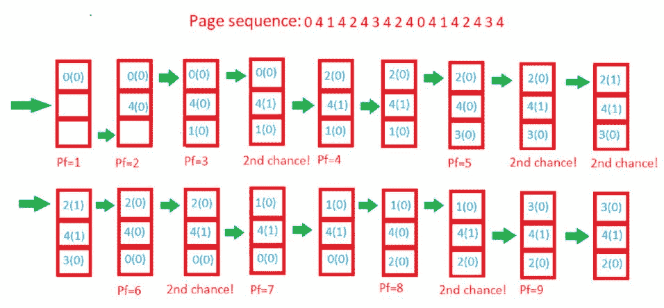

# 第二次机会(或时钟)页面替换策略

> 原文:[https://www . geesforgeks . org/second-chance-or-clock-page-replacement-policy/](https://www.geeksforgeeks.org/second-chance-or-clock-page-replacement-policy/)

先决条件–[页面替换算法](https://www.geeksforgeeks.org/operating-system-page-replacement-algorithm/)
除了 LRU、OPT 和 FIFO 页面替换政策，我们还有第二次机会/时钟页面替换政策。在第二次机会页面替换策略中，以循环方式考虑要删除的候选页面，在连续考虑之间访问过的页面不会被替换。被替换的页面是这样一个页面，当以循环方式考虑时，自上次考虑后就没有被访问过。
可以通过在每个内存帧中添加一个“第二次机会”位来实现——每次考虑该帧时(由于对其中的页面进行了引用)，该位被设置为 1，这给了页面第二次机会，因为当我们考虑替换的候选页面时，我们用设置为 0 的该位替换第一个页面(同时将我们在该过程中看到的其他页面的位清零)。因此，“第二次机会”位设置为 1 的页面在第一次考虑时永远不会被替换，只有当所有其他页面也值得第二次机会时才会被替换！
**例–**
假设参考字符串为 **0 4 1 4 2 4 3 4 2 4 0 4 1 4 2 4 3 4** 我们有 **3** 帧。让我们通过跟踪第二个机会位和指针来看看算法是如何进行的。

*   最初，所有帧都是空的，因此在前 3 次通过后，它们将被填充{0，4，1}，第二次机会数组将是{0，0，0}，因为还没有引用过。此外，指针将循环回到 0。

*   **Pass-4:** Frame={0，4，1}，second_chance = {0，1，0} [4 将获得第二次机会]，指针= 0(不需要更新页面，因此候选页面仍在 frame 0 中)，pf = 3(页面错误数不增加)。

*   **Pass-5:** Frame={2，4，1}，second_chance= {0，1，0} [0 替换；它的第二次机会位是 0，所以它没有得到第二次机会]，指针=1(更新)，pf=4

*   **Pass-6:** Frame={2，4，1}，second_chance={0，1，0}，指针=1，pf=4(无变化)

*   **Pass-7:** Frame={2，4，3}，second_chance= {0，0，0} [4 存活下来，但它的第二个机会位变成了 0]，指针=0(因为索引 2 处的元素最终被替换)，pf=5

*   **Pass-8:** Frame={2，4，3}，second_chance= {0，1，0} [再次引用 4]，指针=0，pf=5

*   **Pass-9:** Frame={2，4，3}，second_chance= {1，1，0} [再次引用 2]，指针=0，pf=5

*   **Pass-10:** Frame={2，4，3}，second_chance= {1，1，0}，指针=0，pf=5(无变化)

*   **传球-11:** 框架={2，4，0}，第二次机会= {0，0，0}，指针=0，pf=6 (2 和 4 获得第二次机会)

*   **Pass-12:** Frame={2，4，0}，second_chance= {0，1，0}，指针=0，pf=6 (4 将再次获得第二次机会)

*   **Pass-13:** Frame={1，4，0}，second_chance= {0，1，0}，指针=1，pf=7(指针更新，pf 更新)

*   **第 14 页:**帧={1，4，0}，秒 _ 机会= {0，1，0}，指针=1，pf=7(无变化)

*   **第-15 页:**帧={1，4，2}，second_chance= {0，0，0}，指针=0，pf=8 (4 由于第二次机会再次存活！)

*   **第 16 页:**帧={1，4，2}，第二次机会= {0，1，0}，指针=0，pf=8(第二次机会更新)

*   **第 17 页:**帧={3，4，2}，秒 _ 机会= {0，1，0}，指针=1，pf=9(指针，pf 更新)

*   **第 18 页:**帧={3，4，2}，秒 _ 机会= {0，1，0}，指针=1，pf=9(无变化)

在这个例子中，第二次机会算法和 LRU 方法一样好，后者在硬件中实现的成本要高得多。
**更多示例–**

```
Input: 2 5 10 1 2 2 6 9 1 2 10 2 6 1 2 1 6 9 5 1
3
Output: 14

Input: 2 5 10 1 2 2 6 9 1 2 10 2 6 1 2 1 6 9 5 1
4
Output: 11 
```

**算法–**
创建一个数组**框住**以跟踪当前在内存中的页面，并创建另一个布尔数组 **second_chance** 以跟踪自上次替换以来该页面是否被访问过(即它是否值得第二次机会)以及一个变量**指针**以跟踪替换目标。

1.  开始遍历数组 **arr** 。如果页面已经存在，只需将其在 **second_chance** 中对应的元素设置为 true 并返回。

2.  如果页面不存在，检查**指针**指向的空间是否为空(表示缓存尚未满)–如果是，我们将把元素放在那里并返回，否则我们将逐个遍历数组 **arr** (循环使用**指针**的值)，将所有对应的 **second_chance** 元素标记为 false，直到找到一个已经为 false 的元素。那是最适合替换的页面，所以我们这样做并返回。

3.  最后，我们报告页面错误计数。



## C++

```
// CPP program to find largest in an array
// without conditional/bitwise/ternary/ operators
// and without library functions.
#include<iostream>
#include<cstring>
#include<sstream>
using namespace std;

// If page found, updates the second chance bit to true
static bool findAndUpdate(int x,int arr[],
                bool second_chance[],int frames)

{
    int i;

    for(i = 0; i < frames; i++)
    {

        if(arr[i] == x)
        {
            // Mark that the page deserves a second chance
            second_chance[i] = true;

            // Return 'true', that is there was a hit
            // and so there's no need to replace any page
            return true;
        }
    }

    // Return 'false' so that a page for replacement is selected
    // as he reuested page doesn't exist in memory
    return false;

}

// Updates the page in memory and returns the pointer
static int replaceAndUpdate(int x,int arr[],
            bool second_chance[],int frames,int pointer)
{
    while(true)
    {

        // We found the page to replace
        if(!second_chance[pointer])
        {
            // Replace with new page
            arr[pointer] = x;

            // Return updated pointer
            return (pointer + 1) % frames;
        }

        // Mark it 'false' as it got one chance
        // and will be replaced next time unless accessed again
        second_chance[pointer] = false;

        //Pointer is updated in round robin manner
        pointer = (pointer + 1) % frames;
    }
}

static void printHitsAndFaults(string reference_string,
                                            int frames)
{
    int pointer, i, l=0, x, pf;

    //initially we consider frame 0 is to be replaced
    pointer = 0;

    //number of page faults
    pf = 0;

    // Create a array to hold page numbers
    int arr[frames];

    // No pages initially in frame,
    // which is indicated by -1
    memset(arr, -1, sizeof(arr));

    // Create second chance array.
    // Can also be a byte array for optimizing memory
    bool second_chance[frames];

    // Split the string into tokens,
    // that is page numbers, based on space

    string str[100];
    string word = "";
    for (auto x : reference_string)
    {
        if (x == ' ')
        {
            str[l]=word;
            word = "";
            l++;
        }
        else
        {
            word = word + x;
        }
    }
    str[l] = word;
    l++;
    // l=the length of array

    for(i = 0; i < l; i++)
    {
        x = stoi(str[i]);

        // Finds if there exists a need to replace
        // any page at all
        if(!findAndUpdate(x,arr,second_chance,frames))
        {
            // Selects and updates a victim page
            pointer = replaceAndUpdate(x,arr,
                    second_chance,frames,pointer);

            // Update page faults
            pf++;
        }
    }
    cout << "Total page faults were " << pf << "\n";
}

// Driver code
int main()
{
    string reference_string = "";
    int frames = 0;

    // Test 1:
    reference_string = "0 4 1 4 2 4 3 4 2 4 0 4 1 4 2 4 3 4";
    frames = 3;

    // Output is 9
    printHitsAndFaults(reference_string,frames);

    // Test 2:
    reference_string = "2 5 10 1 2 2 6 9 1 2 10 2 6 1 2 1 6 9 5 1";
    frames = 4;

    // Output is 11
    printHitsAndFaults(reference_string,frames);
    return 0;
}

// This code is contributed by NikhilRathor
```

## Java 语言(一种计算机语言，尤用于创建网站)

```
// Java program to find largest in an array
// without conditional/bitwise/ternary/ operators
// and without library functions.
import java.util.*;
import java.io.*;
class secondChance
{
    public static void main(String args[])throws IOException
    {
        String reference_string = "";
        int frames = 0;

        //Test 1:
        reference_string = "0 4 1 4 2 4 3 4 2 4 0 4 1 4 2 4 3 4";
        frames = 3;

        //Output is 9
        printHitsAndFaults(reference_string,frames);

        //Test 2:
        reference_string = "2 5 10 1 2 2 6 9 1 2 10 2 6 1 2 1 6 9 5 1";
        frames = 4;

        //Output is 11
        printHitsAndFaults(reference_string,frames);

    }

    //If page found, updates the second chance bit to true
    static boolean findAndUpdate(int x,int arr[],
                       boolean second_chance[],int frames)

    {
        int i;

        for(i = 0; i < frames; i++)
        {

            if(arr[i] == x)
            {
                //Mark that the page deserves a second chance
                second_chance[i] = true;

                //Return 'true', that is there was a hit
                //and so there's no need to replace any page
                return true;
            }
        }

        //Return 'false' so that a page for replacement is selected
        //as he reuested page doesn't exist in memory
        return false;

    }

    //Updates the page in memory and returns the pointer
    static int replaceAndUpdate(int x,int arr[],
                 boolean second_chance[],int frames,int pointer)
    {
        while(true)
        {

            //We found the page to replace
            if(!second_chance[pointer])
            {
                //Replace with new page
                arr[pointer] = x;

                //Return updated pointer
                return (pointer+1)%frames;
            }

            //Mark it 'false' as it got one chance
            // and will be replaced next time unless accessed again
            second_chance[pointer] = false;

            //Pointer is updated in round robin manner
            pointer = (pointer+1)%frames;
        }
    }

    static void printHitsAndFaults(String reference_string,
                                                  int frames)
    {
        int pointer,i,l,x,pf;

        //initially we consider frame 0 is to be replaced
        pointer = 0;

        //number of page faults
        pf = 0;

        //Create a array to hold page numbers
        int arr[] = new int[frames];

        //No pages initially in frame,
        //which is indicated by -1
        Arrays.fill(arr,-1);

        //Create second chance array.
        //Can also be a byte array for optimizing memory
        boolean second_chance[] = new boolean[frames];

        //Split the string into tokens,
        //that is page numbers, based on space
        String str[] = reference_string.split(" ");

        //get the length of array
        l = str.length;

        for(i = 0; i<l; i++)
        {

            x = Integer.parseInt(str[i]);

            //Finds if there exists a need to replace
            //any page at all
            if(!findAndUpdate(x,arr,second_chance,frames))
            {
                //Selects and updates a victim page
                pointer = replaceAndUpdate(x,arr,
                          second_chance,frames,pointer);

                //Update page faults
                pf++;
            }
        }

        System.out.println("Total page faults were "+pf);
    }
}
```

## 蟒蛇 3

```
# Python3 program to find largest in an array
# without conditional/bitwise/ternary/ operators
# and without library functions.

# If page found, updates the second chance bit to true
def findAndUpdate(x, arr, second_chance, frames):

    for i in range(frames):

        if arr[i] == x:
            # Mark that the page deserves a second chance
            second_chance[i] = True

            # Return 'true', that is there was a hit
            #and so there's no need to replace any page
            return True

    # Return 'false' so that a page
    # for replacement is selected
    # as he reuested page doesn't
    # exist in memory
    return False

# Updates the page in memory
# and returns the pointer
def replaceAndUpdate(x, arr, second_chance, frames, pointer):
    while(True):

        # We found the page to replace
        if not second_chance[pointer]:

            # Replace with new page
            arr[pointer] = x

            #Return updated pointer
            return (pointer+1)%frames

        # Mark it 'false' as it got one chance
        # and will be replaced next time unless accessed again
        second_chance[pointer] = False

        # Pointer is updated in round robin manner
        pointer = (pointer + 1) % frames

def printHitsAndFaults(reference_string, frames):

    # initially we consider
    # frame 0 is to be replaced
    pointer = 0

    # number of page faults
    pf = 0

    # Create a array to hold page numbers
    arr = [0]*frames

    # No pages initially in frame,
    # which is indicated by -1
    for s in range(frames):
        arr[s] = -1

    # Create second chance array.
    # Can also be a byte array for optimizing memory
    second_chance = [False]*frames

    # Split the string into tokens,
    # that is page numbers, based on space
    Str = reference_string.split(' ')

    # get the length of array
    l = len(Str)

    for i in range(l):
        x = Str[i]

        # Finds if there exists a need to replace
        # any page at all
        if not findAndUpdate(x,arr,second_chance,frames):

            # Selects and updates a victim page
            pointer = replaceAndUpdate(x,arr,second_chance,frames,pointer)

            # Update page faults
            pf += 1

    print("Total page faults were", pf)

reference_string = ""
frames = 0

# Test 1:
reference_string = "0 4 1 4 2 4 3 4 2 4 0 4 1 4 2 4 3 4"
frames = 3

# Output is 9
printHitsAndFaults(reference_string,frames)

# Test 2:
reference_string = "2 5 10 1 2 2 6 9 1 2 10 2 6 1 2 1 6 9 5 1"
frames = 4

# Output is 11
printHitsAndFaults(reference_string,frames)

# This code is contributed by mukesh07.
```

## C#

```
// C# program to find largest in an array
// without conditional/bitwise/ternary/ operators
// and without library functions.
using System;

public class secondChance
{
    public static void Main()
    {
        String reference_string = "";
        int frames = 0;

        // Test 1:
        reference_string = "0 4 1 4 2 4 3 4 2 4 0 4 1 4 2 4 3 4";
        frames = 3;

        // Output is 9
        printHitsAndFaults(reference_string,frames);

        // Test 2:
        reference_string = "2 5 10 1 2 2 6 9 1 2 10 2 6 1 2 1 6 9 5 1";
        frames = 4;

        // Output is 11
        printHitsAndFaults(reference_string,frames);

    }

    // If page found, updates the second chance bit to true
    static bool findAndUpdate(int x,int []arr,
                    bool []second_chance,int frames)

    {
        int i;

        for(i = 0; i < frames; i++)
        {

            if(arr[i] == x)
            {
                //Mark that the page deserves a second chance
                second_chance[i] = true;

                //Return 'true', that is there was a hit
                //and so there's no need to replace any page
                return true;
            }
        }

        // Return 'false' so that a page
        // for replacement is selected
        // as he reuested page doesn't
        // exist in memory
        return false;

    }

    // Updates the page in memory
    // and returns the pointer
    static int replaceAndUpdate(int x,int []arr,
                bool []second_chance,int frames,int pointer)
    {
        while(true)
        {

            //We found the page to replace
            if(!second_chance[pointer])
            {
                //Replace with new page
                arr[pointer] = x;

                //Return updated pointer
                return (pointer+1)%frames;
            }

            //Mark it 'false' as it got one chance
            // and will be replaced next time unless accessed again
            second_chance[pointer] = false;

            //Pointer is updated in round robin manner
            pointer = (pointer + 1) % frames;
        }
    }

    static void printHitsAndFaults(String reference_string,
                                                int frames)
    {
        int pointer, i, l, x, pf;

        // initially we consider
        // frame 0 is to be replaced
        pointer = 0;

        // number of page faults
        pf = 0;

        // Create a array to hold page numbers
        int []arr = new int[frames];

        // No pages initially in frame,
        // which is indicated by -1
        for(int s = 0;s<frames;s++)
            arr[s]=-1;

        //Create second chance array.
        //Can also be a byte array for optimizing memory
        bool []second_chance = new bool[frames];

        //Split the string into tokens,
        //that is page numbers, based on space
        String []str = reference_string.Split();

        //get the length of array
        l = str.Length;

        for(i = 0; i < l; i++)
        {

            x = int.Parse(str[i]);

            //Finds if there exists a need to replace
            //any page at all
            if(!findAndUpdate(x,arr,second_chance,frames))
            {
                //Selects and updates a victim page
                pointer = replaceAndUpdate(x,arr,
                        second_chance,frames,pointer);

                //Update page faults
                pf++;
            }
        }

        Console.WriteLine("Total page faults were "+pf);
    }
}

// This code has been contributed by 29AjayKumar
```

## java 描述语言

```
<script>
    // Javascript program to find largest in an array
    // without conditional/bitwise/ternary/ operators
    // and without library functions.

    // If page found, updates the second chance bit to true
    function findAndUpdate(x, arr, second_chance, frames)

    {
        let i;

        for(i = 0; i < frames; i++)
        {

            if(arr[i] == x)
            {
                //Mark that the page deserves a second chance
                second_chance[i] = true;

                //Return 'true', that is there was a hit
                //and so there's no need to replace any page
                return true;
            }
        }

        // Return 'false' so that a page
        // for replacement is selected
        // as he reuested page doesn't
        // exist in memory
        return false;

    }

    // Updates the page in memory
    // and returns the pointer
    function replaceAndUpdate(x, arr, second_chance, frames, pointer)
    {
        while(true)
        {

            //We found the page to replace
            if(!second_chance[pointer])
            {
                //Replace with new page
                arr[pointer] = x;

                //Return updated pointer
                return (pointer+1)%frames;
            }

            //Mark it 'false' as it got one chance
            // and will be replaced next time unless accessed again
            second_chance[pointer] = false;

            //Pointer is updated in round robin manner
            pointer = (pointer + 1) % frames;
        }
    }

    function printHitsAndFaults(reference_string, frames)
    {
        let pointer, i, l, x, pf;

        // initially we consider
        // frame 0 is to be replaced
        pointer = 0;

        // number of page faults
        pf = 0;

        // Create a array to hold page numbers
        let arr = new Array(frames);
        arr.fill(0);

        // No pages initially in frame,
        // which is indicated by -1
        for(let s = 0;s<frames;s++)
            arr[s]=-1;

        //Create second chance array.
        //Can also be a byte array for optimizing memory
        let second_chance = new Array(frames);
        second_chance.fill(false);

        //Split the string into tokens,
        //that is page numbers, based on space
        let str = reference_string.split(' ');

        //get the length of array
        l = str.length;

        for(i = 0; i < l; i++)
        {
            x = str[i];

            //Finds if there exists a need to replace
            //any page at all
            if(!findAndUpdate(x,arr,second_chance,frames))
            {
                //Selects and updates a victim page
                pointer = replaceAndUpdate(x,arr,
                        second_chance,frames,pointer);

                //Update page faults
                pf++;
            }
        }

        document.write("Total page faults were " + pf + "</br>");
    }

    let reference_string = "";
    let frames = 0;

    // Test 1:
    reference_string = "0 4 1 4 2 4 3 4 2 4 0 4 1 4 2 4 3 4";
    frames = 3;

    // Output is 9
    printHitsAndFaults(reference_string,frames);

    // Test 2:
    reference_string = "2 5 10 1 2 2 6 9 1 2 10 2 6 1 2 1 6 9 5 1";
    frames = 4;

    // Output is 11
    printHitsAndFaults(reference_string,frames);

    // This code is contributed by divyesh072019.
</script>
```

**输出:**

```
Total page faults were 9
Total page faults were 11
```

**注:**

1.  数组 **arr** 和 **second_chance** 可以通过 hashmap(以元素为键，以真/假为值)替换组合在一起，加快搜索速度。
2.  这种方法的时间复杂度是 **O(帧数*参考字符串长度)**或 **O(mn)** ，但是由于帧数在操作系统中是一个常数(因为主存大小是固定的)，所以它只是 **O(n)** 【与 hashmap 方法相同，但常数较低】
3.  第二次机会算法可能会受到[贝拉迪异常](https://www.geeksforgeeks.org/operating-system-beladys-anomaly/)的影响。