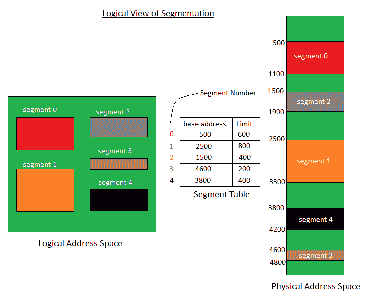
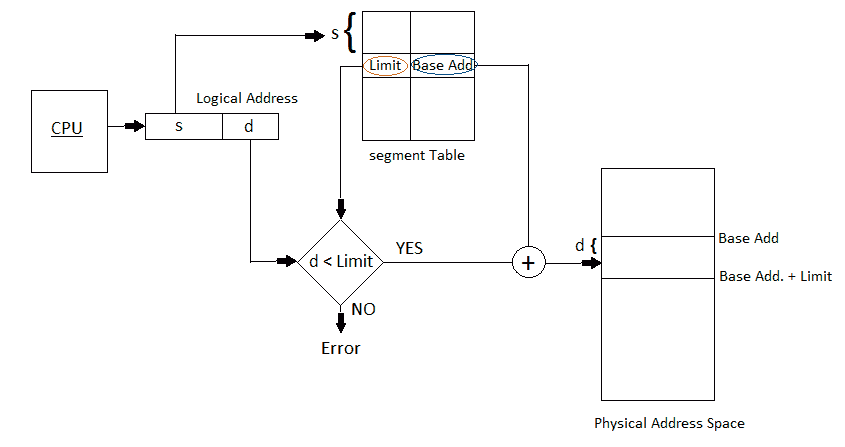

# 操作系统中的分段

> 原文:[https://www . geesforgeks . org/操作系统中的分段/](https://www.geeksforgeeks.org/segmentation-in-operating-system/)

一个过程被分成几个部分。一个程序被分成的不一定都是相同大小的块被称为段。分段让用户看到了分页所没有的过程。在这里，用户的视图被映射到物理内存。
分割有几种类型:

1.  **虚拟内存分段–**
    每个进程都被划分为多个段，并非所有段都驻留在任何一个时间点。
2.  **简单分段–**
    每个进程都被分成若干个段，所有这些段都在运行时加载到内存中，尽管不一定是连续的。

在分段中，逻辑地址和物理地址之间没有简单的关系。一个表存储了所有这些段的信息，称为段表。

**段表–**它将二维逻辑地址映射为一维物理地址。它的每个表条目都有:

*   **基址:**它包含段驻留在内存中的起始物理地址。
*   **极限:**指定线段的长度。

二维逻辑地址到一维物理地址的转换。

由中央处理器产生的地址分为:

*   **段号:**表示段所需的位数。
*   **段偏移(d):** 表示段大小所需的位数。

**细分优势–**

*   没有内部碎片。
*   与分页中的页表相比，段表占用的空间更少。

**分割的劣势–**

*   随着进程从内存中加载和移除，空闲的内存空间被分成小块，导致外部碎片。