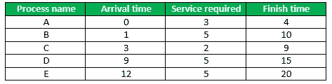
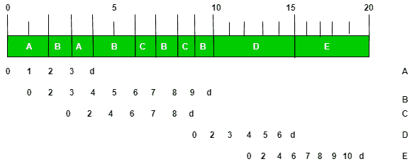

# 自私的循环 CPU 调度

> 原文:[https://www . geesforgeks . org/自私-循环-CPU-调度/](https://www.geeksforgeeks.org/selfish-round-robin-cpu-scheduling/)

先决条件–[循环调度程序](https://www.geeksforgeeks.org/program-round-robin-scheduling-set-1/)

在传统的循环调度算法中，所有进程都被平等对待进行处理。**自私循环**的目标是为已经执行了一段时间的流程提供比新来者更好的服务。与普通的循环算法相比，这是一个更符合逻辑和更优越的实现。

**实施:-**

*   就绪列表中的进程被分为两个列表:新建和接受。
*   新进程等待，而接受的进程由循环提供服务。
*   新流程的优先级以“a”的速率增加，而已接受流程的优先级以“b”的速率增加。
*   当一个新进程的优先级达到一个被接受进程的优先级时，这个新进程就被接受了。
*   如果所有接受的进程都完成，则接受优先级最高的新进程。

让我们来追溯一下这个算法的一般工作原理

**步骤 1:** 假设最初没有准备好的进程，当第一个进程 A 到达时。首先，它的优先级为 0。由于没有其他可接受的流程，A 立即被接受。
**STEP 2:** 过了一会，另一个进程 B 到来。只要 b / a < 1，B 的优先级最终会追上 A，所以被接受；现在 A 和 B 都有相同的优先级。
**STEP 3:** 所有接受的流程共享一个共同的优先级(以 b 速率上升)；这使得该策略易于实施，即任何新流程的优先级在某个时候都必然会被接受。所以没有过程必须经历饥饿。
**STEP 4:** 即使 b / a > 1，A 最终也会完成，然后 B 才能被接受。

```
Adjusting the parameters a and b : 
          -> If b / a >= 1, a new process is not accepted 
                 until all the accepted processes have finished, so SRR becomes FCFS. 
          -> If b / a = 0, all processes are accepted immediately, so SRR becomes RR. 
          -> If 0 < b / a < 1, accepted processes are selfish, but not completely.
```

**自私循环的例子–**



**解(其中 a = 2，b = 1)–**



**解释–**

进程 A 在 t = 0 时一到来就被接受。所以它的优先级每秒只增加‘b’，即‘1’。b 在时间 t = 1 进入，进入等待队列。所以它的优先级在 t = 2 时增加了“a”，即“2”。此时 A 的优先级= B 的优先级= 2。

因此，现在 A & B 的两个进程都在接受队列中，并以循环方式执行。在时间 t = 3 时，进程 C 进入等待队列。在时间 t = 6 时，进程 C 的优先级赶上进程 B 的优先级，然后它们开始以循环方式执行。当 B 在时间 t = 10 完成执行时，D 被自动提升到接受队列。

类似地，当 D 在时间 t = 15 完成执行时，E 被自动提升到接受队列。