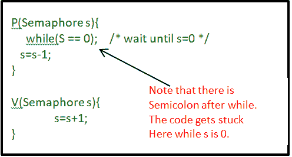
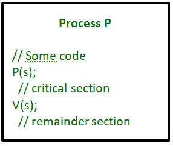
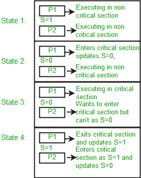

# 进程同步中的信号量

> 原文:[https://www . geesforgeks . org/信号量-进程内同步/](https://www.geeksforgeeks.org/semaphores-in-process-synchronization/)

信号量是由 Dijkstra 在 1965 年提出的，它是一种非常重要的技术，通过使用一个简单的整数值来管理并发进程，这就是信号量。信号量只是线程间共享的整数变量。该变量用于解决临界区问题，并在多处理环境中实现进程同步。
信号量有两种类型:

1.  **二元信号量–**
    这也称为互斥锁。它只能有两个值-0 和 1。它的值被初始化为 1。它用于实现多进程临界区问题的解决。
2.  **计数信号量–**
    它的值可以在一个不受限制的域内变化。它用于控制对具有多个实例的资源的访问。

现在让我们看看它是如何做到的。

首先，看看可以用来访问和更改信号量变量值的两个操作。



**关于 P 和 V 操作的几点:**

1.  p 操作也叫等待、睡眠或下降操作，V 操作也叫信号、唤醒或上升操作。
2.  两个操作都是原子的，信号量总是初始化为 1。这里，原子指的是在没有优先权的同时/时刻对其进行读取、修改和更新的变量，即在读取、修改和更新之间，不执行可能改变该变量的其他操作。
3.  关键部分被两个操作包围，以实现过程同步。见下图。工艺流程 P 的关键部分在工艺流程 P 和工艺流程 V 之间。



现在，让我们看看它是如何实现互斥的。假设有两个进程 P1 和 P2，一个信号量 s 被初始化为 1。现在，假设 P1 进入了它的临界区，那么信号量 s 的值变成了 0。现在，如果 P2 想要进入它的临界区，那么它将等待直到 s > 0，这只能在 P1 完成它的临界区并在信号量 s 上调用 V 操作时发生

这样就实现了互斥。请看下图的细节，这是二进制信号量。



**二进制信号量的实现:**

## 卡片打印处理机（Card Print Processor 的缩写）

```
struct semaphore {
    enum value(0, 1);

    // q contains all Process Control Blocks (PCBs)
    // corresponding to processes got blocked
    // while performing down operation.
    Queue<process> q;

} P(semaphore s)
{
    if (s.value == 1) {
        s.value = 0;
    }
    else {
        // add the process to the waiting queue
        q.push(P)
        sleep();
    }
}
V(Semaphore s)
{
    if (s.q is empty) {
        s.value = 1;
    }
    else {

        // select a process from waiting queue
        Process p=q.pop();
        wakeup(p);
    }
}
```

上面的描述是针对二进制信号量的，它只能取两个值 0 和 1，并确保互斥。还有一种叫做计数信号量的信号量，它可以取大于 1 的值。

现在假设有一个实例数为 4 的资源。现在我们初始化 S = 4，剩下的和二进制信号量一样。每当进程需要该资源时，它就调用 P 或等待函数，当它完成时，它就调用 V 或信号函数。如果 S 的值变为零，那么一个过程必须等待，直到 S 变为正。例如，假设有 4 个进程 P1、P2、P3、P4，它们都调用 S 上的等待操作(用 4 初始化)。如果另一个进程 P5 想要资源，那么它应该等待，直到四个进程中的一个调用信号函数，并且信号量的值变为正。

**限制:**

1.  信号量最大的限制之一是优先级反转。
2.  死锁，假设一个进程试图唤醒另一个不处于睡眠状态的进程。因此，死锁可能会无限期地阻塞。
3.  操作系统必须跟踪所有等待的调用，并向信号量发出信号。

**信号量的这个实现中的问题:**
信号量的主要问题是它们需要繁忙的等待，如果一个进程在临界区，那么其他试图进入临界区的进程将一直等待，直到临界区没有被任何进程占用。
每当任何进程等待时，它就持续检查信号量值(一边看这条线(s = = 0)；在 P 操作中)并浪费 CPU 周期。

当进程在等待锁的同时继续旋转时，也有“自旋锁”的机会。

为了避免这种情况，下面提供了另一种实现。

**计数信号量的实现:**

## 卡片打印处理机（Card Print Processor 的缩写）

```
struct Semaphore {
    int value;

    // q contains all Process Control Blocks(PCBs)
    // corresponding to processes got blocked
    // while performing down operation.
    Queue<process> q;

} P(Semaphore s)
{
    s.value = s.value - 1;
    if (s.value < 0) {

        // add process to queue
        // here p is a process which is currently executing
        q.push(p);
        block();
    }
    else
        return;
}

V(Semaphore s)
{
    s.value = s.value + 1;
    if (s.value >= 0) {

        // remove process p from queue
        Process p=q.pop();
        wakeup(p);
    }
    else
        return;
}
```

在这个实现中，每当进程等待时，它就被添加到与该信号量相关联的进程的等待队列中。这是通过该进程上的系统调用块()完成的。当一个进程完成时，它调用信号函数，队列中的一个进程被恢复。它使用唤醒()系统调用。