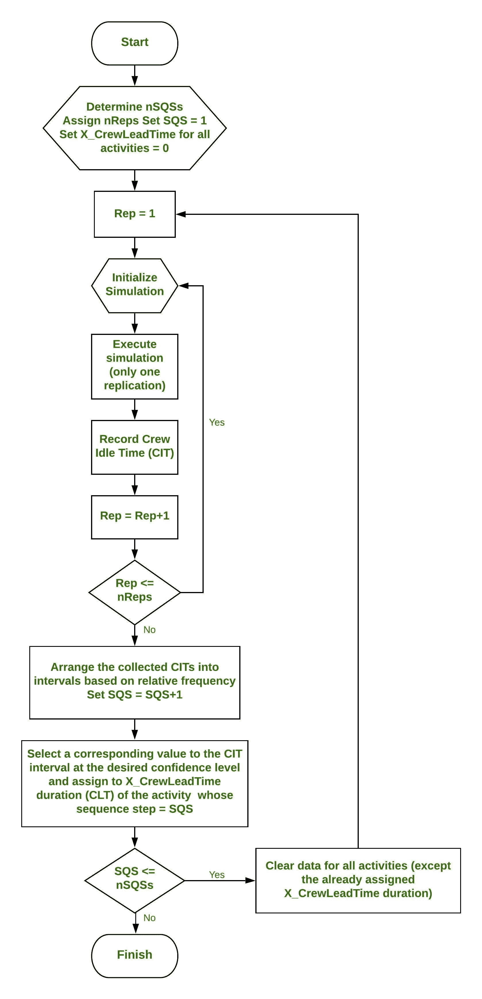

# 操作系统中的序列步长算法

> 原文:[https://www . geesforgeks . org/sequence-step-in-algorithm-in-operating-system/](https://www.geeksforgeeks.org/sequence-step-algorithm-in-operating-system/)

一个**离散事件模拟**将系统的运行建模为一系列的时间事件。每个事件都发生在特定的时刻，在这些时刻之间，系统被认为是不变的。

**序列步长算法**在离散事件仿真系统中实现，以最大化资源利用率。它允许开发基于资源的模拟模型，用于调度具有概率活动持续时间的重复性项目，同时保持持续的资源利用率。

简单地说，让我们假设建造一座多层建筑。在每一层都要做同样的工作，例如，考虑油漆 10 楼，因为这些 10 楼的墙应该被建造，油漆工人应该已经油漆了 9 楼。现在，如果出于某种原因，剧组完成了 9 楼的粉刷，但 10 楼的墙还没有完全建好，那么剧组就会闲着没事干，然后拿工资。这就是算法的作用。

该算法适用于调度重复性项目，其中每个单元的活动持续时间可能会因资源生产率或单元之间的工作量差异而有所不同，因此工作人员可以不间断地连续工作。序列步长算法首先解决概率重复项目的调度问题，以消除机组空闲时间。

通过添加两个嵌套循环，即**内部复制循环**和**外部序列-步骤循环，该算法可以很容易地适应不同的基于资源的仿真软件。**

一般有三个步骤–

1.  第一步是在每个项目副本中模拟网络并收集机组空闲的时间(CIT)。在执行多次复制之后，基于相对频率，CIT 样本以类似直方图的间隔排列。
2.  在第二步中，我们为我们在第一步中计算的 CIT 确定一个特定的累积概率，并将相应的时间值指定为**X _ cruleaddime**的持续时间，对于所有活动，该持续时间最初为 0。
3.  在第三步中，我们重置模拟模型，并清除所有活动的所有先前收集的 CIT 统计数据。使用已经为先前序列步骤中的所有活动分配的**X _ 克鲁提前时间持续时间** (CLT)，我们移动到下一个序列步骤，重复第一个和第二个算法步骤，直到到达最后一个序列步骤。

**流程图–**

