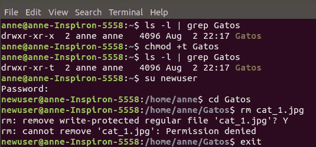
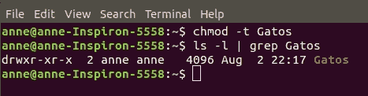

# Linux 文件权限中的设置 UID、设置 GID 和粘性位

> 原文:[https://www . geesforgeks . org/setuid-setgid-和-sticky-bits-in-Linux-file-permissions/](https://www.geeksforgeeks.org/setuid-setgid-and-sticky-bits-in-linux-file-permissions/)

正如文章[**Linux 中的权限**](https://www.geeksforgeeks.org/permissions-in-linux/) 中所解释的，Linux 使用位的组合来存储文件的权限。我们可以使用`chmod`命令更改权限，该命令本质上更改了与文件相关联的‘r’、‘w’和‘x’字符。

此外，文件的所有权还取决于创建者的`uid`(用户标识)和`gid`(组标识)，如本文[所述。同样，当我们启动一个流程时，它会与启动它的用户的`uid`和`gid`一起运行。](https://www.geeksforgeeks.org/real-effective-and-saved-userid-in-linux/)

**1。`setuid`位**
该位用于具有可执行权限的文件。`setuid`位只是表示在运行可执行文件时，它会将其权限设置为创建它的用户(所有者)的权限，而不是将其设置为启动它的用户。类似地，有一个`setgid`位对`gid`也是如此。

要定位`setuid`，在文件权限的可执行位中寻找一个“s”而不是“x”。

具有`setuid`权限的可执行文件的一个例子是`passwd`，如以下输出所示。

```
ls -l /etc/passwd

```

这将返回以下输出:

```
-rwsr-xr-x root root 2447 Aug 29  2018 /etc/passwd

```

我们可以观察到，在文件权限的用户部分中，x 被 s 所取代。

要设置`setuid`位，请使用以下命令。

```
chmod u+s 

```

要删除`setuid`位，请使用以下命令。

```
chmod u-s 

```

**2。`setgid`位**

`setgid`影响文件和目录。当用于文件时，它以拥有它的用户组的权限执行，而不是以执行它的用户组的权限执行。
为目录设置该位时，该目录中的文件集将与父目录的组具有相同的组，而不是创建这些文件的用户的组。这用于文件共享，因为现在属于父目录组的所有用户都可以修改它们。

要定位`setgid`位，请在文件权限的组部分查找一个“s”，如下例所示。

```
-rwxrwsr-x root root 1427 Aug 2 2019 sample_file

```

要设置`setgid`位，请使用以下命令。

```
chmod g+s 

```

要删除`setgid`位，请使用以下命令。

```
chmod g-s 

```

**安全风险**

`setuid`位在各种应用中确实非常有用，但是，支持该功能的可执行程序应该仔细设计，以免危及任何随之而来的安全风险，例如缓冲区溢出和路径注入。如果有漏洞的程序以 root 权限运行，攻击者可以通过它获得对系统的 root 访问权限。为了避免这种可能性，一些操作系统忽略了可执行外壳脚本的`setuid`位。

**3。粘性位**
粘性位最初被引入是为了在程序完成执行后将可执行程序的文本段“粘贴”到交换空间中，以加快同一程序的后续运行。然而，这些天来，粘性比特意味着完全不同的东西。

当一个目录设置了粘性位时，它的文件只能由文件所有者、目录所有者和根用户删除或重命名。下面的命令显示了如何设置粘性位。

```
chmod +t 

```

只需在文件权限中寻找一个“t”字符来定位粘性位。下面的代码片段显示了我们如何为某个目录“Gatos”设置粘性位，以及它如何防止新用户删除目录中的文件。



要删除粘性位，只需使用以下命令。

```
chmod -t 

```



由于删除文件是由文件的写权限控制的，因此粘性位的实际用途包括可写目录，如“/tmp”，因此删除权限只保留给文件的所有者。