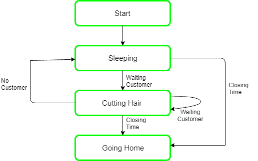

# 进程同步中睡眠理发师问题

> 原文:[https://www . geesforgeks . org/sleeping-barber-process-problem-synchronization/](https://www.geeksforgeeks.org/sleeping-barber-problem-in-process-synchronization/)

先决条件–[进程间通信](https://www.geeksforgeeks.org/inter-process-communication/)
**问题:**这个类比是基于一个假设的有一个理发师的理发店。有一家理发店，有一个理发师，一把理发椅，和 n 把椅子，如果有顾客可以坐在椅子上，可以等待顾客。

*   如果没有顾客，理发师就睡在自己的椅子上。
*   当顾客到达时，他必须叫醒理发师。
*   如果顾客很多，理发师正在给顾客理发，那么剩下的顾客要么等候诊室里有空椅子，要么等没有椅子空了再走。


**解决方案:**这个问题的解决方案包括三个[信号量](https://www.geeksforgeeks.org/semaphores-operating-system/)。首先是对等候室的顾客数进行统计的顾客(坐在理发店椅子上的顾客不包括在内，因为他没有在等候)。第二，理发师 0 或 1 用于判断理发师是空闲还是工作，第三个互斥用于提供进程执行所需的互斥。在该解决方案中，顾客有在等候室等候的顾客数量的记录，如果顾客数量等于等候室中椅子的数量，则即将到来的顾客离开理发店。

当理发师早上出现时，他执行理发程序，导致他阻塞信号量客户，因为它最初是 0。然后理发师睡觉，直到第一个顾客上来。

当一个顾客到达时，他执行顾客程序顾客获得进入关键区域的互斥锁，如果另一个顾客进入，第二个顾客在第一个顾客释放互斥锁之前不能做任何事情。然后，顾客检查等候室的椅子，如果等候的顾客少于椅子的数量，他就坐，否则他离开并释放互斥锁。

如果椅子是可用的，那么顾客坐在等候室，增加可变的等候值，并且增加顾客的信号量，如果理发师正在睡觉，这将唤醒他。

此时，顾客和理发师都醒着，理发师准备给那个人理发。理发结束后，顾客退出程序，如果候诊室没有顾客，理发师就睡觉。



**睡眠理发师问题的算法:**

```
Semaphore Customers = 0;
Semaphore Barber = 0;
Mutex Seats = 1;
int FreeSeats = N;

Barber {
      while(true) {
            /* waits for a customer (sleeps). */
            down(Customers);

            /* mutex to protect the number of available seats.*/
            down(Seats);

            /* a chair gets free.*/
            FreeSeats++;

            /* bring customer for haircut.*/
            up(Barber);

            /* release the mutex on the chair.*/
            up(Seats);
            /* barber is cutting hair.*/
      }
}

Customer {
      while(true) {
            /* protects seats so only 1 customer tries to sit
               in a chair if that's the case.*/
            down(Seats); //This line should not be here.
            if(FreeSeats > 0) {

                  /* sitting down.*/
                  FreeSeats--;

                  /* notify the barber. */
                  up(Customers);

                  /* release the lock */
                  up(Seats);

                  /* wait in the waiting room if barber is busy. */
                  down(Barber);
                  // customer is having hair cut
            } else {
                  /* release the lock */
                  up(Seats);
                  // customer leaves
            }
      }
}
```