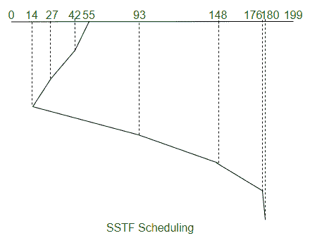

# SSTF 完整版

> 原文:[https://www.geeksforgeeks.org/sstf-full-form/](https://www.geeksforgeeks.org/sstf-full-form/)

SSTF 是 **[最短寻道时间优先(SSTF)](https://www.geeksforgeeks.org/program-for-sstf-disk-scheduling-algorithm/)** 的缩写，这是一种[磁盘调度算法](https://www.geeksforgeeks.org/disk-scheduling-algorithms/)。

它选择最接近当前磁头位置的请求，然后将磁头移开以服务其他请求。这是通过从当前磁头位置选择寻道时间最少的请求来实现的。


SSTF 调度优先级被给予那些具有最短寻道的进程，即使这些请求不是队列中的第一个请求。为了实现这一点，在队列中预先计算每个请求的寻道时间，然后根据它们的寻道时间来调度请求。

SSTF 不能确保公平，因为它可能导致无限期推迟，因为它的寻道模式倾向于高度本地化。SSTF 就像最短作业优先(SJF)，因为它可以防止远程请求在大负载下被服务，这可以被称为饥饿。

**示例:**
考虑一个有 200 个磁道(0-199)的磁盘，该磁盘队列有如下顺序的 I/O 请求:93、176、42、148、27、14、180。读写磁头的当前磁头位置是 55。使用 SSTF 计算读/写磁头的磁道移动总数。



总寻道时间，

```
= (55-14) + (180-14)
= 207 
```

**优势:**

1.  吞吐量优于 FCFS。
2.  由于头部移动次数较少，平均响应时间被最小化。

**缺点:**

1.  因为我们提前计算每个请求的寻道时间，所以开销很大。
2.  如果一个请求比队列中的其他请求具有更长的寻道时间，即使它可能已经首先到达队列，也会发生请求饥饿。