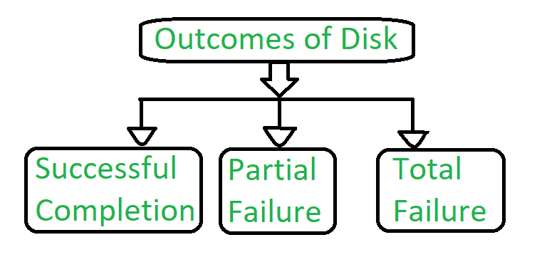
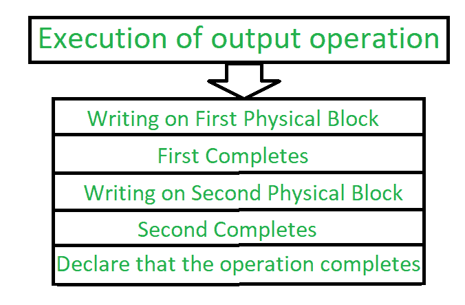

# 操作系统中的稳定存储实现

> 原文:[https://www . geesforgeks . org/stable-storage-implementation-in-operating-system/](https://www.geeksforgeeks.org/stable-storage-implementation-in-operating-system/)

根据定义，驻留在**稳定存储器**中的信息永远不会丢失。甚至，如果磁盘和 CPU 有一些错误，它永远不会丢失任何数据。

**稳定存储实施:**
为了实现这样的存储，我们需要在多个具有独立故障模式的存储设备上复制所需的信息。更新的写入应该以这样一种方式进行协调，即它不会删除状态的所有副本，并且当我们从故障中恢复时，即使在恢复期间发生另一个故障，我们也可以将所有副本强制为一致且正确的值。在这些中，我们讨论如何满足这些需求。

磁盘写入操作导致以下结果之一:

**Figure –** Outcomes of Disk

1.  **成功完成–**
    数据将正确写入磁盘。
2.  **部分故障–**
    在这种情况下，故障发生在数据传输的中间，因此只有一些扇区被写入了新数据，并且在故障期间写入的扇区可能已经损坏。
3.  **完全故障–**
    故障发生在磁盘写入开始之前，因此磁盘上以前的数据值保持不变。

在以某种方式写入块的过程中，如果出现故障，系统的第一项工作是检测故障，然后调用恢复过程来恢复一致状态。为此，系统必须为每个逻辑块包含两个物理块。

输出操作执行如下:

**Figure –** Process of execution of output operation

1.  将信息写入第一个物理块。
2.  当第一次写入成功完成时，将相同的操作写入第二个物理块。
3.  当两个操作都声明成功时，将操作声明为完成。

在从故障中恢复的过程中，会检查每个物理块。如果两者相同，并且不存在可检测的错误，则无需采取进一步的措施。如果一个块包含可检测的错误，那么我们用另一个块的值替换它的内容。如果两个块都不包含可检测的错误，但是块的内容不同，那么我们用第二个块的内容替换第一个块的内容。这个恢复过程给了我们一个结论，要么对稳定内容的写入成功，要么不产生任何变化。

如果我们想要稳定存储的每个块的任意大量的副本，这个过程将被扩展。随着大量副本的使用，失败的机会减少了。一般来说，模拟只有两个副本的稳定存储通常是合理的。稳定存储中的数据是安全的，除非故障破坏了所有副本。稳定存储中存在的数据保证是安全的，除非故障破坏了所有副本。

因为等待磁盘写入完成非常耗时，所以许多存储阵列会添加 NVRAM 作为缓存。由于内存是非易失性的，因此可以信任它在去往磁盘的途中存储数据。这样，它被认为是稳定存储的一部分。写入稳定存储比写入磁盘快得多，因此性能大大提高。