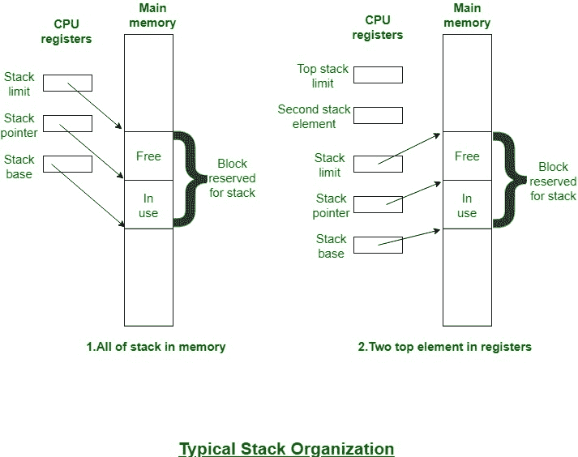

# 处理器使用的操作系统中的堆栈实现

> 原文:[https://www . geesforgeks . org/stack-操作系统中的实现-按处理器使用/](https://www.geeksforgeeks.org/stack-implementation-in-operating-system-uses-by-processor/)

堆栈是一组有序组件的关联，一次通常只访问其中一个(最后添加的)。访问点被命名为堆栈的最高处。堆栈中组件的数量或堆栈的长度是可变的。项目可以单独放在堆栈的最上面或从最上面删除。因此，堆栈也被称为下推列表或后进先出列表。

栈的实现需要有一些存储栈组件的位置集合。下图说明了一种典型的方法。

连续块的位置在主存储器(或虚拟存储器)中为堆栈保留。大多数情况下，该块是堆栈组件的一部分，其余部分可用于堆栈增长。正确操作所需的三个地址区域单元，这些区域单元通常保存在处理器寄存器中:

*   **栈指针:**
    它包含栈的这个素数的地址。如果相关联的项被附加到堆栈(PUSH)或从堆栈(POP)中删除，指针将递减或递增，以包含堆栈新质数的地址。
*   **栈基:**
    它包含保留块内一个非常便宜的位置的地址。一旦相关联的项目与空堆栈相关联，这可以是要使用的主要位置。如果一旦堆栈为空，就试图弹出组件，则会报告错误。
*   **堆栈限制:**
    它包含保留块的相反结束或顶部的地址。如果一旦堆栈满了，就试图推送一个组件，则会报告一个错误。

传统上，在大多数处理器上，目前堆栈的底部在保留堆栈块的高地址结束处，而限制也在低地址结束处。因此，堆栈将从较高的地址增长到较低的地址。