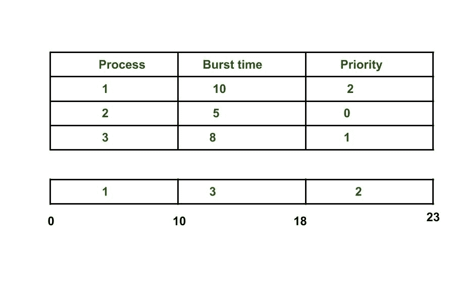
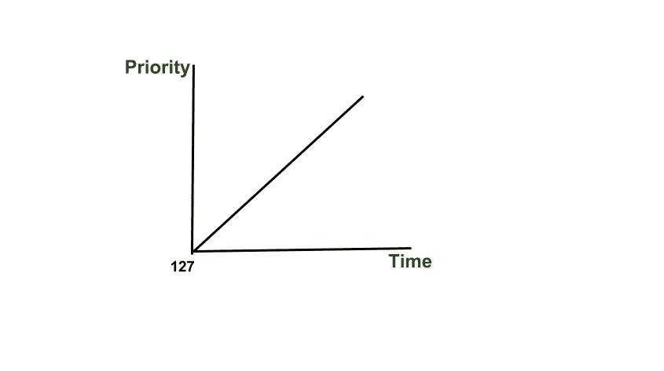

# 操作系统饥饿和老化

> 原文:[https://www . geeksforgeeks . org/操作系统饥饿和老化/](https://www.geeksforgeeks.org/starvation-and-aging-in-operating-systems/)

**先决条件:** [优先调度](https://www.geeksforgeeks.org/program-priority-scheduling-set-1/)

我们已经在[这个](https://www.geeksforgeeks.org/program-priority-scheduling-set-1/)的帖子里讨论过优先级调度了。它是批处理系统中最常见的调度算法之一。每个进程都有一个优先级。优先级最高的进程将首先执行，以此类推。

在这篇文章中，我们将讨论一个与优先级调度相关的主要问题及其解决方案。

**饥饿**或无限期阻塞是与优先级调度算法相关联的现象，其中准备为中央处理器运行的进程可以因为低优先级而无限期等待。在高负载的计算机系统中，稳定的高优先级进程流会阻止低优先级进程获得 CPU。

有传言说，1967 年麻省理工学院的 IBM 7094 使用了优先级调度，他们发现了一个直到 1973 年才提交的低优先级流程。

正如我们在上面的示例中看到的，进程比其他进程更早获得 CPU，具有更高的优先级。我们可以想到一个场景，其中只有一个进程具有非常低的优先级(例如 127)，而我们给其他进程以高优先级，这可能导致无限期等待具有低优先级的 CPU 进程，这导致**饥饿**。此外，我们还讨论了饥饿的解决方案。

**死锁和操作系统饥饿的区别:**

1.  如下图所示，当集合中的任何一个进程由于其他进程占用了所需的资源而无法前进时，就会发生死锁。另一方面，当一个进程无限期地等待获取所需的资源时，就会发生饥饿。
2.  死锁的另一个名称是**循环等待**。饥饿的另一个名字是**活锁**。
3.  当死锁发生时，任何进程都不能取得进展，而在饥饿状态下，除了受害进程之外，其他进程都可以进展或继续。

**饥饿解决方案:老化**

老化是一种逐渐增加在系统中等待很长时间的进程的优先级的技术。例如，如果优先级范围从 127(低)到 0(高)，我们可以每 15 分钟将等待进程的优先级增加 1。最终，即使是初始优先级为 127 的进程，优先级为 127 的进程老化为优先级为 0 的进程也不会超过 32 小时。

本文由**萨洛尼·古普塔**供稿。如果你喜欢 GeeksforGeeks 并想投稿，你也可以使用[contribute.geeksforgeeks.org](http://www.contribute.geeksforgeeks.org)写一篇文章或者把你的文章邮寄到 contribute@geeksforgeeks.org。看到你的文章出现在极客博客主页上，帮助其他极客。

如果你发现任何不正确的地方，或者你想分享更多关于上面讨论的话题的信息，请写评论。