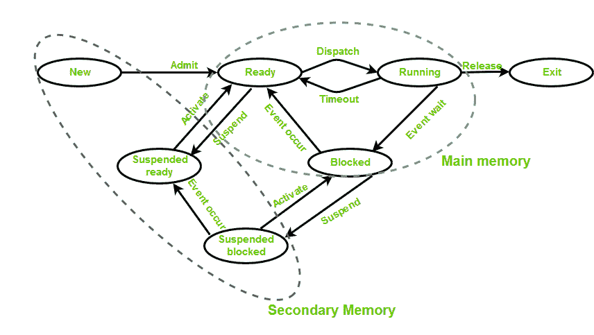

# 操作系统中进程的状态

> 原文:[https://www . geesforgeks . org/操作系统进程状态/](https://www.geeksforgeeks.org/states-of-a-process-in-operating-systems/)

进程的状态如下:

*   **New(Create)–**在这一步中，进程即将创建但尚未创建，是存在于二级内存中的程序将被 OS 拾取来创建进程。
*   **就绪–**新- >准备运行。创建进程后，进程进入就绪状态，即进程被加载到主存储器中。这里的进程已经准备好运行，正在等待获得执行它的 CPU 时间。准备好由中央处理器执行的进程被维护在准备好的进程队列中。
*   **运行–**进程由中央处理器选择执行，进程中的指令由任何一个可用的中央处理器内核执行。
*   **阻塞或等待–**每当进程请求访问 I/O 或需要用户输入或需要访问某个关键区域(已获取该区域的锁)时，它就会进入阻塞或等待状态。进程继续在主内存中等待，不需要 CPU。一旦输入/输出操作完成，过程就进入就绪状态。
*   **终止或完成–**进程被终止，印刷电路板被删除。
*   **挂起就绪–**最初处于就绪状态但被从主内存中换出(参见虚拟内存主题)并被调度程序放入外部存储的进程被称为处于挂起就绪状态。每当进程再次进入主存储器时，进程将转换回就绪状态。
*   **挂起等待或挂起阻塞–**类似于挂起就绪，但使用正在执行输入/输出操作的进程，主内存不足导致它们移动到辅助内存。
    工作完成后，可以暂停准备。

**CPU 和 IO 绑定进程:**
如果进程在 CPU 操作方面是密集的，那么它被称为 CPU 绑定进程。类似地，如果进程在输入/输出操作方面是密集的，那么它被称为输入输出绑定进程。

**调度器类型:**

1.  **长期–性能–**决定应该让多少个进程保持就绪状态，这决定了多道程序设计的程度。一旦作出决定，它会持续很长时间，因此被称为长期计划。
2.  **短期–上下文切换时间–**短期调度器将决定下一步执行哪个进程，然后调用调度器。调度程序是一种软件，它将流程从就绪状态转移到运行状态，反之亦然。换句话说，就是语境转换。
3.  **中期–交换时间–**暂停决定由中期计划员做出。中期调度程序用于将进程从主内存移动到辅助内存的交换，反之亦然。

**多道程序设计–**我们有许多进程准备运行。多道程序设计有两种类型:

1.  **先发制人–**进程被强制从中央处理器中移除。先发制人也被称为分时或多任务处理。
2.  **非优先–**进程在完成执行之前不会被删除。

**多道程序设计的程度–**
最多可以驻留在就绪状态的进程数决定了多道程序设计的程度，例如，如果编程的程度= 100，这意味着最多可以有 100 个进程驻留在就绪状态。