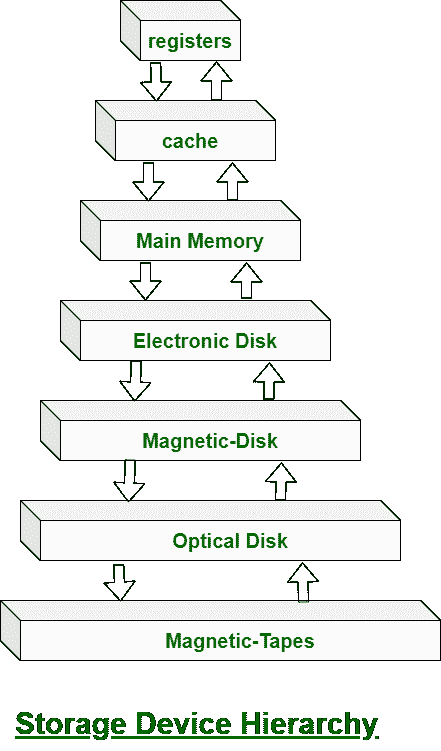

# 操作系统中的存储结构

> 原文:[https://www . geeksforgeeks . org/操作系统中的存储结构/](https://www.geeksforgeeks.org/storage-structure-in-operating-systems/)

基本上我们希望程序和数据永久驻留在[主存储器](https://www.geeksforgeeks.org/levels-of-memory-in-operating-system/)中。

由于以下两个原因，这种安排通常是不可能的:

1.  主存储器通常小到可以永久存储所有需要的程序和数据。
2.  主存储器是一种易失性存储设备，当电源关闭或丢失时，其内容会丢失。

有两种类型的存储设备

*   **易失性存储设备–**
    当设备断电时，它会丢失内容。

*   **Non-Volatile Storage device –**
    It does not loses its contents when the power is removed. It holds all the data when the power is removed.

    [二级存储器](https://www.geeksforgeeks.org/introduction-of-secondary-memory/)作为主存的扩展。辅助存储设备可以永久保存数据。
    存储设备包括[寄存器](https://www.geeksforgeeks.org/different-classes-of-cpu-registers/)、[缓存](https://www.geeksforgeeks.org/cache-memory-in-computer-organization/)、主存、电子盘、[磁盘](https://www.geeksforgeeks.org/differences-between-magnetic-tape-and-magnetic-disk/)、[光盘](https://www.geeksforgeeks.org/difference-between-magnetic-disk-and-optical-disk/)、[磁带](https://www.geeksforgeeks.org/magnetic-tape-memory/)。每个存储系统都提供了存储数据和保存数据直到以后被检索的基本系统。所有存储设备在速度、成本、大小和易失性方面都有所不同。最常见的辅助存储设备是磁盘，它为程序和数据提供存储。

    在此图中，显示了存储的层次结构–

    

    在这个层次结构中，所有的存储设备都是根据速度和成本来安排的。较高的级别很贵，但速度很快。当我们向下移动层次结构时，每比特的成本通常会降低，而当访问时间增加时，成本通常会降低。

    电子磁盘上方的存储系统是易失性的，而下方的存储系统是非易失性的。
    电子磁盘可以设计为易失性或非易失性。在正常操作期间，电子磁盘将数据存储在大型[动态随机存取存储器](https://www.geeksforgeeks.org/difference-between-sram-and-dram/)阵列中，该阵列是易失性的。但是许多电子磁盘设备包含一个隐藏的磁性硬盘和一个备用电源电池。如果外部电源中断，电子磁盘控制器将数据从随机存取存储器复制到磁盘。当外部电源恢复时，控制器将数据复制回[内存](https://www.geeksforgeeks.org/different-types-ram-random-access-memory/)。

    一个完整的存储系统的设计必须平衡所有的因素。它必须只使用尽可能多的昂贵内存，同时提供尽可能多的廉价非易失性内存。当两个组件之间存在较大的访问时间或传输速率差异时，可以安装缓存来提高性能。