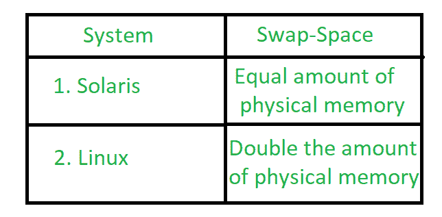
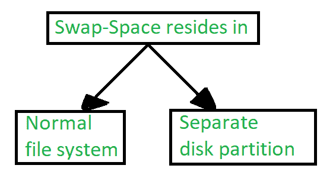

# 操作系统中的交换空间管理

> 原文:[https://www . geesforgeks . org/swap-space-management in-operating-system/](https://www.geeksforgeeks.org/swap-space-management-in-operating-system/)

**交换**是多程序设计中使用的一种内存管理技术，用于增加共享 CPU 的进程数量。这是一种从主内存中删除一个进程并将其存储到辅助内存中，然后将其带回主内存继续执行的技术。将进程从主内存移出到辅助内存的动作称为**换出**，将进程从辅助内存移出到主内存的动作称为**换入**。

**<u>【交换空间】</u> :**
磁盘上存储换出进程的区域称为交换空间。

**<u>交换-空间管理</u> :**
交换-交换管理是操作系统的另一个低级任务。虚拟内存将磁盘空间用作主内存的扩展。众所周知，磁盘访问比内存访问慢得多，在交换空间管理中，我们使用磁盘空间，因此它会显著降低系统性能。基本上，在我们所有的系统中，我们都需要最佳的吞吐量，所以这个交换空间实现的目标是为虚拟内存提供最佳的吞吐量。在本文中，我们将讨论如何使用交换空间，交换空间在磁盘上的位置，以及如何管理交换空间。

**<u>【交换空间使用】</u> :**
不同的操作系统以不同的方式使用交换空间。正在实现交换的系统可以使用交换空间来保存整个过程，包括图像、代码和数据段。分页系统可以简单地存储从主存储器中推出的页面。系统上交换空间的需求可能从兆字节到千兆字节不等，但这也取决于物理内存的数量、它所支持的虚拟内存以及它使用虚拟内存的方式。

高估比低估所需的交换空间量更安全，因为如果系统用完了交换空间，它可能会被迫中止进程或完全崩溃。高估会浪费原本可以用于文件的磁盘空间，但不会损害其他空间。

下表显示了使用交换空间量的不同系统:

**图–**使用交换空间量的不同系统

**<u>上表</u> :**
Solaris 的解释，将交换空间设置为虚拟内存超过可分页物理内存的量。过去，Linux 建议将交换空间设置为物理内存的两倍。如今，这种限制已经不复存在，大多数 Linux 系统使用的交换空间也少得多。

包括 Linux，一些操作系统；允许使用多个交换空间，包括文件和专用交换分区。交换空间放在磁盘上，因此分页和交换对输入/输出造成的负载将分散在系统的带宽上。

**<u>交换空间位置</u> :**

**图–**交换空间的位置

交换空间可以位于两个位置之一–

1.  普通文件系统
2.  独立磁盘分区

假设交换空间只是文件系统中的一个大文件。要创建它，命名它并分配它的空间**可以使用普通的文件系统**例程。这种方法虽然容易实施，但效率很低。浏览目录结构和磁盘分配数据结构需要时间和额外的磁盘访问。在读取或写入过程映像期间，**外部碎片**可以通过强制多次寻道来大大增加交换时间。

还有一种方法可以创建交换空间，该空间位于单独的**原始分区**中。这个地方没有任何文件系统。相反，交换空间存储管理器用于分配和取消分配块。从原始分区。它使用算法是为了速度而不是存储效率，因为我们知道交换空间的访问时间比文件系统短。借此**内部碎片**增加，但这是可以接受的，因为交换空间的寿命比文件系统中的文件短。在**磁盘分区**的情况下，原始分区方法创建固定数量的交换空间。

有些操作系统很灵活，可以在原始分区和文件系统空间中进行交换，例如: **Linux** 。

**<u>交换空间管理:一个例子</u>–**
传统的 UNIX 内核从一个交换的实现开始，该实现在连续的磁盘区域和内存之间复制整个过程。随着分页硬件的出现，UNIX 后来发展为交换和分页的结合。在 Solaris 中，设计人员改变了标准的 UNIX 方法来提高效率。为了提高效率，在 Solaris 的后期版本中进行了更多的更改。

Linux 几乎和 Solaris 系统差不多。在这两个系统中，交换空间只用于匿名内存，它是那种没有任何文件支持的内存。在 Linux 系统中，允许建立一个或多个交换区。交换区可以位于常规文件系统的交换文件中，也可以位于专用文件分区中。

**图–**在 Linux 系统上进行交换的数据结构

每个交换区由 4kb**页槽**组成，用于存放交换的页。与每个交换区相关联的是一个整数计数器阵列**交换图-** ，每个计数器对应于交换区中的一个页槽。如果计数器的值为 0，则表示换页占用了页槽。计数器的值指示到交换页面的映射数量。例如，值 3 表示交换的页面被映射到 3 个不同的进程。