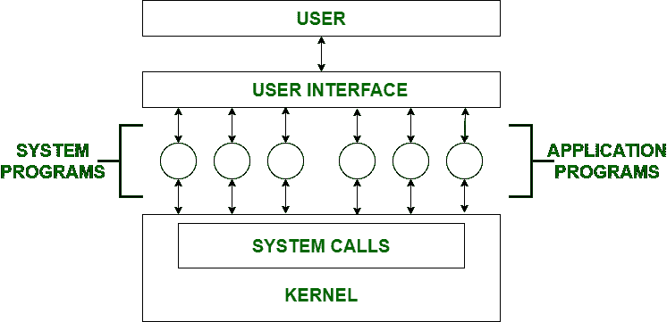

# 操作系统中的系统程序

> 原文:[https://www . geesforgeks . org/system-progres-in-operating-system/](https://www.geeksforgeeks.org/system-programs-in-operating-system/)

**系统编程**可以定义为使用系统编程语言构建系统软件的行为。根据计算机体系结构，最后一个是硬件。然后是操作系统、系统程序，最后是应用程序。程序开发和执行可以在系统程序中方便地完成。有些系统程序只是简单的用户界面，有些则很复杂。传统上，它位于用户界面和系统调用之间。

因此，在这里，用户只能查看他看不到的最新系统程序系统调用。
系统程序可分为以下几类:

1.  **文件管理–**
    文件是存储在计算机系统内存中的特定信息的集合。文件管理被定义为在计算机系统中操作文件的过程，其管理包括创建、修改和删除文件的过程。
    *   它有助于在计算机系统中创建新文件，并将其放置在特定位置。
    *   它有助于在计算机系统中轻松快速地定位这些文件。
    *   它使不同用户之间共享文件的过程变得非常容易和用户友好。
    *   它有助于将文件存储在称为目录的单独文件夹中。
    *   这些目录帮助用户快速搜索文件或根据文件的使用类型管理文件。
    *   它帮助用户修改文件的数据或修改目录中的文件名。

2.  **Status Information –** 
    Information like date, time amount of available memory, or disk space is asked by some users. Others providing detailed performance, logging, and debugging information which is more complex. All this information is formatted and displayed on output devices or printed. Terminal or other output devices or files or a window of GUI is used for showing the output of programs. 
3.  **File Modification –** 
    For modifying the contents of files we use this. For Files stored on disks or other storage devices, we used different types of editors. For searching contents of files or perform transformations of files we use special commands. 
4.  **Programming-Language support –** 
    For common programming languages, we use Compilers, Assemblers, Debuggers, and interpreters which are already provided to users. It provides all support to users. We can run any programming language. All languages of importance are already provided. 
5.  **Program Loading and Execution –** 
    When the program is ready after Assembling and compilation, it must be loaded into memory for execution. A loader is part of an operating system that is responsible for loading programs and libraries. It is one of the essential stages for starting a program. Loaders, relocatable loaders, linkage editors, and Overlay loaders are provided by the system. 
6.  **通信–**
    进程、用户和计算机系统之间的虚拟连接由程序提供。用户可以在屏幕上向另一个用户发送消息，用户可以发送电子邮件、浏览网页、远程登录、将文件从一个用户转换到另一个用户。

操作系统中系统程序的一些例子有–

*   Windows 10
*   Mac OS X
*   人的本质
*   Linux 操作系统
*   Unix 操作系统
*   机器人
*   反病毒
*   磁盘格式化
*   计算机语言翻译