# Windows 10 中的任务调度

> 原文:[https://www . geesforgeks . org/task-scheduling-in-windows-10/](https://www.geeksforgeeks.org/task-scheduling-in-windows-10/)

**任务调度器**是微软视窗系统的重要组成部分，它让用户能够根据自己的判断或在指定的时间跨度后计划项目或程序的启动。这是首次介绍在“微软 Plus”为 Windows-95 作为“系统代理”，然而，它被重命名为“任务调度器”。在任务计划程序启动之前，必须运行 Windows 事件日志管理。这种管理不应该与调度程序相混淆，调度程序是操作系统内核的核心部分，它将 CPU 资源分配给先前运行的度量。

任务计划程序管理通过控制任务来工作。任务是指由于触发器而采取的活动。一个任务由许多活动共同表征，这些活动可以包括启动一个应用程序或进行一些专门表征的移动到许多触发器，这些触发器可以是时间敏感的或基于场合的。

此外，任务还可以包含描述如何执行活动的元数据。示例–安全设置任务将在中运行。任务被序列化为”。作业”记录，并存放在名为“任务文件夹”的特殊组织器中，由子目录组成。隐式地，通过使用 ITaskFolder 接口或任务文件夹脚本对象以及使用 IRegisteredTask 接口或注册任务对象的单个任务，可以访问任务组织器。

现在，在使用任务计划程序实现任务自动化之前，我们需要对以下几点有基本的了解–

**触发器:**

*   当一些已经定义的事件发生时，触发器将执行特定的程序。
*   任务计划程序有两种触发器:“时间敏感触发器”和“基于事件的触发器”。
*   基于时间敏感场合的触发器用于在特定时间播放任务。
*   基于事件的触发器用于在任何系统事件发生时播放任务。

**动作:**

*   “动作”是循环的，在系统中执行触发器时发生，例如，启动程序、发送信件和显示消息等。

**基本任务调度程序:**

**步骤 1 :** 右键单击屏幕左下角显示的窗口徽标。然后，点击“运行”选项，运行提示打开。

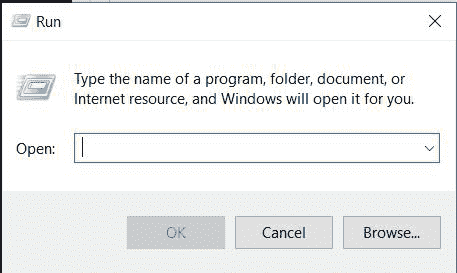

**第 2 步:**在已经打开的“运行”对话框中，在左窗格中键入以下命令，然后单击“确定”执行该命令。

```
taskschd.msc
```

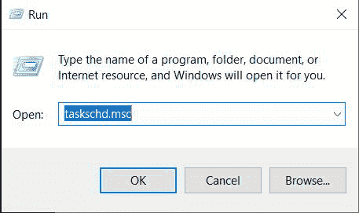

**第三步:**“任务调度器”对话框现在打开。在窗口的左窗格中，单击“任务计划程序库”以选择文件夹，然后右键单击该文件夹，并选择“新建文件夹”选项。

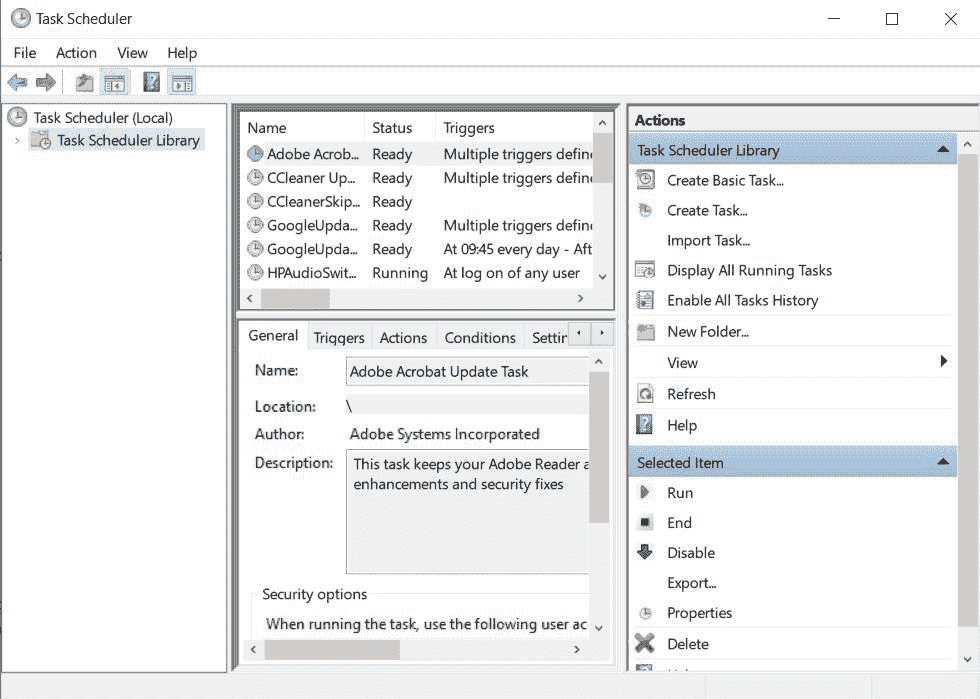

[](https://media.geeksforgeeks.org/wp-content/uploads/20200923133500/Capture4.JPG)

**第 4 步:**输入想要的文件夹名称，然后点击“确定”按钮。

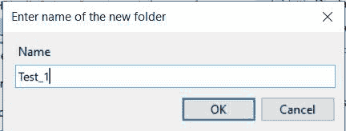

**第 5 步:**现在，导航到在“任务计划程序库”目录下创建的新文件夹，并选择您创建的文件夹，然后单击窗口右窗格上的“创建基本任务...”选项。

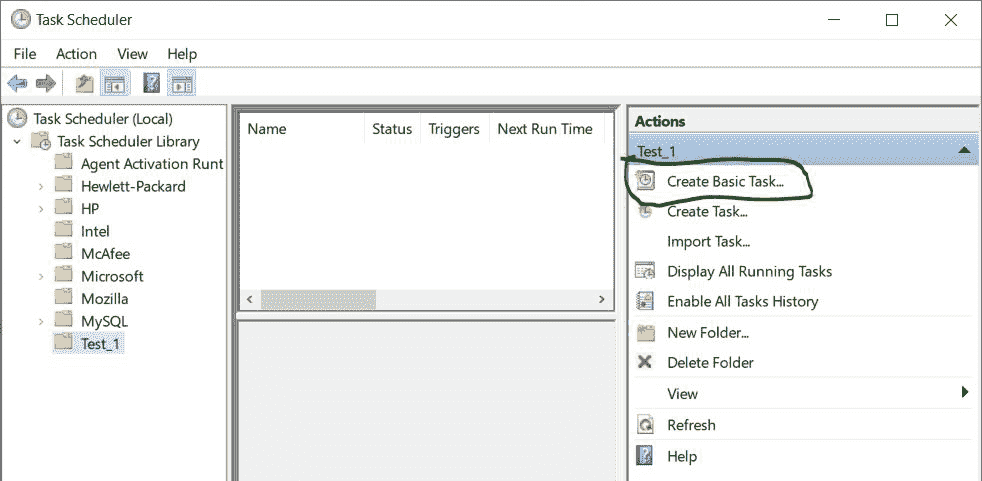

**步骤-6 :** 点击步骤-5 中提到的上一个选项后，你要给你的任务命名，建议名字要始终和它正在执行的任务相似，因为这样可以减少歧义，你也可以为你的任务提供描述，然后点击“下一步”按钮。

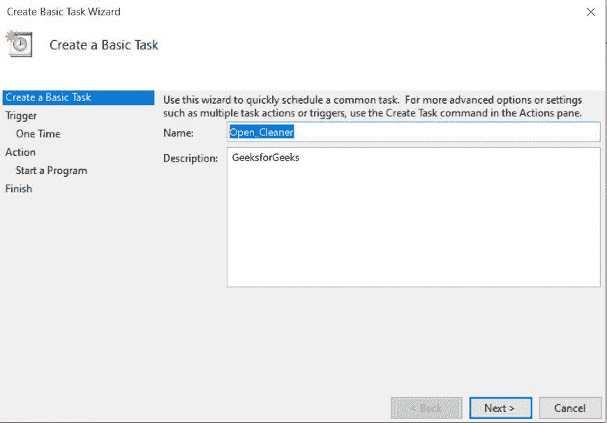

**第 7 步:**出现的下一个对话框是“触发”选项，在这里你可以根据自己的喜好选择任意选项，然后点击“下一步”按钮。

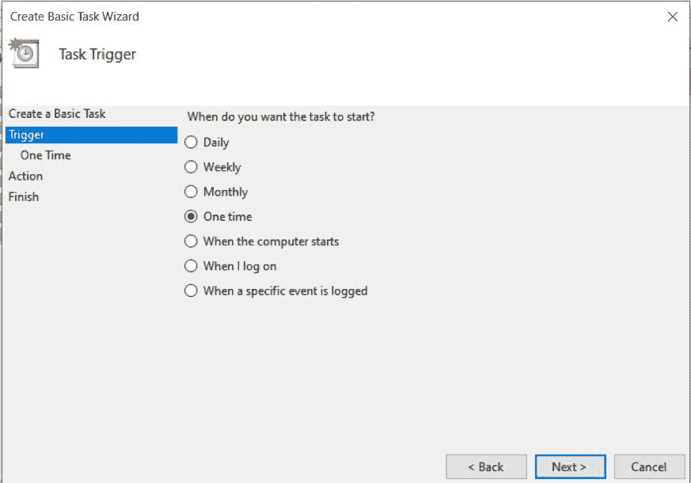

**第 8 步:**根据你的选项你会看到选项出现在你的屏幕上，所以此后设置任务的开始日期和时间，然后点击“下一步”按钮。

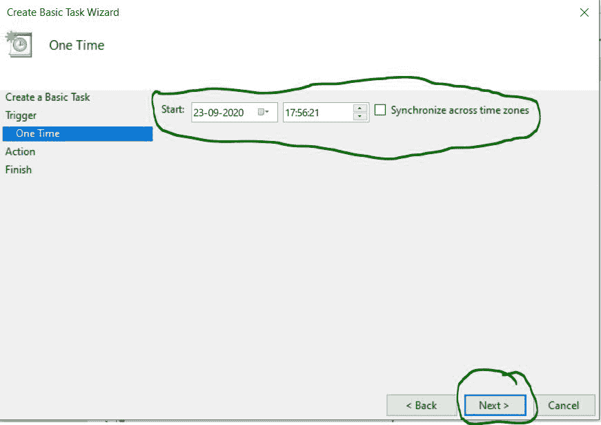

**第 9 步:**现在，从出现的三个选项中选择“启动程序”选项，但任何选项都可以根据你的任务进行选择。

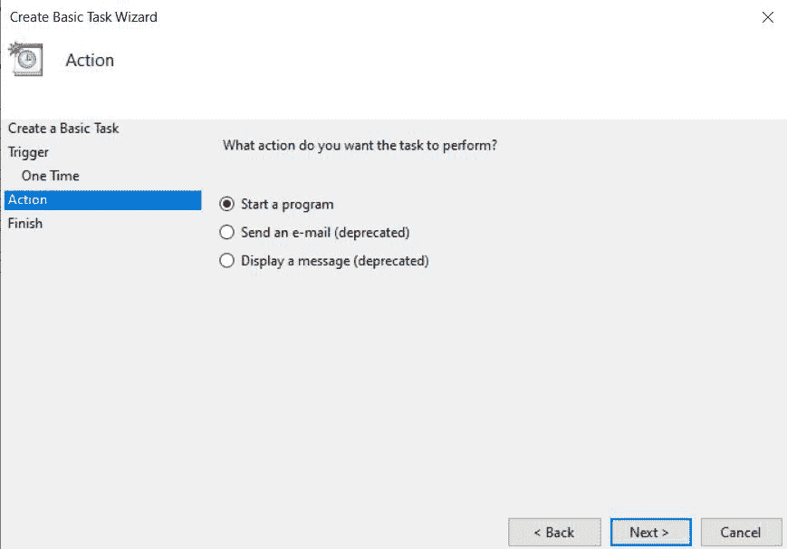

**第 10 步:**点击“浏览”按钮，选择您想要在指定时间运行的程序，然后点击“下一步”选项。

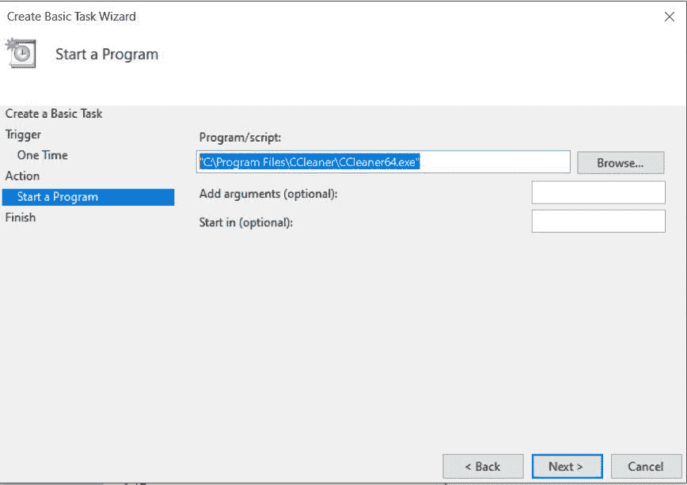

**第 11 步:**点击“下一步”选项后，我们会看到最后一个对话框，显示我们已经填写的所有信息，然后我们必须通过点击“完成”按钮来确认，然后我们的任务就会成功创建。

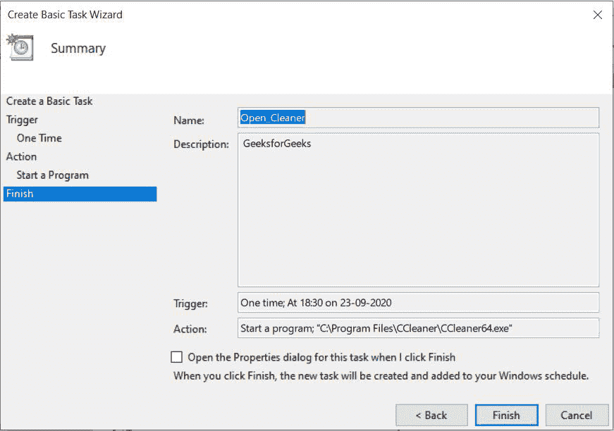

现在，分配的任务将在决定的时间开始。

**高级任务自动化程序:**

**步骤-1 :** 按照前面的步骤-1 到步骤-4，并相应地创建文件夹，然后单击该文件夹并选择右窗格上的“创建任务”选项。此外，一旦对话框出现，在顶部填充名称字段，显示您想要执行的任务，并在“安全选项”下根据您的需要选择首选项。

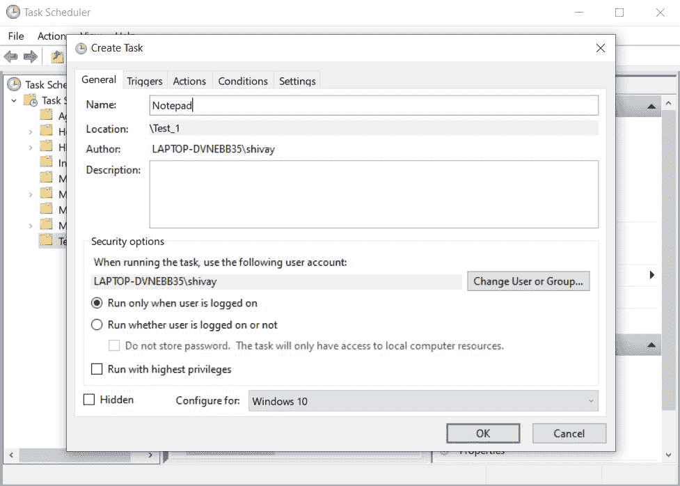

**第二步:**点击顶部的“触发器”选项卡，然后点击“新建”按钮。

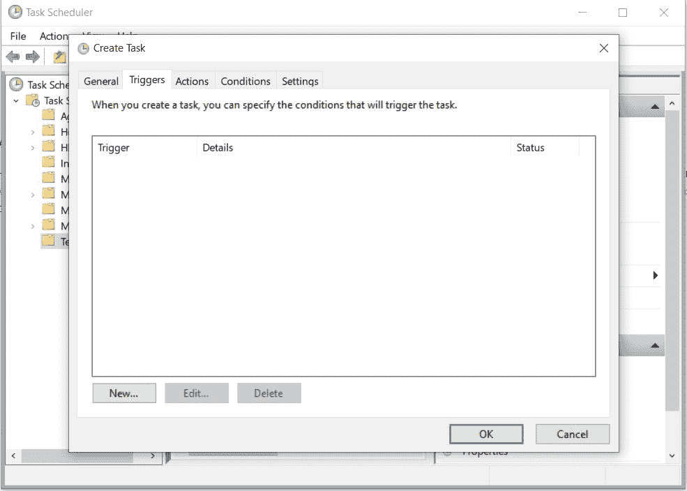

**步骤-3 :** 在新建选项对话框中，根据您的需要选择所有选项并设置执行程序的时间表，您也可以从高级选项中选择选项，然后点击“确定”按钮。

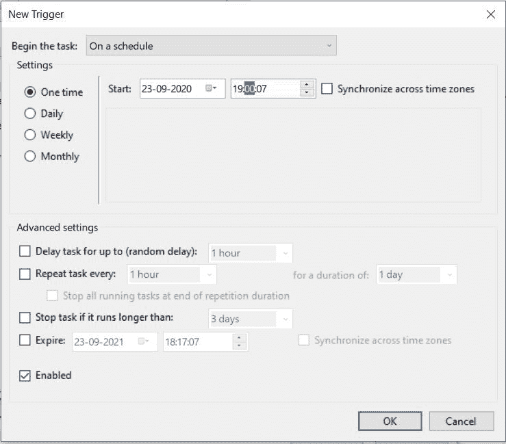

**第四步:**点击上方的“动作”选项卡，点击下方的“新建”选项。

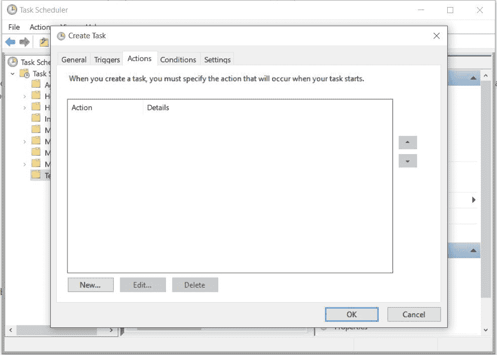

**第 5 步:**点击“浏览”按钮，然后点击“确定”选项，选择要自动运行的应用程序路径。

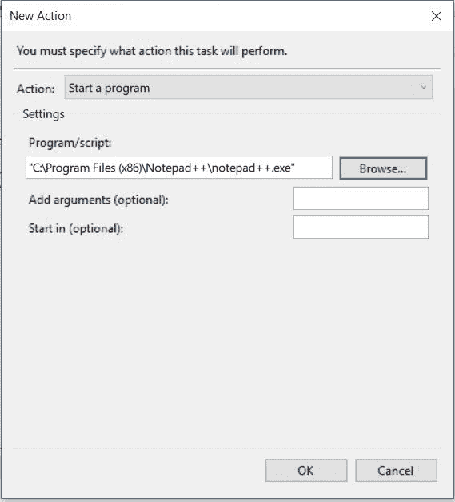

**第 6 步:**同样可以转到“条件”和“设置”选项卡，并相应地为自动化任务配置所有所需的设置。

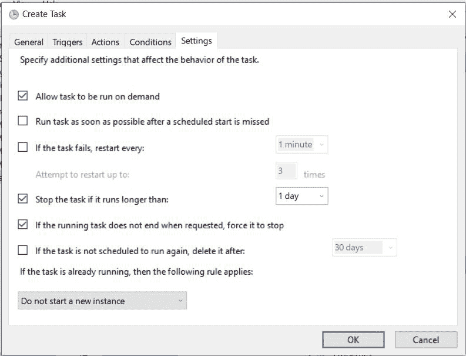

**第 7 步:**在您为程序配置好所有设置后，您可以点击“确定”选项，任务将在已经指定的文件夹中创建，并在已经指定的时间成功启动。

**结论:**我们已经在 Windows 10 中成功分配或创建了要在声明的时间自动完成的任务。