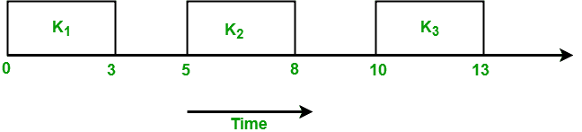
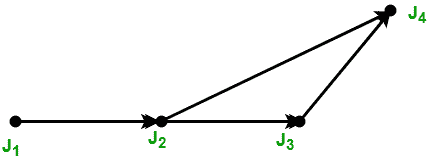

# 实时系统中的任务

> 原文:[https://www.geeksforgeeks.org/tasks-in-real-time-systems/](https://www.geeksforgeeks.org/tasks-in-real-time-systems/)

系统是实时的，即响应应保证在规定的时间限制内，或者系统应满足规定的截止日期。例如飞行控制系统、实时监视器等。

实时系统中有两种类型的任务:

1.  周期性任务
2.  动态任务

*   **周期性任务:**在周期性任务中，每隔一定时间发布一次作业。周期性任务是指在固定的时间间隔后重复进行的任务。周期任务由五个元组表示:**TI=<φI，P i ，e i ，D i >**
    其中，
    *   **φI**——是任务的阶段。阶段是任务中第一个作业的发布时间。如果没有提到阶段，那么第一个作业的发布时间被假定为零。
    *   **PI**–是任务的周期，即两个连续作业的发布时间之间的时间间隔。
    *   **eI**–是任务的执行时间。
    *   **DI**——是任务的相对截止时间。

例如:考虑任务 T i 周期= 5，执行时间= 3
相位未给定，假设第一个作业的发布时间为零。因此，该任务的作业首先在 t = 0 时释放，然后执行 3s，然后在 t = 5 时释放下一个作业，t = 5 时执行 3s，然后在 t = 10 时释放下一个作业。所以作业在 t = 5k 时释放，其中 k = 0，1，.。。，n

周期任务集合的超周期是该集合中所有任务周期的最小公倍数。例如，分别具有周期 4 和 5 的两个任务 T 1 和 T 2 将具有超周期，H = lcm(p1，p2) = lcm(4，5) = 20。超级周期是作业发布时间模式开始重复的时间。

*   **动态任务:**它是一个顺序程序，通过事件的发生来调用。事件可能由系统外部的进程或系统内部的进程生成。动态到达的任务可以根据其重要性和对其发生时间的了解进行分类。
    1.  **非周期性任务:**在这种类型的任务中，作业以任意的时间间隔发布，即随机发布。非周期性任务有软期限或没有期限。
    2.  **零星任务:**类似于非周期性任务，即随机重复执行。唯一不同的是，零星的任务有严格的期限。零星任务用三元组表示: **T i =(e i ，g i ，D i )**
        其中
        eI–任务的执行时间。
        **gI**–任务的两个连续实例发生之间的最小间隔。
        **DI**–任务的相对截止时间。

**抖动:**有时作业的实际发布时间是未知的。只知道 r i 在范围内【r i -，r i +】。这个范围被称为释放时间抖动。这里 rI–是一个作业可以多早发布，r i +是一个作业可以多晚发布。只有作业执行时间的范围[ e i -，e i + ]是已知的。这里 eI–是作业完成其执行所需的最小时间量，e i +是作业完成其执行所需的最大时间量。

**作业的优先约束:**任务中的作业如果可以按任意顺序执行，则是独立的。如果任务中的作业有一个特定的执行顺序，那么作业就被称为具有优先约束。为了表示作业的优先约束，使用了部分顺序关系<。这叫做优先关系。作业 J i 是作业 J j 的前身，如果作业 JIT68】JJ即作业 J j 在作业 J i 完成之前不能开始执行。J i 是 J j 的直接前身如果 JIT69】JJ并且没有其他工作 J k 使得 JIT70】JkT71】JJ。J i 和 J j 如果 JIT72】JJ和 JJT73】JI都不是真的，那么它们就是独立的。
表示优先约束的有效方法是使用有向图 G = (J，<)，其中 J 是作业集。这个图被称为优先图。作业用图的顶点表示，优先约束用有向边表示。如果存在从 J i 到 J j 的定向边，则意味着 J i 是 J j 的直接前身。例如:考虑一个任务 T 有 5 个作业 J 1 、J 2 、J 3 、J 4 和 J 5 ，使得 J 2 和 J 5 在 J 1 完成并且没有其他约束之前不能开始它们的执行。

此示例的优先约束为:
J1T9】J2和 J1T10】J5

优先图的集合表示:

1.  < (1) = { }
2.  < (2) = {1}
3.  < (3) = { }
4.  < (4) = { }
5.  < (5) = {1}

考虑另一个例子，其中给出了一个优先图，你必须找到优先约束

从上图中，我们导出了以下优先约束:

1.  J1T4 J2
2.  J2T4 J3
3.  J2T4 J4
4.  J3T4 J4