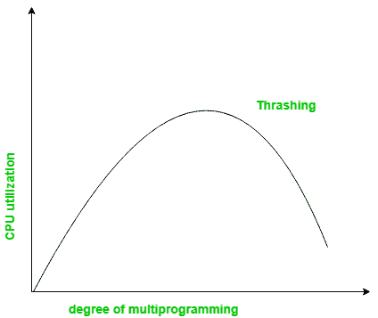
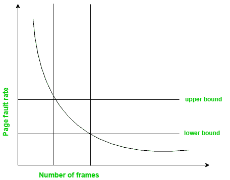

# 处理抖动的技术

> 原文:[https://www . geesforgeks . org/technologies-to-hand-thrashing/](https://www.geeksforgeeks.org/techniques-to-handle-thrashing/)

先决条件–[虚拟内存](https://www.geeksforgeeks.org/virtual-memory-operating-systems/)

**抖动**是系统花费大部分时间来处理页面错误的一种情况，但是实际完成的处理可以忽略不计。

涉及的基本概念是，如果一个进程被分配的帧太少，那么就会有太多太频繁的页面错误。因此，中央处理器不会做任何有用的工作，中央处理器的利用率将大幅下降。然后，长期调度程序会尝试通过将更多的进程加载到内存中来提高 CPU 利用率，从而提高多道程序设计的程度。这将导致 CPU 利用率进一步降低，引发更高页面错误的连锁反应，随后是多道程序设计程度的提高，称为抖动。

**地点模型–**
地点是一组被一起主动使用的页面。局部模型指出，当一个进程执行时，它从一个局部移动到另一个局部。一个程序通常由几个可能重叠的不同地点组成。

例如，当一个函数被调用时，它定义了一个新的位置，在这个位置内存引用函数调用的指令，它的局部和全局变量，等等。类似地，当函数退出时，进程离开这个位置。

**处理技术:**

**1。工作集模型–**

该模型基于上述位置模型的概念。
基本原理是，如果我们给一个进程分配足够的帧来容纳它当前的局部性，那么它只会在移动到某个新的局部性时出错。但是，如果分配的帧小于当前位置的大小，该过程必然会失败。

根据该模型，基于参数 A，工作集被定义为最近“A”个页面引用中的一组页面。因此，所有活跃使用的页面最终都会成为工作集的一部分。

工作集的精度取决于参数 A 的值。如果 A 太大，则工作集可能重叠。另一方面，对于较小的 A 值，局部性可能无法完全覆盖。

如果 D 是对框架的总需求，是过程 I 的工作集大小，

现在，如果“m”是内存中可用的帧数，有两种可能:

*   (i) D>m，即总需求超过了帧数，那么将会发生抖动，因为一些进程将得不到足够的帧数。
*   (ii) D<=m，则不会出现抖动。

**2。页面故障频率–**

处理抖动的更直接的方法是使用页面故障频率的概念。

与抖动相关的问题是高页面错误率，因此，这里的概念是控制页面错误率。
如果页面错误率太高，则表示进程分配给它的帧太少。相反，较低的页面错误率表明进程有太多的帧。
如图所示，可以根据所需的页面错误率建立上限和下限。
如果页面错误率低于下限，可以从进程中删除帧。同样，如果页面错误率超过上限，可以为进程分配更多的帧数。
换句话说，系统的图形状态应保持限制在给定图表中形成的矩形区域内。
这里也是，如果页面错误率高，没有空闲帧，那么一些进程可以暂停，分配给它们的帧可以重新分配给其他进程。暂停的进程随后可以重新启动。