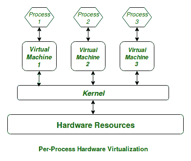
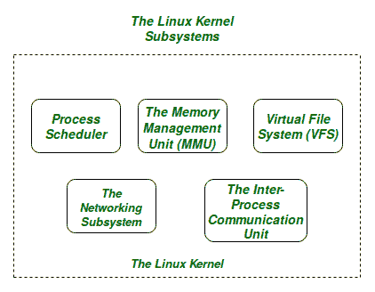

# Linux 内核

> 原文:[https://www.geeksforgeeks.org/the-linux-kernel/](https://www.geeksforgeeks.org/the-linux-kernel/)

计算机的主要目的是运行一个预先定义的指令序列，即 T2 程序。正在执行的程序通常被称为**过程**。现在，大多数专用计算机是用来运行单个进程的，但是在复杂的系统中，例如通用计算机，是用来同时运行多个进程的。任何类型的进程都需要硬件资源，如内存、处理器时间、存储空间等。

在同时运行多个进程的通用计算机中，我们需要一个中间层来有效和公平地管理计算机硬件资源在计算机上运行的各种进程之间的分配。这个中间层被称为**内核**。基本上，内核虚拟化计算机的公共硬件资源，为每个进程提供自己的虚拟资源。这使得该过程看起来像是机器上运行的唯一过程。内核还负责防止和减轻不同进程之间的冲突。

这示意性地表示如下:

**Figure:** Virtual Resources for each Process

**Linux 内核**的**核心子系统**如下:

1.  进程调度程序
2.  内存管理单元
3.  虚拟文件系统(VFS)
4.  网络股
5.  进程间通信股

**Figure:** The Linux Kernel

出于本文的目的，我们将只关注 Linux 内核的前三个重要子系统。

前三个子系统的基本功能详述如下:

*   **进程调度器:**
    这个内核子系统负责在系统上同时运行的所有进程之间公平分配 CPU 时间。
*   **内存管理单元:**
    这个内核子单元负责在系统上运行的各种进程之间正确分配内存资源。MMU 不仅仅是为每个进程提供单独的虚拟地址空间。
*   **虚拟文件系统:**
    该子系统负责提供统一的接口，以跨不同的文件系统和物理存储介质访问存储的数据。