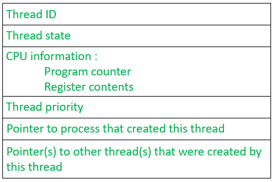

# 操作系统中的线程控制块

> 原文:[https://www . geesforgeks . org/thread-control-block-in-operating-system/](https://www.geeksforgeeks.org/thread-control-block-in-operating-system/)

与代表进程的[进程控制块](https://www.geeksforgeeks.org/process-table-and-process-control-block-pcb/)非常相似，**线程控制块**代表系统中生成的线程。它包含关于线程的信息，比如它的标识和状态。

组件定义如下:

*   **线程 ID:** 是操作系统在创建线程时分配给线程的唯一标识符。
*   **线程状态:**这些是线程的状态，随着线程在系统中的前进而改变
*   **CPU 信息:**包括了 OS 需要知道的一切，比如线程进展到什么程度，正在使用什么数据。
*   **线程优先级:**它表示线程相对于其他线程的权重(或优先级)，这有助于线程调度器确定下一个应该从就绪队列中选择哪个线程。
*   一个**指针**，它指向触发该线程创建的进程。
*   指向由该线程创建的线程的**指针**。