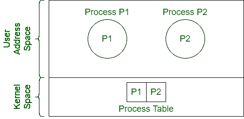
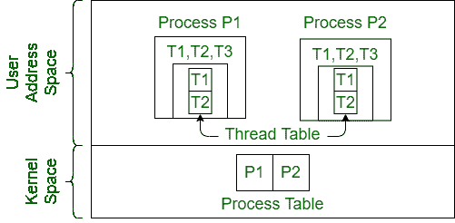
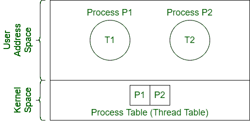
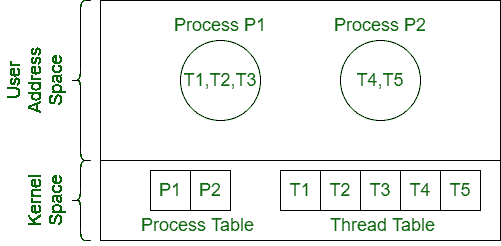

# 操作系统中的线程模型

> 原文:[https://www . geesforgeks . org/thread-models-in-operating-system/](https://www.geeksforgeeks.org/thread-models-in-operating-system/)

线程是一个轻量级的进程，类似于每个进程可以有一个或多个线程的进程。每个线程包含一个堆栈和一个线程控制块。有四种基本线程模型:

**1。用户级单线程模型:**

*   每个进程包含一个线程。
*   单个进程本身就是一个线程。
*   工艺表包含通过维护其 PCB 的每个工艺的条目。

**2。用户级多线程模型:**

*   每个进程包含多个线程。
*   进程的所有线程都由用户级的线程库调度。
*   线程切换比进程切换要快。
*   线程切换独立于操作系统，可以在进程内完成。
*   阻塞一个线程会阻塞整个进程。
*   线程表维护进程中每个线程的线程控制块。
*   线程调度发生在一个进程内，而内核不知道。

**3。内核级单线程模型:**

*   每个进程包含一个线程。
*   这里使用的线程是内核级线程。
*   进程表作为线程表工作。

**4。内核级多线程模型:**

*   线程调度在内核级完成。
*   细粒度调度是在线程的基础上完成的。
*   如果一个线程阻塞，可以调度另一个线程，而不会阻塞整个进程。
*   内核进程的线程调度比用户级线程调度慢。
*   线程切换涉及到切换。

