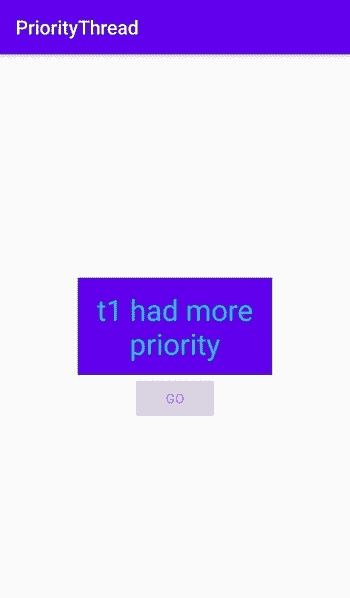

# 科特林&安卓

线程优先级

> 原文:[https://www . geesforgeks . org/thread-priority-in-kot Lin-Android/](https://www.geeksforgeeks.org/thread-priority-in-kotlin-android/)

进程中的每个线程都有一个**优先级**。它们在 1 到 10 的范围内。在**线程调度器**的帮助下，线程根据其优先级进行调度。
一个线程可以设置 3 个优先级常量，它们是:

*   最小优先级等于 1
*   最大优先级等于 10
*   NORM_PRIORITY 为**默认值**，等于 5

下面是检查两个线程优先级的代码。

**检查线程的当前优先级:**

```
val t1 = Thread(Runnable{
    // Some Activity
})

    val t2
    = Thread(Runnable{
        // Some Activity
    })

        println("${t1.priority} ${t2.priority}")
```

```
Output: 5 5

```

两个线程的输出与**相同，一个线程的默认优先级**为 5。
**给线程分配新的优先级:**
下面两个线程被分配不同的优先级。线程 t1 被分配 1，线程 t2 被分配 10。由于线程 **t1** 优先级更高，所以先启动，其余线程按优先级启动。优先级可以隐式或显式声明。

```
val t1 = Thread(Runnable{
    // Some Activity
})

    val t2= Thread(Runnable{
        // Some Activity
    })

    t1.priority= 1 
    t2.priority = 10

    println("${t1.priority} ${t2.priority}")
```

```
Output : 1 10

```

同样可以在安卓应用中实现，下面是一个例子。
**Android 中的例子:**
尝试在 Android 中运行下面的程序，检查代码内声明的两个线程的优先级。当用户点击按钮时，优先级更高的线程启动。

```
package com.example.gfg

    import androidx.appcompat.app.AppCompatActivity import android.os.Bundle import android.widget.Button import android.widget.TextView

    class MainActivity : AppCompatActivity() {
    override fun onCreate(savedInstanceState: Bundle?)
    {
        super.onCreate(savedInstanceState)
            setContentView(R.layout.activity_main)

                val tv = findViewById<TextView>(R.id.tv)
                val btn1= findViewById<Button>(R.id.btn1)

                val t1 = Thread(Runnable{
                tv.text = "t1 had more priority" })

                val t2= Thread(Runnable{
                tv.text = "t2 had more priority" })

                t1.priority= 1 
                t2.priority = 10

               btn1.setOnClickListener{
               when{
                t1.priority < t2.priority -> t1.start() t2.priority < t1.priority -> t2.start() else -> tv.text = 
                 "Both had same priority"
                }
            btn1.isEnabled = false
        }
    }
}
```

下面的 XML 代码用于布局。

```
<?xml version="1.0" encoding="utf-8"?>
<RelativeLayout xmlns:android="http://schemas.android.com/apk/res/android"
    xmlns:app="http://schemas.android.com/apk/res-auto"
    xmlns:tools="http://schemas.android.com/tools"
    android:layout_width="match_parent"
    android:layout_height="match_parent"
    tools:context=".MainActivity">

    <TextView
        android:id="@+id/tv"
        android:layout_width="200sp"
        android:layout_height="100sp"
        android:gravity="center"
        android:textColor="@color/colorAccent"
        android:background="@color/colorPrimary"
        android:layout_centerInParent="true"
        android:textSize="30sp"
        />

    <Button
        android:id="@+id/btn1"
        android:layout_width="wrap_content"
        android:layout_height="wrap_content"
        android:text="Go"
        android:layout_centerHorizontal="true"
        android:layout_below="@id/tv"
        />

</RelativeLayout>
```

**输出**:

