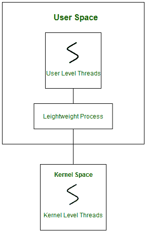
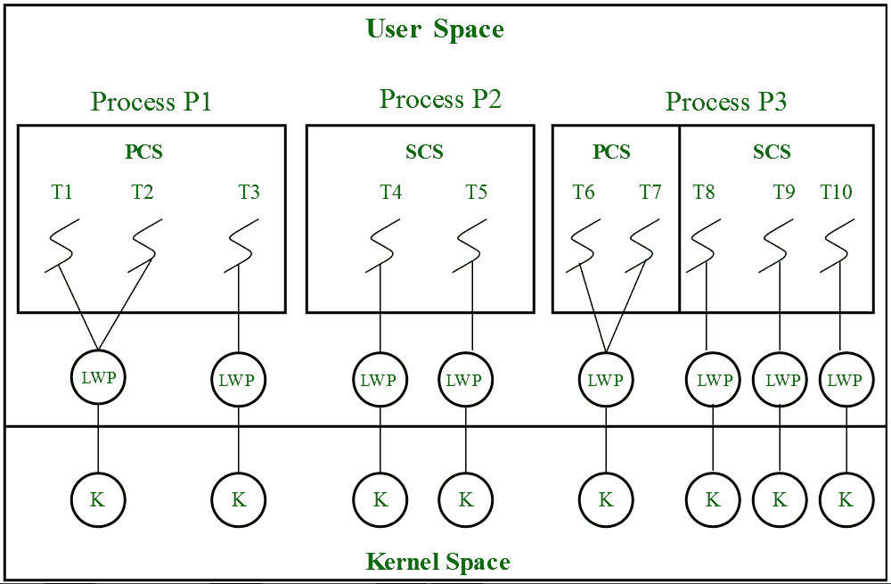

# 线程调度

> 原文:[https://www.geeksforgeeks.org/thread-scheduling/](https://www.geeksforgeeks.org/thread-scheduling/)

[线程](https://www.geeksforgeeks.org/threads-and-its-types-in-operating-system/)的调度涉及两个边界调度，

*   应用程序开发人员通过 leightweight 进程(LWP)将用户级线程(ULT)调度到内核级线程(KLT)。
*   系统调度程序对内核级线程的调度，以执行不同的独特操作系统功能。

**轻量级进程(LWP) :**
轻量级进程是用户空间中的线程，充当 ULT 访问物理 CPU 资源的接口。线程库调度进程的哪个线程在哪个 LWP 上运行以及运行多长时间。线程库创建的 LWP 数取决于应用程序的类型。在 I/O 绑定应用程序的情况下，LWP 的数量取决于用户级线程的数量。这是因为当一个 LWP 在一个输入/输出操作中被阻塞时，为了调用另一个 ULT，线程库需要创建和调度另一个 LWP。因此，在输入/输出绑定应用程序中，LWP 的数量等于 ULT 的数量。在 CPU 绑定应用程序的情况下，它只取决于应用程序。每个 LWP 都连接到一个独立的内核级线程。



在实时中，线程调度的第一个边界超出了指定调度策略和优先级。它要求为用户级线程指定两个控件:争用范围和分配域。这些解释如下。

**1。争用范围:**
这里的争用一词指的是用户级线程之间为访问内核资源而进行的竞争或争斗。因此，该控件定义了发生争用的程度。它是由应用程序开发人员使用线程库定义的。根据争用程度，分为**流程争用范围**和**系统争用范围**。

1.  **进程争用范围(PCS)–**
    争用发生在同一进程内的线程**之间。线程库调度高优先级的 PCS 线程通过可用的 LWPs 访问资源(优先级由应用程序开发人员在线程创建期间指定)。**
2.  **System Contention Scope (SCS) –**
    The contention takes place among **all threads in the system**. In this case, every SCS thread is associated to each LWP by the thread library and are scheduled by the system scheduler to access the kernel resources.

    在 LINUX 和 UNIX 操作系统中，POSIX Pthread 库提供了一个函数 *Pthread_attr_setscope* 来定义线程创建期间的争用范围类型。

    ```
    int Pthread_attr_setscope(pthread_attr_t *attr, int scope) 
    ```

    第一个参数表示范围被定义到进程中的哪个线程。
    第二个参数定义了指向的线程的争用范围。它需要两个值。

    ```
    PTHREAD_SCOPE_SYSTEM
    PTHREAD_SCOPE_PROCESS 
    ```

    如果系统不支持指定的范围值，则函数返回 *ENOTSUP* 。

**2。分配域:**
分配域是**一个线程正在竞争的一个或多个资源**的集合。在多核系统中，可能有一个或多个分配域，每个分配域由一个或多个内核组成。一个 ULT 可以是一个或多个分配域的一部分。由于处理硬件和软件架构接口的复杂性很高，因此没有指定该控件。但是默认情况下，多核系统会有一个影响线程分配域的接口。

考虑一个场景，一个具有三个进程 P1、P2、P3 和 10 个用户级线程(T1 到 T10)的操作系统有一个分配域。100%的 CPU 资源将分布在所有三个进程中。分配给每个进程和每个线程的 CPU 资源量取决于应用程序开发人员使用线程库定义的每个线程的争用范围、调度策略和优先级，还取决于系统调度程序。这些用户级线程属于不同的争用范围。



在这种情况下，分配域的竞争发生如下，

1.  **进程 P1:**
    进程 P1 的所有 PCS 线程 T1、T2、T3 将相互竞争。同一进程的 PCS 线程可以共享一个或多个 LWP。T1 和 T2 共享一个 LWP，T3 分配给一个单独的 LWP。在 T1 和 T2 之间，通过 LWP 分配内核资源是基于线程库的抢占式优先级调度。具有高优先级的线程将抢占低优先级的线程。而进程 p1 的线程 T1 不能抢占进程 p3 的线程 T3，即使 T1 的优先级大于 T3 的优先级。如果优先级相等，则根据系统调度器的线程调度策略(在这种情况下，不是通过线程库)将 ULT 分配给可用的 LWPs。
2.  **进程 P2:**
    进程 P2 的 SCS 线程 T4 和 T5 都将与进程 P1 作为一个整体，与进程 P3 的 SCS 线程 T8、T9、T10 竞争。系统调度器将在进程 P3 的 P1、T4、T5、T8、T9、T10 和 PCS 线程(T6、T7)之间调度内核资源，将每个线程视为单独的进程。这里，线程库无法控制内核资源的 ULT 调度。
3.  **进程 P3:**
    PCS 和 SCS 线程的组合。考虑一下，如果系统调度器分配 50%的 CPU 资源来处理 P3，那么 25%的资源用于进程范围的线程，剩余的 25%用于系统范围的线程。PCS 线程 T6 和 T7 将根据线程库的优先级被分配来访问 25%的资源。SCS 线程 T8、T9、T10 将在它们之间划分 25%的资源，并通过单独的 LWP 和 KLT 访问内核资源。SCS 调度是由系统调度器执行的。

**注意:**
对于每个访问内核资源的系统调用，系统调度器都会创建一个内核级线程并关联到单独的 LWP。

```
Number of Kernel Level Threads = Total Number of LWP 
Total Number of LWP = Number of LWP for SCS + Number of LWP for PCS
Number of LWP for SCS = Number of SCS threads
Number of LWP for PCS = Depends on application developer 
```

在这里，

```
Number of SCS threads = 5 
Number of LWP for PCS = 3 
Number of SCS threads = 5 
Number of LWP for SCS = 5 
Total Number of LWP   = 8 (=5+3)
Number of Kernel Level Threads = 8 
```

**PCS 相对于 SCS 的优势:**

*   如果所有线程都是 PCS，那么上下文切换、同步、调度一切都在用户空间内进行。这减少了系统调用并获得了更好的性能。
*   PCS 比 SCS 便宜。
*   PCS 线程共享一个或多个可用的 lwp。对于每个 SCS 线程，都有一个单独的 LWP 相关联。对于每个系统调用，都会创建一个单独的 KLT。
*   创建的 KLT 和 lwp 的数量在很大程度上取决于创建的 SCS 线程的数量。这增加了处理调度和同步的内核复杂性。因此，导致对 SCS 线程创建的限制，声明 SCS 线程的数量小于 PCS 线程的数量。
*   如果系统有多个分配域，那么资源的调度和同步就变得更加繁琐。当一个 SCS 线程是多个分配域的一部分时，系统必须处理 n 个接口，就会出现问题。

线程调度的第二个边界涉及到系统调度器对 CPU 的调度。调度器将每个内核级线程视为一个独立的进程，并提供对内核资源的访问。