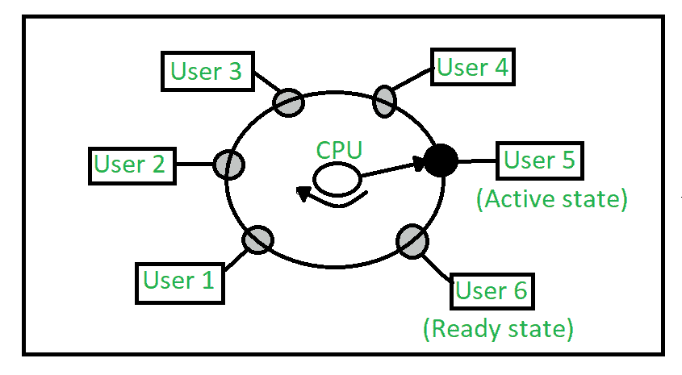

# 分时操作系统

> 原文:[https://www . geesforgeks . org/分时操作系统/](https://www.geeksforgeeks.org/time-sharing-operating-system/)

多程序、成批系统提供了一个环境，在这个环境中，各种系统资源得到了有效利用，但它没有提供用户与计算机系统的交互。分时是多道程序设计的逻辑扩展。中央处理器通过开关执行许多任务，开关如此频繁，以至于用户可以在每个程序运行时与之交互。

分时操作系统允许多个用户同时共享计算机。共享系统每次的每个动作或命令都会变小，因此每个用户只需要很少的 CPU 时间。当系统从一个用户快速切换到另一个用户时，每个用户都给人一种印象，即整个计算机系统都专用于其使用，尽管它是由多个用户共享的。

一个**时间共享操作系统**使用 CPU 调度和多编程，一次为每个人提供一小部分共享计算机。每个用户在内存中至少有一个单独的程序。一个装入内存并执行的程序，它在完成之前或完成输入输出之前执行一小段时间。这段用户引起中央处理器注意的短时间被称为**时间片、时隙或时间段**。它通常约为 10 到 100 毫秒。分时操作系统比多程序操作系统更复杂。在这两种情况下，多个作业必须同时保存在内存中，因此系统必须具有内存管理和安全性。为了获得良好的响应时间，作业可能必须从主内存换入和换出磁盘，主内存现在充当主内存的后备存储。实现这一目标的常见方法是虚拟内存，这是一种允许执行可能不完全在内存中的作业的技术。

在上图中，用户 5 处于**活动状态**，但是用户 1、用户 2、用户 3 和用户 4 处于**等待状态**，而用户 6 处于**就绪状态。**

1.  **活动状态–**
    用户的程序在 CPU 的控制下。在这种状态下只有一个程序可用。
2.  **就绪状态–**
    用户程序已经准备好执行，但它正在等待轮到它获取 CPU。一次可以有多个用户处于就绪状态。
3.  **等待状态–**
    用户程序正在等待一些输入输出操作。一次可以有多个用户处于等待状态。

**分时操作系统的要求:**
一种闹钟机制，在每个时间片后向 CPU 发送中断信号。防止一个作业的指令和数据干扰其他作业的内存保护机制。

**优势:**

1.  每项任务都有平等的机会。
2.  软件复制的机会更少。
3.  可以减少 CPU 空闲时间。

**缺点:**

1.  可靠性问题。
2.  必须考虑用户程序和数据的安全性和完整性。
3.  数据通信问题。