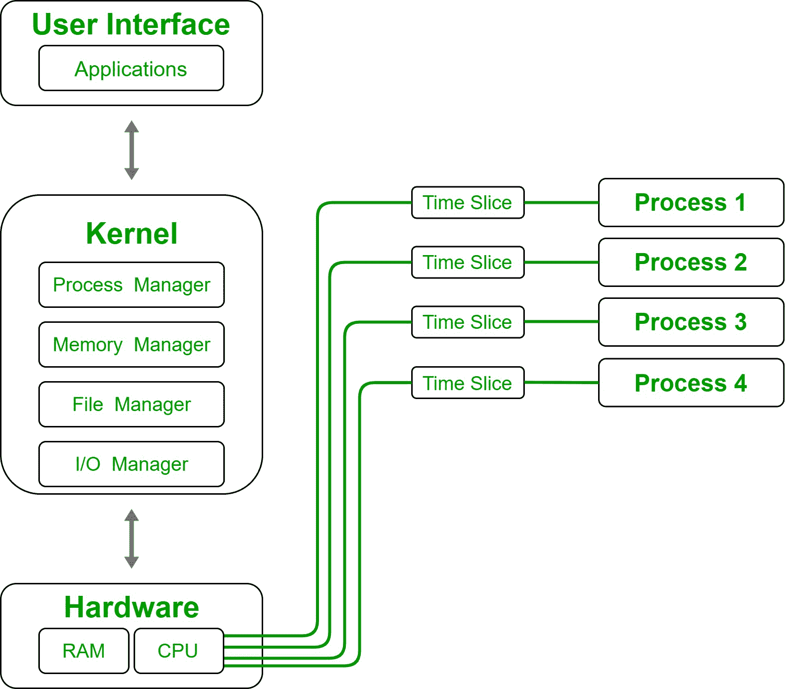
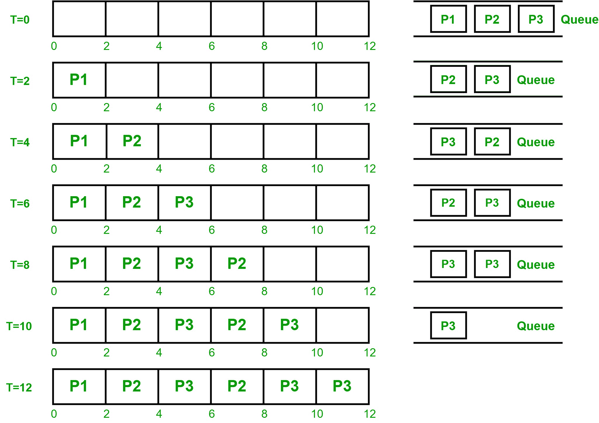

# CPU 调度中的时间分片

> 原文:[https://www . geeksforgeeks . org/CPU 时间分片调度/](https://www.geeksforgeeks.org/time-slicing-in-cpu-scheduling/)

CPU 内核不是简单地将我们个人电脑的全部资源分配给单个进程或服务。CPU 正在持续运行许多对其运行至关重要的进程，因此我们的内核需要管理这些进程，没有片刻的延迟。

当程序需要运行时，必须为其创建进程。这个过程需要像内存和中央处理器这样的重要资源。内核为中央处理器安排时间周期来执行进程中的命令和指令。尽管如此，还是只有一个中央处理器和许多进程。

CPU 如何出色地执行不同的进程而没有片刻的延迟？它通过按时间片逐个执行进程来实现。时间片是分配给中央处理器执行的进程的短时间帧。

**时间片:**
这是分配给进程在抢先多任务 CPU 中运行的时间范围。调度程序在每个时间片运行每个进程。每个时间片的周期对于平衡中央处理器的性能和响应能力非常重要。

如果时间片很短，调度程序将花费更多的处理时间。相反，如果时间片太长，调度程序将再次花费更多的处理时间。

当进程被分配给中央处理器时，时钟定时器被设置为对应于时间片。

*   如果进程在时间片之前完成了它的突发，中央处理器就像传统的 FCFS 计算一样简单地将其交换出去。
*   如果时间片首先消失，CPU 会将其移出到正在进行的队列的后面。

正在进行的队列像循环队列一样管理，因此，在所有进程执行一次后，调度程序再次执行第一个进程，然后执行第二个进程，依此类推。

**示例–**

| 进程队列 | 按进程划分的所需突发时间(毫秒) |
| 第一亲代 | one |
| P2 | four |
| P3 | five |

我们有三个进程(P1、P2、P3)及其相应的突发时间(1 毫秒、4 毫秒、5 毫秒)。经验法则是，80%的 CPU 突发应该小于时间量。考虑到 2 毫秒的时间片。
下面是 CPU 如何通过时间分片进行管理。

流程管理的时间切片方法

**优势:**

*   CPU 资源的公平分配。
*   它以同等的优先级处理所有进程。
*   易于在系统上实现。
*   用于保存抢占进程状态的上下文切换方法
*   在平均处理时间方面提供最佳性能。

**缺点:**

*   如果切片时间短，处理器输出将会延迟。
*   它花时间在上下文切换上。
*   性能在很大程度上取决于时间量。
*   流程的优先级不能固定。
*   更重要的任务没有优先权。
*   找到一个合适的时间量是相当困难的。