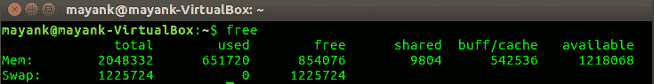
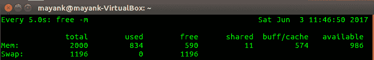
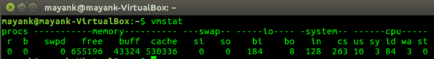
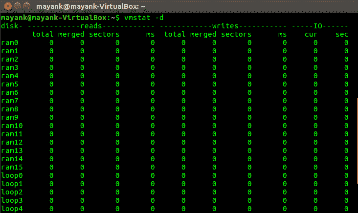
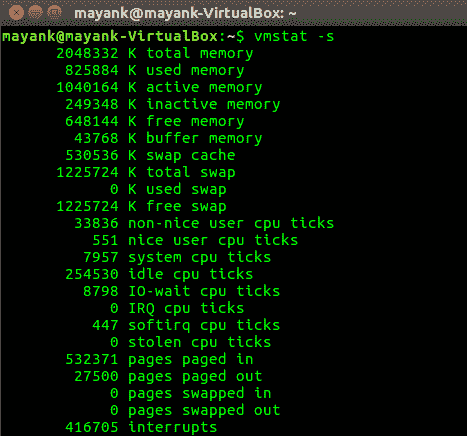
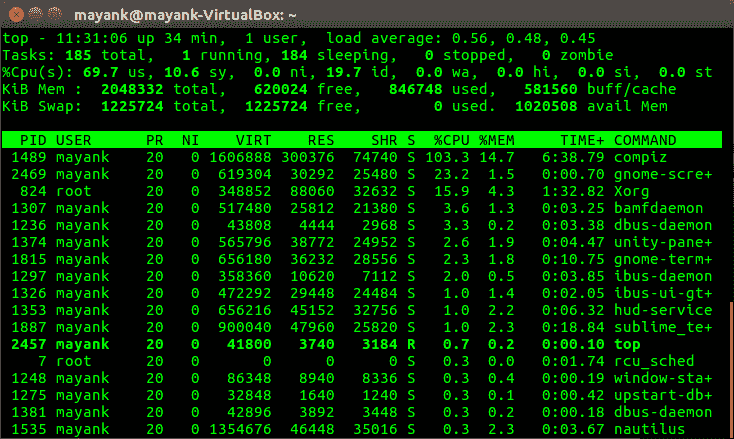
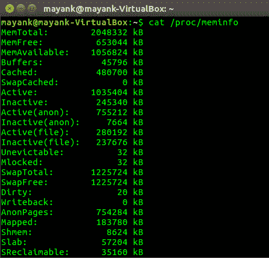
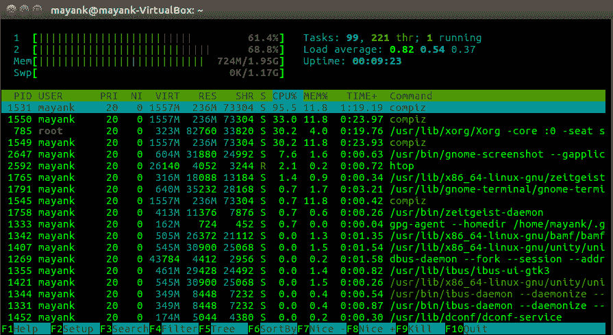

# 跟踪 Linux 中的内存使用情况

> 原文:[https://www.geeksforgeeks.org/tracing-memory-usage-linux/](https://www.geeksforgeeks.org/tracing-memory-usage-linux/)

通常需要跟踪系统的内存使用情况，以确定消耗所有 CPU 资源的程序或导致 CPU 活动变慢的程序。跟踪内存使用情况对于确定服务器上的负载也很有必要。解析使用数据使服务器能够平衡负载并满足用户的请求，而不会降低系统的速度。

1.  **free** Displays the amount of memory which is currently available and used by the system(both physical and swapped). free command gathers this data by parsing /proc/meminfo. By default, the amount of memory is display in kilobytes.

    **UNIX 中的自由命令**

    [](https://media.geeksforgeeks.org/wp-content/uploads/Screenshot-from-2017-06-03-11-16-35-e1496478387353.png)

    ```
    watch -n 5 free -m watch command is used to execute a program periodically.
    ```

    [](https://media.geeksforgeeks.org/wp-content/uploads/Screenshot-from-2017-06-03-11-46-53-e1496478442792.png)

    根据上图，总共有 2000 兆内存和 1196 兆交换空间分配给 Linux 系统。在这 2000 兆的内存中，目前有 834 兆用于 590 兆的空闲空间。同样，对于交换空间，在 1196 兆字节中，0 兆字节正在使用，1196 兆字节当前在系统中可用。

2.  **vmstat** vmstat command is used to display virtual memory statistics of the system. This command reports data about the memory, paging, disk and CPU activities, etc. The first use of this command returns the data averages since the last reboot. Further uses returns the data based on sampling periods of length delays.

    [](https://media.geeksforgeeks.org/wp-content/uploads/Screenshot-from-2017-06-03-11-21-16-e1496478359885.png)

    ```
    vmstat -d Reports disk statistics
    ```

    [](https://media.geeksforgeeks.org/wp-content/uploads/Screenshot-from-2017-06-03-11-21-50.png)

    ```
    vmstat -s Displays the amount of memory used and available
    ```

    [](https://media.geeksforgeeks.org/wp-content/uploads/Screenshot-from-2017-06-03-11-22-54-e1496478489876.png)

3.  **top** top command displays all the currently running process in the system. This command displays the list of processes and thread currently being handled by the kernel. top command can also be used to monitor the total amount of memory usage.

    [](https://media.geeksforgeeks.org/wp-content/uploads/Screenshot-from-2017-06-03-11-31-08.png)

    ```
     top -H Threads-mode operation
        Displays individual thread that are currently in the system. Without this command 
    option, a summation of all thread in each process is displayed.
    ```

    [](https://media.geeksforgeeks.org/wp-content/uploads/Screenshot-from-2017-06-03-11-34-39.png)

4.  **/proc/meminfo** This file contains all the data about the memory usage. It provides the current memory usage details rather than old stored values.

    [](https://media.geeksforgeeks.org/wp-content/uploads/Screenshot-from-2017-06-03-11-42-25-e1496478415564.png)

5.  **htop** htop is an interactive process viewer. This command is similar to top command except that it allows to scroll vertically and horizontally to allows users to view all processes running on the system, along with their full command line as well as viewing them as a process tree, selecting multiple processes and acting on them all at once.

    **UNIX 中 htop 命令的工作:**

    [](https://media.geeksforgeeks.org/wp-content/uploads/Screenshot-from-2017-06-03-13-48-49.png)

**参考:**

*   **[Ubuntu 手册](http://manpages.ubuntu.com/)**

本文由 **[Mayank Kumar](https://www.linkedin.com/in/mayank-kumar-a9058b137/)** 供稿。如果你喜欢 GeeksforGeeks 并想投稿，你也可以使用[contribute.geeksforgeeks.org](http://contribute.geeksforgeeks.org)写一篇文章或者把你的文章邮寄到 contribute@geeksforgeeks.org。看到你的文章出现在极客博客主页上，帮助其他极客。

如果你发现任何不正确的地方，或者你想分享更多关于上面讨论的话题的信息，请写评论。