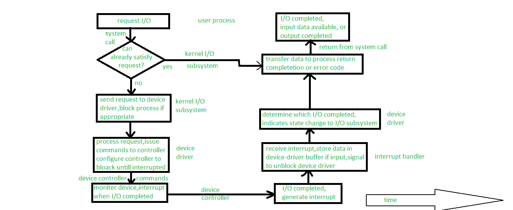

# 将输入/输出请求转换为硬件操作

> 原文:[https://www . geeksforgeeks . org/I-o 请求到硬件操作的转换/](https://www.geeksforgeeks.org/transforming-of-i-o-requests-to-hardware-operations/)

我们知道设备驱动程序和设备控制器之间有握手，但这里的问题是操作系统如何将应用程序请求或者我们可以说是输入/输出请求连接到一组网络线路或特定的磁盘扇区，或者我们可以说是硬件操作。

为了理解概念，让我们考虑下面的例子。

**示例–**
我们正在从磁盘读取文件。我们请求的应用程序将通过文件名引用数据。在磁盘中，文件系统从文件名映射到文件系统目录，以获得文件的空间分配。在微软操作系统中，文件名映射到数字，数字表示文件访问表中的条目，表中的条目告诉我们哪些磁盘块被分配给文件。在 UNIX 中，名称映射到[索引节点号](https://www.geeksforgeeks.org/inode-in-operating-system/)，索引节点号包含关于空间分配的信息。但是这里出现了一个问题，从文件名到磁盘控制器是如何连接的？

微软操作系统使用的方法是相对简单的操作系统。MS-DOS 文件名的第一部分，前面是冒号，是一个字符串，表示有特定的硬件设备。

UNIX 使用不同于 MS-DOS 的方法。它表示常规文件系统名称空间中的设备名称。与带有冒号分隔符的 MS-DOS 文件名不同，UNIX 路径名没有明确的设备部分分隔。事实上，路径名的任何部分都不是设备名。Unix 有一个装载表，它将路径名的前缀与特定的硬件设备名相关联。

现代操作系统从请求和物理设备级控制器之间路径的多级查找表中获得了极大的灵活性。有一些通用的机制用于在应用程序和驱动程序之间传递请求。因此，无需重新编译内核，我们就可以将新设备和驱动程序引入计算机。事实上，一些操作系统能够按需加载设备驱动程序。在引导时，系统首先探测硬件总线，以确定存在哪些设备。然后根据输入/输出请求，将其加载到必要的驱动程序中。

下图显示了阻塞读请求的典型生命周期。从图中，我们可以看出输入/输出操作需要许多步骤，这些步骤一起消耗大量的 CPU 周期。

**Figure –** The life cycle of I/O request

1.  **[系统调用](https://www.geeksforgeeks.org/introduction-of-system-call/)–**
    每当任何 I/O 请求到来时，进程都会对文件的先前打开的文件描述符发出阻塞读取()系统调用。基本上，系统调用代码的作用是检查内核中参数的正确性。如果我们以输入形式输入的数据已经在缓冲区缓存中可用，数据将被返回处理，在这种情况下，输入/输出请求就完成了。
2.  **输入不可用时的替代方法–**
    如果数据在缓冲区缓存中不可用，则必须执行物理输入/输出。该进程从运行队列中删除，并被放在设备的等待队列中，输入/输出请求被调度。调度后，输入输出子系统通过子程序调用或内核消息向设备驱动程序发送请求，但这取决于操作系统发送请求的模式。
3.  **设备驱动程序的作用–**
    收到请求后，设备驱动程序必须接收数据，它将通过分配内核缓冲区空间来接收数据，并在接收数据后调度输入/输出。所有这些之后，命令将通过写入设备控制寄存器的方式提供给设备控制器。
4.  **设备控制器的角色–**
    现在，设备控制器操作设备硬件。实际上，数据传输是由设备硬件完成的。
5.  **DMA 控制器的作用–**
    数据传输后，驱动程序可能会轮询状态和数据，也可能已经设置了 DMA 传输到内核内存。传输由 DMA 控制器管理。最后当传输完成时，它会产生中断。
6.  **中断处理程序的角色–**
    中断通过中断向量表发送到正确的中断处理程序。它存储任何必要数据，向设备驱动发出信号，并从中断返回。
7.  **完成输入/输出请求–**
    当，设备驱动程序收到信号。该信号确定输入/输出请求已完成，并确定请求状态，向内核输入/输出子系统发出请求已完成信号。将数据或返回代码传输到地址空间后，内核将进程从等待队列移回就绪队列。
8.  **系统调用完成–**
    当进程移动到就绪队列时，表示进程未被阻塞。当进程被分配给中央处理器时，意味着进程在系统调用完成时恢复执行。