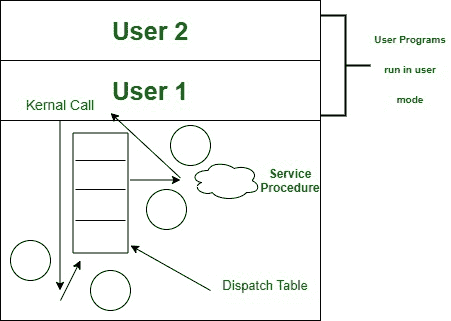

# 操作系统(OS)中的陷阱和系统调用

> 原文:[https://www . geesforgeks . org/traps-and-system-calls-in-operating-system-OS/](https://www.geeksforgeeks.org/traps-and-system-calls-in-operating-system-os/)

在[操作系统(OS)](https://www.geeksforgeeks.org/operating-systems/) 安全的极小可能性下，程序如何向 OS 请求管理？
客户端程序不能调用工作框架内存中的容量，因为它看不到那些内存区域。

一个特殊的客户端模式机器引导，被称为 **TRAP 引导**，导致豁免，[将](https://www.geeksforgeeks.org/types-of-switches-in-computer-network/) CPU 模式切换到**内核模式**，并启动 TRAP 引导的处理器。

为了向操作系统请求特定的帮助，客户端程序在机器寄存器中放置尊重，以显示它需要什么管理。此时，它执行 TRAP 指导，将 CPU 模式更改为优势模式，并将执行移动到操作系统内存中的 TRAP 处理程序。

操作系统检查并执行请求，利用调度表将控制传递给操作系统管理计划之一。当管理工作结束时，操作系统将控制权交还给程序，将优势带回客户端模式。因此，活动只需通过单独的、围绕确定的截面点接近偏好的操作系统。

这个用于获取操作系统管理的组件被称为 [**【系统调用】**](https://www.geeksforgeeks.org/introduction-of-system-call/) 。可访问框架调用的安排被称为操作系统的**应用程序接口**或[**应用编程接口**](https://www.geeksforgeeks.org/api-full-form/) 。