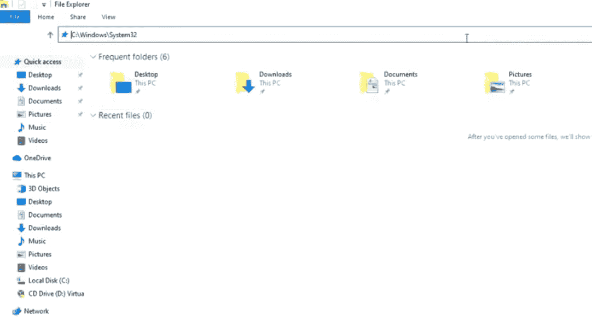
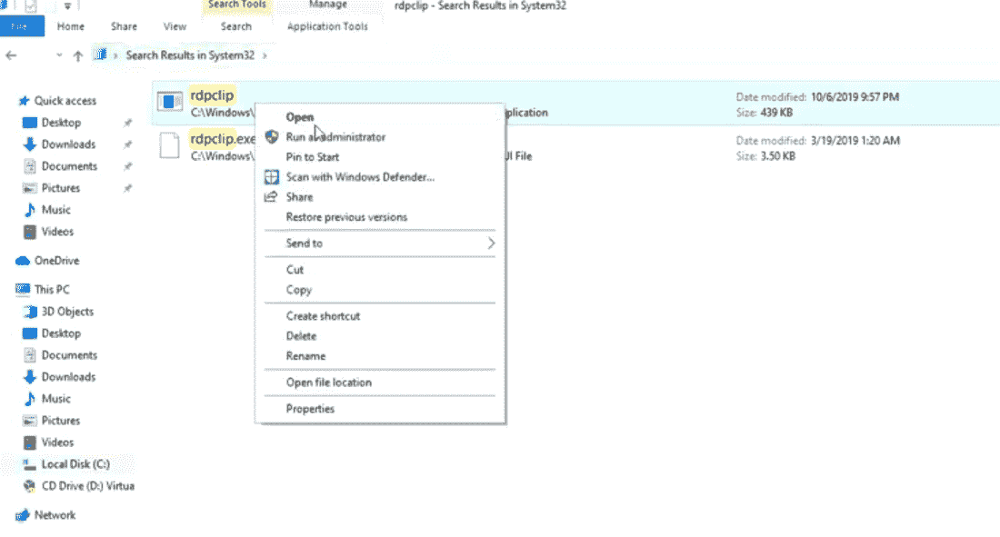
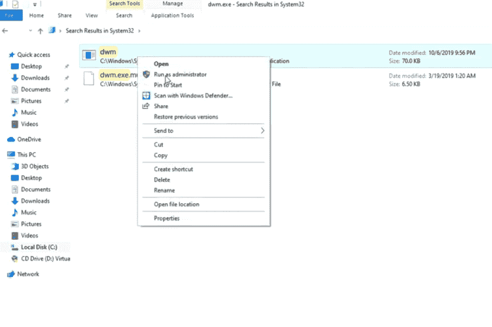
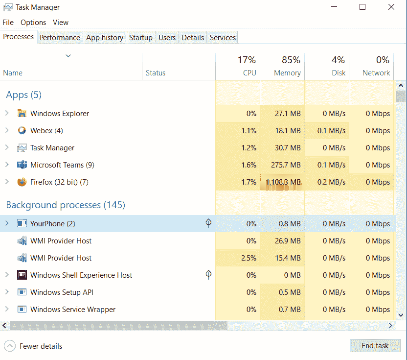
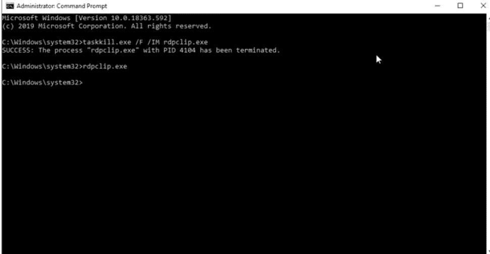
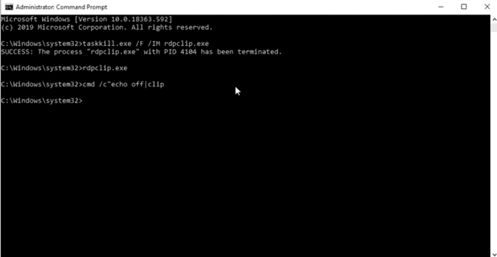

# Windows 10 复制粘贴故障排除

> 原文:[https://www . geesforgeks . org/疑难解答-windows-10 上的复制和粘贴/](https://www.geeksforgeeks.org/troubleshooting-copy-and-paste-on-windows-10/)

**复制和粘贴**是计算机上最基本和最重要的功能，但是如果它们停止工作，那么就会很麻烦。在本文中，我们将向您展示解决此问题的几个过程。

让我们首先了解复制和粘贴功能是如何工作的。它实际上复制了一个文本或图像，并将其保存到**虚拟剪贴板**中。当我们使用粘贴功能时，它直接从剪贴板粘贴。这是通过不同的服务来管理的，如果它不起作用，那么这些服务可能已经损坏或者没有运行。让我们来看看如何解决这个问题。

### 修复#1:使用系统 32 文件夹

*   打开**文件浏览器**。
*   转到 c 盘，输入 **C:\Windows\System32。**

*   在右上角的搜索框中搜索 **rdpclip** 。

*   你会得到如下所示的一堆搜索结果。右键单击 *rdpclip* ，以管理员身份运行。然后点击是以管理员身份运行。
*   它不会做任何事情，你不会被任何屏幕提示，它实际上在后台工作。
*   我们得再做一部分。为此，搜索**dwm.exe**并点击进入。

*   我们将做与上面讨论的完全相同的事情。右键单击**并以管理员身份运行。什么都不会发生，只是让它作为管理员运行。**
*   **重新启动计算机。**
*   **试着复制粘贴，如果不行，试试第二个。**

### **修复#2:重置 rdclip.exe 进程**

*   **打开**任务管理器**。**

****

*   **在**进程选项卡**中，向下滚动并找到 RDP 剪贴板监视器。**
*   **继续，右键单击并选择结束任务。**
*   **关闭任务管理器。**
*   **再次重新打开任务管理器。**
*   **这一次，转到文件并运行一个新任务。**
*   **输入***【rdpclip.exe】***，点击 OK。**
*   **请重新启动计算机，看看它是否能解决您的问题。**

### **修复#3:使用命令提示符重置 rdclip.exe**

*   **以管理员身份打开**命令提示符**。**
*   **输入**taskskill.exe/rdpclip.exe/即时消息**并点击进入。**
*   **输入**rdpclip.exe。****

****

*   **就这样，继续重启你的电脑，看看它能不能解决你的问题。**

### **修复#4:清除剪贴板历史记录**

*   **以管理员身份打开**命令提示符**。**
*   **键入 **cmd /c“回声关闭|剪辑**，然后点击进入。**

****

*   **重新启动计算机，看看它是否能解决您的问题。**
*   **如果没有，坚持下去，遵循以下解决方案。**

### **修复#5:重新安装复制粘贴不工作的程序**

*   **要检查与应用程序相关的问题，请在您的计算机系统上打开多个应用程序，如记事本和 word。**
*   **尝试将文本从记事本复制粘贴到 word，反之亦然。**
*   **查看哪个程序不响应这些操作。**
*   **尝试识别产生问题的特定程序。**
*   **重新安装或修复这样的程序，看看它是否能解决您的问题。**

### **修复#6:重新启动窗口资源管理器**

*   **打开任务管理器。**

****

*   **选择进程选项卡并找到窗口资源管理器。**
*   **右键单击窗口资源管理器并重新启动它。**
*   **检查复制粘贴是否有效。**

### **修复#7:禁用防病毒程序**

*   **系统中安装的防病毒应用程序可能是导致此问题的原因。**
*   **尝试禁用所有第三方安全应用程序。**
*   **再次检查复制粘贴选项是否有效**