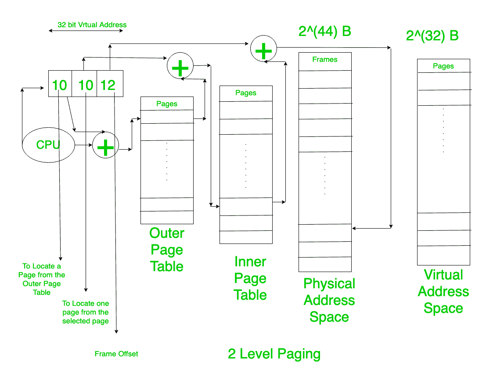

# 操作系统中的两级分页和多级分页

> 原文:[https://www . geesforgeks . org/两级分页和多级分页 in-os/](https://www.geeksforgeeks.org/two-level-paging-and-multi-level-paging-in-os/)

[分页](https://www.geeksforgeeks.org/paging-in-operating-system/)是我们将整个过程转换成大小相等的页面的过程。每页还包括固定数量的单词(如果它是单词可寻址的)。

页面由中央处理器生成的[虚拟地址表示。这些页面由内存管理单元映射到物理地址。因此，为了帮助这个映射，我们使用了页表的概念。就像数组一样，在页表中，索引代表页码，内容包含进程实际加载到主内存的帧号地址。因为虚拟/逻辑地址相对于零，应该映射到主存储器](https://www.geeksforgeeks.org/logical-and-physical-address-in-operating-system/)的实际[物理地址空间。](https://www.geeksforgeeks.org/mapping-virtual-addresses-to-physical-addresses/)

页表的大小可以从这样一个事实来计算，即页表的每个条目的大小是给定的，否则如果没有给定，那么我们可以找到在主存储器中寻址每个帧所需的位数(这是不正确的，但是应该在没有给定问题时使用)。

> 页表大小=页表条目数(总页数)*(页表每个条目的大小)

当页表的大小小于一个框架的大小时，我们不用担心，因为我们可以直接把页表放在主存的一个框架中。因此，我们可以直接访问页表。

但是如果页表的大小大于框架的大小。那么作为回报，页表将被分成若干页，并且页表的这些页将被存储在主存储器中。这样，一个外页表就出现了。

该外部页表将包含主存储器中包含**内部页表**(即[页表](https://www.geeksforgeeks.org/page-table-entries-in-page-table/)一页)的页的帧的地址。

该外部页面的大小也以与上面解释的相同的方式计算，并用于计算内部页面表格的大小。现在，如果内页表格的大小小于或等于一个框架的大小，那么我们可以在此停止，因为我们可以将最外面的表格保留在一个框架中。

这被称为**二级分页。**

**例:**
考虑给定，

```
Physical Address Space = 2(44) B
Virtual Address Space = 2(32) B

Page Entry = 4B
Page Size = 4Kb

So, No.of Frame = 2(32)
No. of Pages Of the Process = 2(20)
Page Table 1 size =2(20) * 4 B= 4 MB 
```

因为，它比 4B(帧大小)大。因此，该页表必须转换为页

页表 2(外页表)的页数

```
= 2(22)*2(-12)= 2(10) pages 
```

所以，外页表的大小

```
= 2(10) * 4B = 4KB 
```

因此，这里我们的外部页表(页表 2)可以存储在一个框架中。

因此，我们可以到此为止。

这是两级分页，因为这里有两个页表。



但是，如果页表的大小仍然大于帧大小，那么我们必须继续，直到我们达到最外层表的大小小于帧大小的阶段。这个概念被称为多级分页。我们的目标应该是将最外层的页表保持在一个框架中。