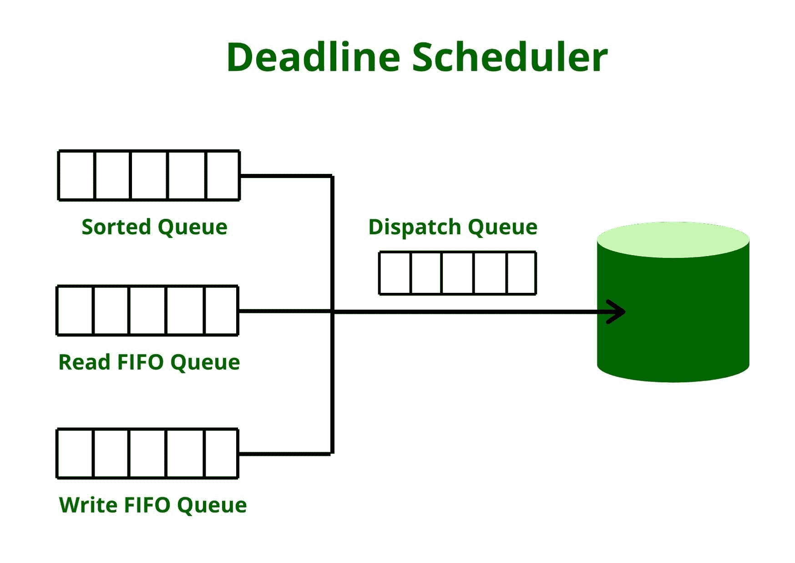

# 操作系统中的两级调度

> 原文:[https://www . geesforgeks . org/两级操作系统调度/](https://www.geeksforgeeks.org/two-level-scheduling-in-operating-systems/)

**两级调度**是利用两个调度器进行进程调度的高效调度方式。

让我们通过一个**例子** :
假设一个系统有 50 个运行的进程，所有进程的优先级都相等，系统的内存只能同时容纳 10 个进程。因此，40 个进程总是被换出并写入硬盘上的虚拟内存。在一个过程中换出和换出分别需要 50 毫秒。

让我们用简单的循环调度来处理上面的场景:每次发生上下文切换时，都需要换入一个进程(最近最少使用的进程被换入)。换入和换出的成本太高，不必要的交换浪费了调度器的大量时间。

所以解决问题的办法就是**两级调度**。两级调度中有两种不同的调度程序:

```
1. Lower level scheduler
2. Higher level scheduler 
```



1.  **低级调度程序–**
    该调度程序选择哪个进程将从内存中运行。
2.  **更高级别的调度程序–**
    这个调度程序专注于在硬盘和内存之间交换进程。交换需要很多时间，因此它进行调度的频率要低得多。它还会将内存中长时间运行的进程换出，并与磁盘上长时间未运行的进程交换。

使用以下变量:

1.  **响应时间–**
    响应时间变量很重要，因为它可以防止资源匮乏，并且一个过程将会完成。如果一个进程被换出太长时间，其他一些进程将不得不不必要地等待很长时间。因此，这个变量是必不可少的。
2.  **进程的大小–**
    较大的进程不太经常被交换，因为它们需要很长时间来交换。由于这些进程较大，因此只有其中一些进程可以与该进程共享内存。
3.  **优先级–**
    优先级较高的进程会在内存中停留更长的时间，以便更快地完成。