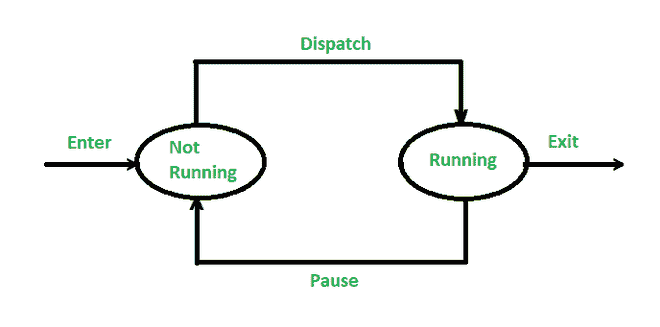
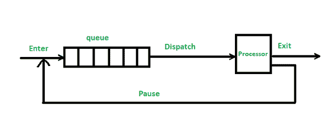

# 操作系统中的两状态流程模型

> 原文:[https://www . geesforgeks . org/操作系统中的双态进程模型/](https://www.geeksforgeeks.org/two-state-process-model-in-operating-system/)

**先决条件:** [操作系统中进程的状态](https://www.geeksforgeeks.org/states-of-a-process-in-operating-systems/)

操作系统中的进程从形成到完成从不同的状态传递。一个过程由程序数据及其相关数据和一个[过程控制块](https://www.geeksforgeeks.org/process-table-and-process-control-block-pcb/)(印刷电路板)组成。进程可能会因为以下事件而改变其状态，如输入/输出请求、中断例程、[进程同步](https://www.geeksforgeeks.org/introduction-of-process-synchronization/)、[进程调度算法](https://www.geeksforgeeks.org/cpu-scheduling-in-operating-systems/)等。该过程可以运行，也可以不运行，如果正在运行，则必须由系统维护，以获得过程的适当进展。

### **双态过程模型**

流程状态中最简单的模型将是双状态模型，因为它仅由下面给出的两种状态组成:

*   **运行状态-** 进程当前正在执行的状态。
*   **未运行状态-** 进程正在等待执行的状态。

### 两状态模型中进程的执行

无论进程是否正在执行，都可以随时创建双态。

*   首先，当操作系统创建一个新的进程时，它也为该进程创建一个进程控制块，以便该进程可以在非运行状态下进入系统。如果任何进程退出/离开系统，操作系统就会知道。
*   偶尔，当前运行的进程将被中断或闯入，操作系统的调度程序(将处理器从一个进程切换到另一个进程的程序)将运行任何其他进程。
*   现在，前一个进程(中断的进程)从运行状态移动到非运行状态，另一个进程移动到运行状态，然后退出系统。

两状态过程模型

没有运行的进程必须保持在一个队列中，等待轮到它们执行。在排队图中，有一个单独的队列，其中的条目是指向特定进程的进程控制块(一个数据结构中存储有状态、标识符、程序计数器、上下文数据等信息的块)的指针。

排队图

我们必须知道，队列可能有链表块，其中每个块代表一个进程。在排队图中可以看到调度程序的行为，一个被中断的进程被转移到队列等待进程中，如果该进程已经完成，它将被终止。之后，dispatcher 再次从队列中取出另一个进程并执行该进程。