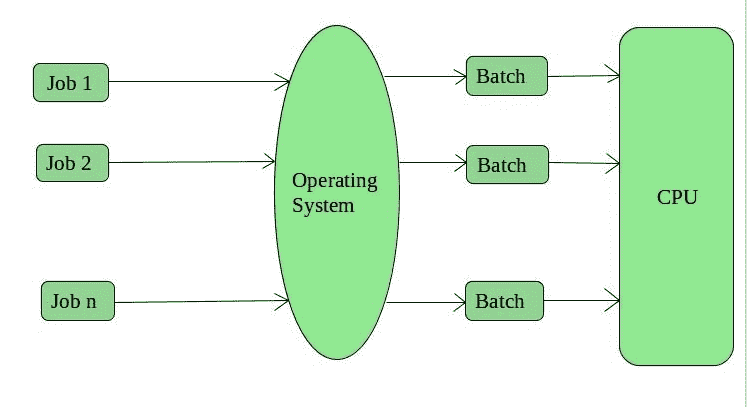
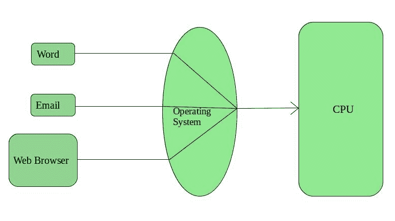
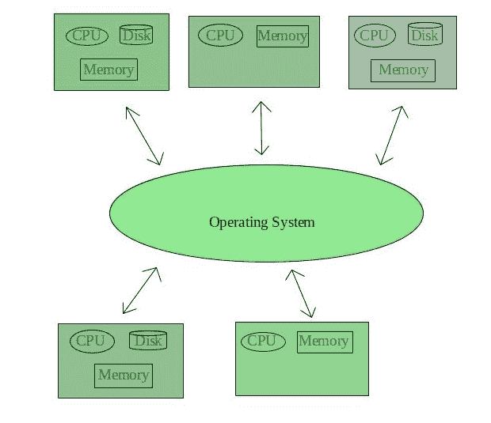
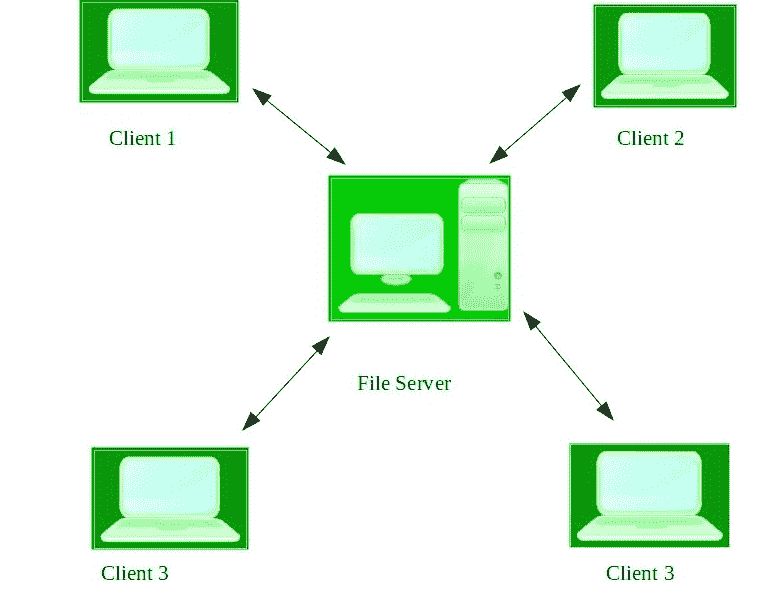
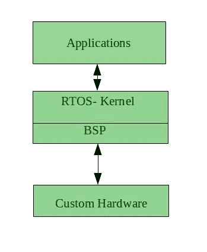

# 操作系统类型

> 原文:[https://www.geeksforgeeks.org/types-of-operating-systems/](https://www.geeksforgeeks.org/types-of-operating-systems/)

操作系统执行所有基本任务，如管理文件、进程和内存。因此，操作系统充当所有资源的管理器，即**资源管理器**。因此，操作系统成为用户和机器之间的接口。

**操作系统类型:**一些广泛使用的操作系统如下-

**1。批处理操作系统–**
这种类型的操作系统不直接与计算机交互。有一个操作员，他接受有相同要求的类似工作，并把它们分成批次。操作员有责任对有类似需求的工作进行分类。

**批量操作系统的优势:**

*   很难猜测或知道任何工作完成所需的时间。批处理系统的处理器知道作业排队的时间
*   多个用户可以共享批处理系统
*   批处理系统的空闲时间非常少
*   在批处理系统中重复管理大量工作很容易

**批量操作系统的缺点:**

*   计算机操作员应该熟知批处理系统
*   批处理系统很难调试
*   有时成本很高
*   如果任何作业失败，其他作业将不得不等待未知的时间

**批量操作系统示例:**薪资系统、银行对账单等。

**2。分时操作系统–**
每个任务都有一定的执行时间，以便所有任务都能顺利完成。每个用户在使用单个系统时都会获得 CPU 时间。这些系统也被称为多任务系统。任务可以来自单个用户，也可以来自不同的用户。每个任务开始执行的时间称为时间量。这个时间间隔结束后，操作系统切换到下一个任务。

**分时操作系统的优势:**

*   每项任务都有平等的机会
*   减少软件重复的机会
*   可以减少中央处理器空闲时间

**分时操作系统的缺点:**

*   可靠性问题
*   人们必须注意用户程序和数据的安全性和完整性
*   数据通信问题

**分时操作系统的例子有:** Multics、Unix 等。

**3。分布式操作系统–**
这些类型的操作系统是计算机技术领域的最新进展，正在被全世界广泛接受，而且速度也很快。各种自主互连的计算机使用共享通信网络相互通信。独立的系统拥有自己的存储单元和中央处理器。这些被称为**松散耦合系统**或分布式系统。这些系统的处理器在尺寸和功能上有所不同。使用这些类型的操作系统的主要好处是，一个用户总是可以访问实际上并不存在于他的系统中的文件或软件，而是连接在该网络中的一些其他系统，即，在连接在该网络中的设备中启用远程访问。

**分布式操作系统的优势:**

*   一个系统的故障不会影响另一个网络通信，因为所有系统都是相互独立的
*   电子邮件提高了数据交换速度
*   由于资源是共享的，计算非常快速和持久
*   主机上的负载减少
*   这些系统易于扩展，因为许多系统可以轻松添加到网络中
*   数据处理延迟减少

**分布式操作系统的缺点:**

*   主网络的故障将会停止整个通信
*   为了建立分布式系统，所使用的语言还没有被很好地定义
*   这些类型的系统不容易获得，因为它们非常昂贵。不仅底层软件非常复杂，而且还没有被很好地理解

**分布式操作系统的例子有-** LOCUS 等。

**4。网络操作系统–**
这些系统运行在服务器上，能够管理数据、用户、组、安全、应用程序和其他网络功能。这些类型的操作系统允许通过小型专用网络共享文件、打印机、安全、应用程序和其他网络功能。网络操作系统的一个更重要的方面是，所有用户都很清楚底层配置、网络中所有其他用户、他们各自的连接等。这就是为什么这些计算机被普遍称为**紧密耦合系统**。

**网络操作系统优势:**

*   高度稳定的集中式服务器
*   安全问题通过服务器来处理
*   新技术和硬件升级很容易集成到系统中
*   可以从不同位置和不同类型的系统远程访问服务器

**网络操作系统的缺点:**

*   服务器很贵
*   用户必须依赖一个中心位置进行大多数操作
*   需要定期维护和更新

**网络操作系统的例子有:**微软 Windows Server 2003、微软 Windows Server 2008、UNIX、Linux、Mac OS X、Novell NetWare、BSD 等。

**5。实时操作系统–**
这些类型的操作系统为实时系统服务。处理和响应输入所需的时间间隔非常短。这个时间间隔称为**响应时间**。

**实时系统**在有时间要求非常严格的时候使用，比如导弹系统、空管系统、机器人等。

**两种实时操作系统，如下所示:**

*   **硬实时系统:**
    这些操作系统适用于时间限制非常严格，甚至最短延迟都不可接受的应用。这些系统是为了拯救生命而建造的，就像自动降落伞或安全气囊一样，需要在发生任何事故时随时可用。虚拟内存在这些系统中很少出现。
*   **软实时系统:**
    这些操作系统适用于时间限制不太严格的应用。

**RTOS 优势:**

*   **最大消耗:**设备和系统的最大利用率，从而从所有资源中获得更多的输出
*   **任务转移:**在这些系统中，分配给转移任务的时间非常少。例如，在较旧的系统中，将一个任务转移到另一个任务大约需要 10 微秒，而在最新的系统中，需要 3 微秒。
*   **关注应用:**关注正在运行的应用，对队列中的应用不太重视。
*   **嵌入式系统中的实时**操作系统:**由于程序规模小，RTOS 也可以用在交通等嵌入式系统中。**
*   **无错误:**这些类型的系统是无错误的。
*   **内存分配:**内存分配最好在这些类型的系统中管理。

**RTOS 的劣势:**

*   **有限任务:**很少有任务同时运行，为了避免错误，它们的注意力很少集中在少数应用程序上。
*   **使用重系统资源:**有时候系统资源不太好，也很贵。
*   **复杂算法:**算法非常复杂，设计人员很难在上面写。
*   **设备驱动和中断信号:**它需要特定的设备驱动和中断信号来最早响应中断。
*   **线程优先级:**设置线程优先级不好，因为这些系统非常不容易切换任务。

**实时操作系统的例子有:** 科学实验、医学成像系统、工业控制系统、武器系统、机器人、空中交通管制系统等。