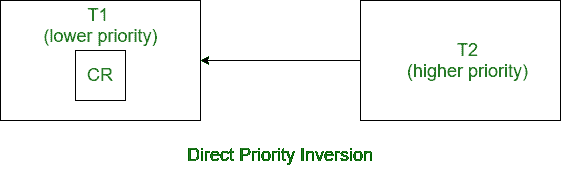
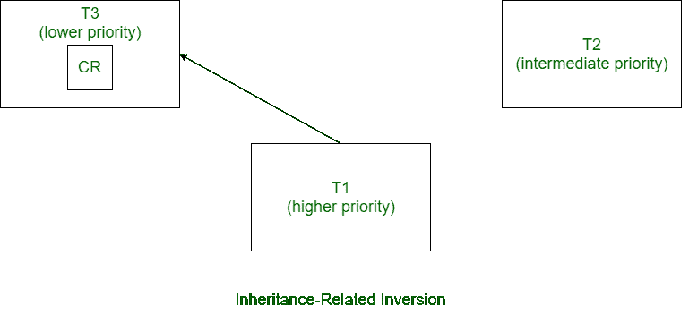
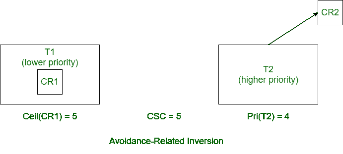

# 五氯苯酚下优先级反转的类型

> 原文:[https://www . geesforgeks . org/priority-inversion-type-under-PCP/](https://www.geeksforgeeks.org/types-of-priority-inversions-under-pcp/)

当一组任务使用优先级上限协议共享关键资源时，它可能会经历不同类型的优先级反转。使用五氯苯酚共享关键资源时，任务所经历的优先级反转类型如下:

**1。直接反转:**
当优先级较高的任务等待优先级较低的任务释放该优先级较低的任务持有的关键资源，而优先级较高的任务需要该关键资源时，则发生直接反转。

**示例:**
假设有两个任务 T 1 和 T 2 ，其中 T 2 的优先级高于 T 1 。T 1 (低优先级任务)持有关键资源 CR。现在 T 2 (优先级更高的任务)需要这个资源，但是 T 2 要等到 T 1 执行并释放关键资源 CR。这里可以看出，在这种反转中，较低优先级的任务通过持有较高优先级任务所需的资源，使得较高优先级的任务进入反转。

**2。继承相关反转:**
当一个较低优先级的任务持有一个关键资源，而一个较高优先级的任务正在等待这个关键资源时，则使用 PCP 下的继承技术，将较低优先级任务的优先级设置为与等待较高优先级任务的优先级相等。因此，不需要关键资源的中间优先级任务进入与继承相关的反转。

**例:**
假设有三个任务 T 1 ，T 2 和 T 3 。这些任务的优先级为 T1>T2T36】T3。T 1 和 T 3 都需要关键资源 CR，而 T 2 不需要关键资源。在某个时间点，T 3 (最低优先级任务)获取关键资源 CR。现在 T 1 (最高优先级任务)需要关键资源 CR 并请求。现在通过继承条款 T 3 获得其优先权等于 T 1 的优先权。因此，不需要关键资源的 T 2 不会因为 T 3 的优先级提高而被执行。因此，任务 T 2 处于与继承相关的反转状态。

**3。回避相关反转:**
当任务需要关键资源时，其优先级与当前系统上限(CSC)进行比较。如果任务的优先级大于 CSC 的值，则任务被分配关键资源。当关键资源未分配给任何任务时，即关键资源空闲，并且优先级低于 CSC 的任务请求该关键资源，则拒绝访问该关键资源。具有比当前执行的任务更高的优先级和比 CSC 更高的优先级并请求空闲的关键资源的任务被称为处于回避相关反转状态。这也被称为优先级上限相关反转，因为较高优先级的任务被分配关键资源，不是因为所请求的关键资源被另一个任务持有，而是因为它的优先级低于 CSC。它也被称为死锁避免反转，因为对于没有被任何其他任务使用的关键资源，较高优先级的任务被阻塞。

**示例:**
假设有两个任务 T 1 和 T 2 ，其中 T 2 的优先级高于 T 2 。两者都需要关键资源 CR 1 和 CR 2 。T 1 (低优先级任务)当前正在使用关键资源 CR 1 。现在，T 2 (较高优先级任务)请求使用关键资源 CR 2 ，但由于其优先级低于 CSC，访问被拒绝。不允许 T 2 使用 CR 2 阻断了 T 1 可能会请求 CR 2 和 T 2 可能会稍后请求 CR 1 而导致死锁的可能性。

**参考:**T2[T4](https://nptel.ac.in/content/storage2/courses/106105086/pdf/module3.pdf)