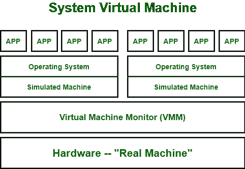
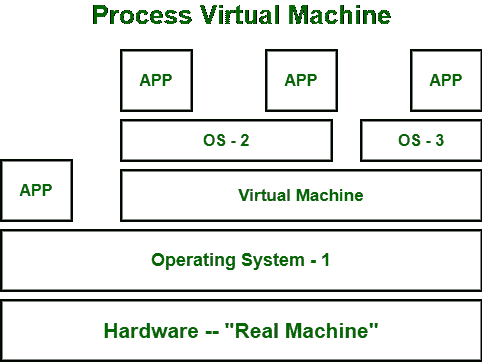

# 虚拟机类型

> 原文:[https://www.geeksforgeeks.org/types-of-virtual-machines/](https://www.geeksforgeeks.org/types-of-virtual-machines/)

在本文中，我们将研究虚拟机、虚拟机类型和虚拟机语言。

**[虚拟机](https://www.geeksforgeeks.org/virtual-machines-in-operating-system/)** 就像是在你的硬件上运行的假计算机系统。它部分使用了您系统的硬件(如中央处理器、内存、磁盘空间等)。)但它的空间与你的主系统完全分离。两个虚拟机不会中断彼此的工作和功能，也不会超出彼此的空间，这给人一种我们使用完全不同的硬件系统的错觉。有关虚拟机的更多详细信息。

**问题:**
一个人可以安装的虚拟机数量有限制吗？

**回答–**
一般来说没有限制，因为这取决于你系统的硬件。由于虚拟机正在使用您系统的硬件，如果它超出了容量，那么它将限制您不安装更多虚拟机。

**问题:**
可以从一个虚拟机访问另一个虚拟机的文件吗？

**回答–**
一般来说不会，但是作为一个高级硬件特性，我们可以允许不同虚拟机的文件共享。

**虚拟机的类型:**
可以将虚拟机分为两种类型:

**1。系统虚拟机:**
这些类型的虚拟机给了我们完整的系统平台，并给出了完整的虚拟操作系统的执行。就像虚拟盒子一样，系统虚拟机为操作系统的完全安装提供了一个环境。我们可以在下图中看到，我们的真实机器硬件正通过虚拟机监视器分布在两个模拟操作系统之间。然后一些程序、进程分别在模拟机器的分布式硬件中运行。

**2。进程虚拟机:**
虽然进程虚拟机与系统虚拟机不同，并不为我们提供完全安装虚拟操作系统的便利。相反，它会在使用某个应用程序或程序时创建该操作系统的虚拟环境，一旦我们退出该应用程序，该环境就会被破坏。如下图所示，一些应用程序运行在主操作系统上，一些虚拟机被创建来运行其他应用程序。这表明，由于这些程序需要不同的操作系统，进程虚拟机暂时为它们提供这些程序正在运行的操作系统。

**示例–**
Linux 中的 Wine 软件有助于运行 Windows 应用程序。

**虚拟机语言:**
这是一种可以被不同操作系统理解的语言。它与平台无关。就像运行任何编程语言(C、python 或 java)一样，我们需要特定的编译器，它实际上将代码转换成系统可理解的代码(也称为字节码)。同样的虚拟机语言也有效。如果我们想使用可以在不同类型的操作系统上执行的代码，比如(视窗、Linux 等)，那么虚拟机语言将会很有帮助。