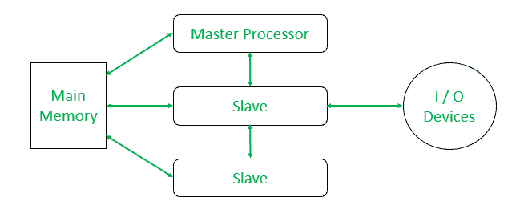
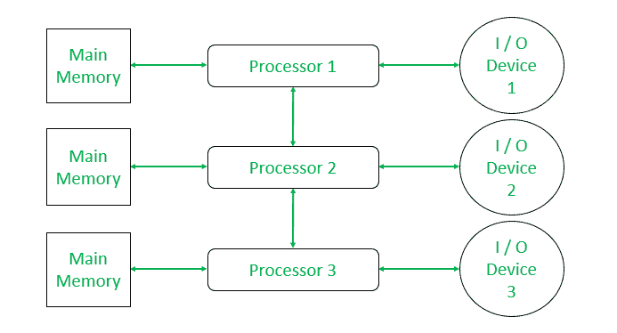
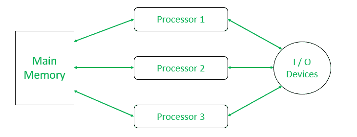

# 典型多处理配置

> 原文:[https://www . geeksforgeeks . org/典型值-多处理-配置/](https://www.geeksforgeeks.org/typical-multiprocessing-configuration/)

多处理是多个处理器协同工作的情况。因此，它们必须配置良好，以免产生任何类型的问题。

通常有 3 种类型的配置:主/从配置、松耦合配置和对称配置。这些解释如下。

**1。主/从配置:**
主/从配置是一个单处理器系统，其中有额外的从处理器在工作，由主主处理器管理。这是一个不对称的系统。

主处理器的工作是管理由文件、设备、主存储器和从处理器组成的整个系统。它维护所有进程的状态，为从处理器安排工作，并执行所有控制程序。它还负责存储管理。这种类型的配置适用于需要在前端和后端处理器之间分配处理时间的计算环境。

这种配置的**优势**就是简单易懂。

**缺点**包括:

*   它与单处理器系统一样可靠，即如果主处理器出现故障，整个系统都会出现故障。
*   这会产生更多的间接费用。在主处理器可以给从处理器分配另一个任务之前，会有从处理器空闲的情况。那么就需要宝贵的处理时间。
*   在从处理器完成每个任务后，它会中断主处理器，进行一些操作系统干预，如输入/输出请求。这会在主处理器级别造成长队列。

**2。松散耦合配置:**
在这种类型的配置中，有几个完整的计算机系统，它们有自己的内存、I/O 设备、CPU 和操作系统。

每个处理器控制自己的资源(输入/输出设备、内存等)。)以及它们自己的命令和管理表。每个处理器还可以相互通信和协作。
当一个作业被给定时，它被分配给一个处理器，该处理器处理该任务直到它完成。因此，必须有全局表来指示哪个处理器被赋予了特定的任务。同样，为了使系统很好地平衡，必须根据各种参数和各种策略进行作业调度。

这种配置的**优势**是不容易出现灾难性故障。如果一个处理器出现故障，其他处理器可以独立继续工作。

这种配置的**缺点**是很难检测到处理器是否出现故障。

**3。对称配置:**
在对称配置中，处理器调度是分散的。操作系统的单一副本和列出每个进程及其状态的表格存储在所有处理器都可以访问的公共内存中，以便每个处理器可以使用算法来决定下一个运行的作业。

**优势–**

*   它比松散耦合的配置更可靠。
*   它有效地利用资源。
*   它能很好地管理工作负荷。
*   它可以在失败时优雅地退化。

**缺点–**

*   每当一个进程被中断，它的处理器就会更新进程列表中相应的条目，并找到另一个要运行的进程。这意味着不仅所有的处理器保持忙碌，而且其他处理器也可能同时执行该作业(如输入/输出请求)。这增加了处理器之间冲突的可能性。
*   这是最难实现的配置，因为系统必须很好地同步，以避免任何类型的竞争或死锁。