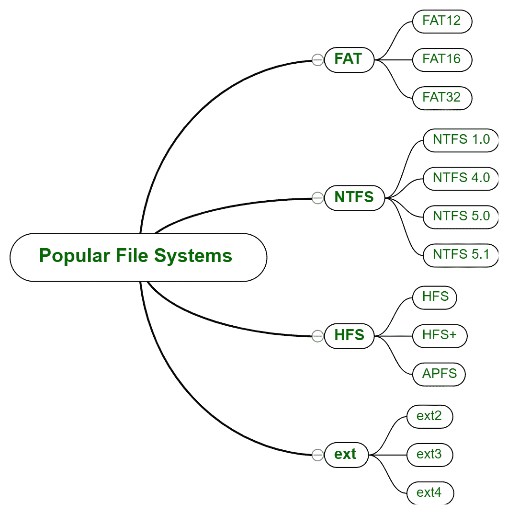
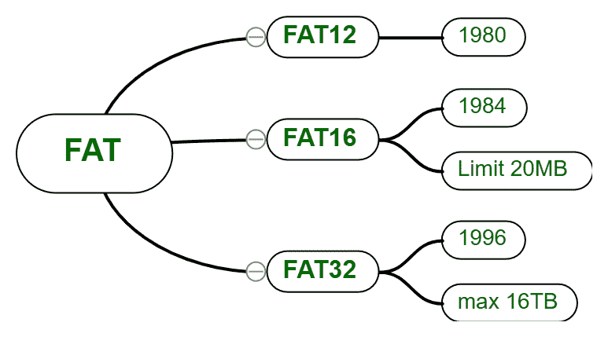
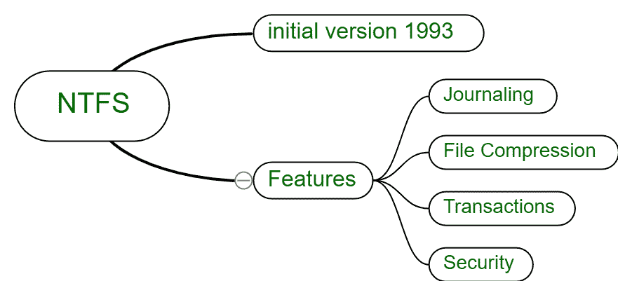
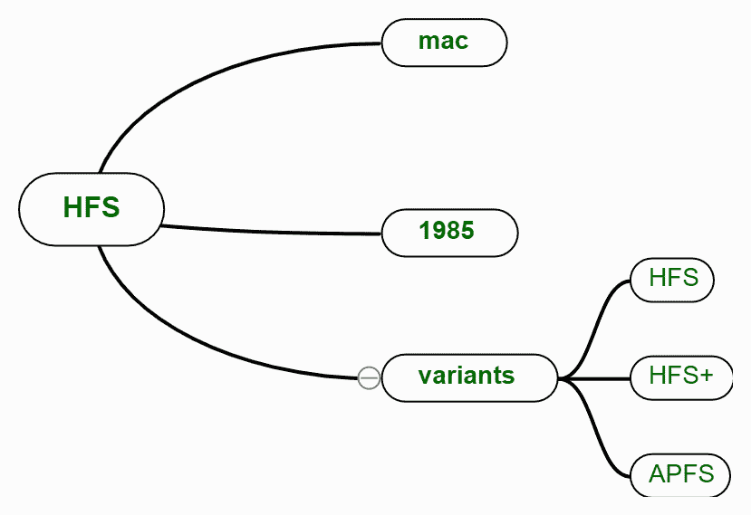
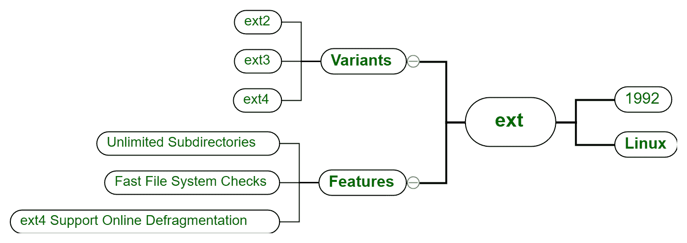

# 了解文件系统

> 原文:[https://www.geeksforgeeks.org/understanding-file-system/](https://www.geeksforgeeks.org/understanding-file-system/)

先决条件–[操作系统中的文件系统](https://www.geeksforgeeks.org/file-systems-in-operating-system/)

文件和文件夹是人类生活中不可分割的一部分。我们每天都会浏览这两个名字，并在不知不觉中使用它们。这些文件确实有不同的类型，随着用户和开发人员需求的变化而演变。一些科技巨头建立了自己的文件系统来增加他们产品的市场，他们也做了一些改变，增强了在任何类型的存储器上存储文件的技术。

一些最流行的文件存储系统是:-

```
(i). FAT
(i). NTFS
(i). HFS
(i). EXT 
```

这些解释如下。



<center>**Figure –** Popular File System</center>

*   **(i). FAT (File Allocation Table):**
    FAT stands for File Allocation Table and this is called so because it allocates different file and folders using tables. This was originally designed to handle small file systems and disks. This system majorly has three variant FAT12, FAT16 and FAT32 which were introduced in 1980, 1984 and 1996 respectively.

    这些变体各有利弊，像 FAT32(多用于笔式驱动和 micro SD)。它可以存储或复制最大大小为 4GB 的文件(要存储的单个文件的大小)，如果文件大小超过 4GB，它不会在存储介质上复制，但其分区大小高达 8TB(可应用 FAT 的分区大小)。

    

    <center>**Figure –** FAT File System</center>

    这个文件系统在最初的时候是 windows 使用的，现在 windows 已经切换到了 NTFS，这也是它自己的一个文件系统，我们来了解一下。

*   **(ii). NTFS (New Technology File System):**
    Windows NT has come with a new file system called NTFS in 1993\. This stands for New Technology File System. This was an enhanced and more advanced version of FAT systems. All Windows installation is done on NTFS, it first formats the storage in NFTS format and then install on it. Mostly NTFS is done on internal drives.

    这没有文件大小限制，也没有分区或卷限制。理论上，单个文件的大小可达 16 个 EiB。

    

    <center>**Figure –** NTFS File System</center>

    *   **日志记录–**这种技术在卷或分区中记录元数据及其变化。
    *   **事务–**该功能可以在不影响其他文件和文件夹的情况下，重新创建、重命名、删除文件和文件夹等。
*   **(iii). HFS (Hierarchical File System):**
    HFS stands for Hierarchical File System, as the name suggests us this is a hierarchy of files and folders. This is especially designed for mac OS by Apple. The higher version which is in market is AHFS Apple Hierarchical File System. This was originally and initially designed for medial like floppy and HDD, at some extent use on CD – Rom as read only.

    

    <center>**Figure –** HFS File System</center>

    ```
    Max file size = 2GB
    Max volume size = 2TB 
    ```

*   **(iv). EXT (Extended File System):**
    Originally developed for UNIX and LINUX like Operating Systems. Its first variant came into market in 1992.Variant by variant this has overcome the limitations like size of single file, size of volume, number of files in a folder or directory. We have many software which could help in developing ext2 environment on Windows OS.

    

    <center>**Figure –** ext File System</center>

    ```
    Max file size EXT4 = 16TB
    Max volume size EXT4 = 50TB 
    ```

**哪个是最好的文件系统？**
质量取决于它的用例，正如我们所知在计算机科学世界里没有最好的编程语言同样也没有最好的文件系统但是有不同的实现。Linux 与 ext 最兼容，Windows 与 NTFS 和 FAT 兼容，Mac OS 与 AHFS HFS 兼容。

如何更改笔电、微标等存储设备的文件系统？
有两种方式:

1.  **格式化驱动器，选择文件系统–**您将丢失所有数据。
2.  **使用一些软件–**你不会丢失任何数据，但必须安装一些可以付费或免费的软件。