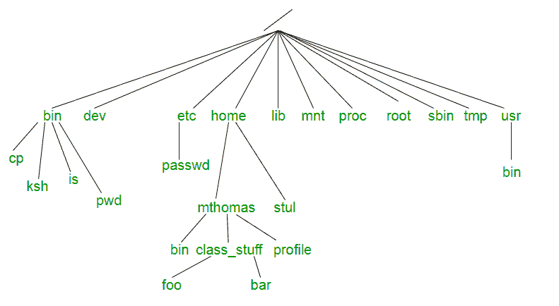
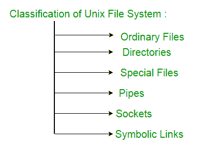

# Unix 文件系统

> 原文:[https://www.geeksforgeeks.org/unix-file-system/](https://www.geeksforgeeks.org/unix-file-system/)

Unix 文件系统是以易于管理的方式组织和存储大量信息的逻辑方法。文件是存储信息的最小单位。Unix 文件系统有几个重要的特性。Unix 中的所有数据都被组织成文件。所有文件都组织到目录中。这些目录被组织成树状结构，称为文件系统。

Unix 系统中的文件被组织成称为目录树的多层层次结构。文件系统的最顶端是一个名为“root”的目录，用“/”表示。所有其他文件都是 root 的“后代”。

**目录或文件及其描述–**

*   **/ :** 斜线/字符单独表示文件系统树的根。
*   **/bin :** 代表“二进制文件”，包含某些基本的实用程序，比如 ls 或 cp，一般所有用户都需要。
*   **/boot :** 包含成功启动过程所需的所有文件。
*   **/dev :** 代表“设备”。包含外围设备和伪设备的文件表示。
*   **/等:**包含系统范围的配置文件和系统数据库。最初也包含“危险的维护实用程序”，如 init，但这些通常被移到/sbin 或其他地方。
*   **/home :** 包含用户的主目录。
*   **/lib :** 包含系统库，以及内核模块或设备驱动等一些关键文件。
*   **/媒体:**u 盘、媒体播放器等可移动设备的默认挂载点。
*   **/mnt :** 代表“坐骑”。包含文件系统挂载点。例如，如果系统使用多个硬盘或硬盘分区，则使用这些选项。它还经常用于远程(网络)文件系统、光盘驱动器等。
*   **/proc :** procfs 虚拟文件系统将进程信息显示为文件。
*   **/root :** 超级用户“root”即系统管理员的主目录。该帐户的主目录通常位于初始文件系统上，因此不在/home(可能是另一个文件系统的挂载点)中，以防需要执行特定的维护，而在此期间其他文件系统不可用。例如，如果硬盘驱动器出现物理故障，并且无法正确安装，就会出现这种情况。
*   **/tmp :** 存放临时文件的地方。许多系统在启动时清除该目录；它可能在其上安装了 tmpfs，在这种情况下，它的内容无法在重新启动时存活，或者它可能在启动时被启动脚本显式清除。
*   **/usr :** 原本存放用户主目录的目录，它的用途已经改变。它现在包含可执行文件、库和非系统关键的共享资源，如 X Window 系统、KDE、Perl 等。但是，在某些 Unix 系统上，某些用户帐户可能仍然有一个主目录，它是/usr 的直接子目录，例如 Minix 中的默认目录。(在现代系统中，这些用户帐户通常与服务器或系统使用相关，而不是由个人直接使用)。
*   **/usr/bin :** 该目录存储操作系统不驻留在/bin、/sbin 或(很少)/等中分发的所有二进制程序。
*   **/usr/include :** 存储整个系统使用的开发头。头文件主要由 C/C++编程语言中的 **#include** 指令使用。
*   **/usr/lib :** 存储存储在/usr 或其他地方的程序所需的库和数据文件。
*   **/var :** 是“变量”的缩写存放可能经常变化的文件的地方，尤其是大小，例如发送给系统用户的电子邮件或进程标识锁定文件。
*   **/var/log :** 包含系统日志文件。
*   **/var/mail :** 存放所有传入邮件的地方。用户(根用户除外)只能访问自己的邮件。通常，这个目录是/var/spool/mail 的符号链接。
*   **/var/假脱机:**假脱机目录。包含打印作业、邮件线轴和其他排队任务。
*   **/var/tmp :** 存放临时文件的地方，这些文件应该在系统重新启动之间保留。

**Unix 文件的类型–**Unix 文件系统包含几种不同类型的文件:

**1。普通文件–**普通文件是系统中包含数据、文本或程序指令的文件。

*   用于存储您的信息，例如您写的一些文本或绘制的图像。这是您通常使用的文件类型。
*   总是位于目录文件内/下。
*   不包含其他文件。
*   在 ls -l 的长格式输出中，这种类型的文件由“-”符号指定。

**2。目录–**目录存储特殊和普通文件。对于熟悉 Windows 或 Mac OS 的用户来说，UNIX 目录相当于文件夹。目录文件包含它包含的每个文件和子目录的条目。如果一个目录中有 10 个文件，则该目录中将有 10 个条目。每个条目有两个组成部分。
(1)文件名
(2)文件或目录的唯一标识号(称为信息节点号)

*   层次树中的分支点。*   用于组织文件组。*   可能包含普通文件、特殊文件或其他目录。*   永远不要包含你要处理的“真实”信息(如文本)。基本上，只是用来整理文件。*   All files are descendants of the root directory, ( named / ) located at the top of the tree.

    在 ls–l 的长格式输出中，这种类型的文件由“d”符号指定。

    **3。特殊文件–**用于表示用于输入/输出(I/O)操作的真实物理设备，如打印机、磁带机或终端。**设备或特殊文件**用于 UNIX 和 Linux 系统上的设备输入/输出(I/O)。它们像普通文件或目录一样出现在文件系统中。
    在 UNIX 系统上，每个设备有两种类型的特殊文件，字符特殊文件和块特殊文件:

    *   当字符特殊文件用于设备输入/输出(I/O)时，数据一次传输一个字符。这种类型的访问称为原始设备访问。
    *   当块特殊文件用于设备输入/输出(I/O)时，数据以固定大小的大块传输。这种类型的访问称为阻止设备访问。

    对于终端设备，一次只能有一个字符。然而，对于磁盘设备来说，原始访问意味着读取或写入整块数据——块，这是您的磁盘所固有的。

    *   在 ls -l 的长格式输出中，字符特殊文件用“c”符号标记。
    *   在 ls -l 的长格式输出中，块特殊文件用“b”符号标记。

    **4。管道–**UNIX 允许您使用管道将命令链接在一起。管道充当一个临时文件，它只保存一个命令中的数据，直到另一个命令读取它。Unix 管道提供了单向的数据流。第一命令序列的输出或结果被用作第二命令序列的输入。若要制作管道，请在两个命令之间的命令行上放置一个竖线(|)。例如: **who | wc -l**

    在 ls–l 的长格式输出中，命名管道用“p”符号标记。

    **5。套接字–**Unix 套接字(或进程间通信套接字)是一个允许高级进程间通信的特殊文件。Unix 套接字用于客户机-服务器应用程序框架。本质上，它是一个数据流，非常类似于网络流(和网络套接字)，但是所有事务都是文件系统本地的。

    在 ls -l 的长格式输出中，Unix 套接字用“s”符号标记。

    **6。符号链接–**符号链接用于引用文件系统的其他文件。符号链接也称为软链接。它包含它引用的文件路径的文本形式。对于最终用户来说，符号链接看起来会有自己的名称，但是当您尝试读取或写入数据到该文件时，它会将这些操作引用到它所指向的文件。如果我们删除软链接本身，数据文件将仍然存在。如果我们删除源文件或将其移动到不同的位置，符号文件将无法正常工作。

    在 ls–L 的长格式输出中，符号链接由“L”符号标记(这是小写的 L)。

    **参考–**

    [UNIX–概念和应用](http://www.mheducation.co.in/9780070635463-india-unix-concepts-and-applications)| Sumitabha Das | Tata McGraw Hill |第 4 版

    本文由**萨洛尼·古普塔**供稿。如果你喜欢 GeeksforGeeks 并想投稿，你也可以使用[contribute.geeksforgeeks.org](http://www.contribute.geeksforgeeks.org)写一篇文章或者把你的文章邮寄到 contribute@geeksforgeeks.org。看到你的文章出现在极客博客主页上，帮助其他极客。

    如果你发现任何不正确的地方，或者你想分享更多关于上面讨论的话题的信息，请写评论。