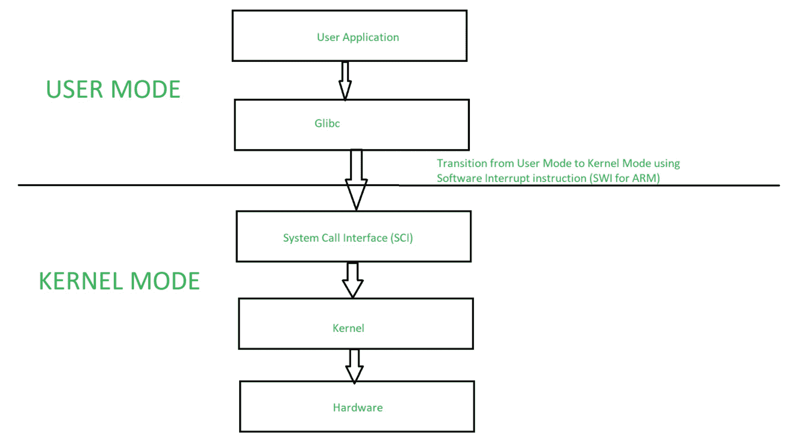

# 用户模式和内核模式切换

> 原文:[https://www . geesforgeks . org/user-mode-and-kernel-mode-switching/](https://www.geeksforgeeks.org/user-mode-and-kernel-mode-switching/)

在其生命周期中，进程以[用户模式和内核模式](https://www.geeksforgeeks.org/dual-mode-operations-os/)执行。**用户模式**是正常模式，在该模式下，进程的访问权限有限。而**内核模式**是特权模式，进程可以不受限制地访问系统资源，如硬件、内存等。进程可以访问输入/输出硬件寄存器对其进行编程，可以执行操作系统内核代码，并在内核模式下访问内核数据。任何与进程管理、输入输出硬件管理和内存管理相关的事情都需要进程在内核模式下执行。

这一点很重要，要知道内核模式下的进程可以访问任何设备和内存，同时内核模式下的任何崩溃都会导致整个系统崩溃。但是用户模式下的任何崩溃只会导致错误的进程。

内核提供系统调用接口( **SCI** )，是内核的入口点。系统调用是进程从用户模式进入内核模式的唯一途径。下图详细解释了用户模式到内核模式的转换。

用户模式到内核模式的切换

进入内核模式，一个应用程序进程。

*   调用 *Glibc* 库函数。
*   Glibc 库知道不同体系结构调用系统调用的正确方法。它根据架构的应用程序二进制接口(ABI)设置传递参数，为系统调用输入做准备。
*   现在 Glibc 调用 SWI 指令(ARM 的软件中断指令)，该指令通过更新 CPSR 寄存器的 mode 位将处理器置于 Supervisor 模式，并跳转到向量地址 0x08。
*   到目前为止，流程执行处于用户模式。在 SWI 指令执行之后，进程被允许执行内核代码。内存管理单元(MMU)现在将允许内核虚拟内存访问和执行，用于这个过程。
*   从向量地址 *0x08* 开始，进程执行加载并跳转到软件中断处理程序例程，这是 ARM 的*向量 _swi()* 。
*   在 *vector_swi()* 中，系统调用号( *SCNO* )从 swi 指令中提取，执行跳转到系统调用函数，使用 *SCNO* 作为系统调用表 *sys_call_table* 中的索引。
*   在系统调用执行之后，在返回路径中，用户空间寄存器在用户模式下开始执行之前被恢复。

为了支持内核模式和用户模式，处理器必须对不同的特权模式提供硬件支持。例如，ARM 处理器支持七种不同的模式。

| 处理器模式 | CPSR 模式位 | 注意 |
| 用户 | ten thousand | 无特权或**用户模式** |
| FIQ | Ten thousand and one | 快速中断模式 |
| 伊拉克 | Ten thousand and ten | 中断模式 |
| 监督者 | Ten thousand and eleven | **内核模式** |
| 流产 | Ten thousand one hundred and eleven | 内存冲突处理模式 |
| 不明确的 | Eleven thousand and eleven | 未定义的指令处理模式 |
| 系统 | Eleven thousand one hundred and eleven | 与主管模式相同，但带有重新入口 |

**结论:**
对于任何系统，特权模式和非特权模式对于访问保护都很重要。处理器必须支持用户/内核模式的硬件。系统调用接口是从用户空间到内核空间的唯一途径。内核空间切换是通过软件中断实现的，软件中断改变处理器模式，将 CPU 执行跳转到中断处理程序中，中断处理程序执行相应的系统调用例程。