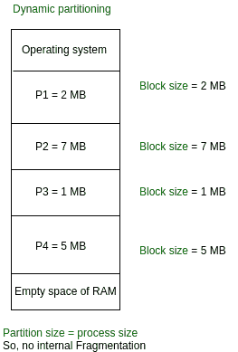
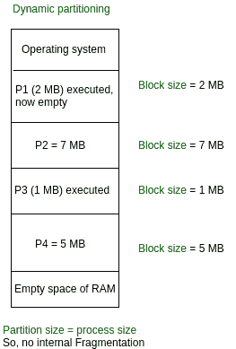

# 操作系统中的变量(或动态)分区

> 原文:[https://www . geesforgeks . org/操作系统中的变量或动态分区/](https://www.geeksforgeeks.org/variable-or-dynamic-partitioning-in-operating-system/)

在操作系统中，内存管理是负责分配和管理计算机主内存的功能。内存管理功能跟踪每个内存位置的状态，无论是已分配的还是空闲的，以确保有效和高效地使用主内存。

有两种内存管理技术:**连续**和**非连续**。在连续技术中，执行进程必须完全加载到主内存中。连续技术可分为:

1.  [固定(或静态)分区](https://www.geeksforgeeks.org/fixed-or-static-partitioning-in-operating-system/)
2.  可变(或动态)分区

**变量划分–**
这是连续分配技术的一部分。它用于缓解固定分区面临的问题。与固定分区相反，分区不是在执行之前或系统配置期间创建的。与可变分区相关的各种**功能**

1.  最初，内存是空的，在运行时根据进程的需要进行分区，而不是在系统配置时进行分区。
2.  分区的大小将等于传入的进程。
3.  分区大小根据进程的需要而变化，因此可以避免内部碎片，以确保内存的有效利用。
4.  内存中的分区数量不是固定的，取决于传入进程的数量和主内存的大小。

变量分区相对于固定分区有一些优点和缺点，如下所示。

**变量划分的优势–**

1.  **无内部碎片:**
    在变量分区中，主存空间严格按照进程需要分配，因此不存在内部碎片的情况。分区中将没有未使用的空间。
2.  **对多道程序设计的程度没有限制:**
    由于没有内部碎片，可以容纳更多数量的进程。可以加载一个进程，直到内存为空。
3.  **对进程大小没有限制:**
    在固定分区中，大小大于最大分区大小的进程不能被加载，进程不能被划分，因为它在连续分配技术中是无效的。这里，在变量分区中，不能限制进程大小，因为分区大小是根据进程大小决定的。

**变量划分的缺点–**

1.  **实现困难:**
    与固定分区相比，实现可变分区困难，因为它涉及运行时而不是系统配置期间的内存分配。
2.  **External Fragmentation:**
    There will be external fragmentation inspite of absence of internal fragmentation.

    例如，假设在上面的示例中，进程 P1(2MB)和进程 P3(1MB)完成了它们的执行。因此，留下了两个空间，即 2MB 和 1MB。假设 3MB 规模的 P5 进程到来了。无法分配内存中的空白空间，因为在连续分配中不允许跨越。规则规定，进程必须连续出现在主内存中才能执行。因此，它会导致外部碎片。

    

    现在，尽管需要可用空间，大小为 3 MB 的 P5 仍无法容纳，因为在连续情况下不允许跨越。