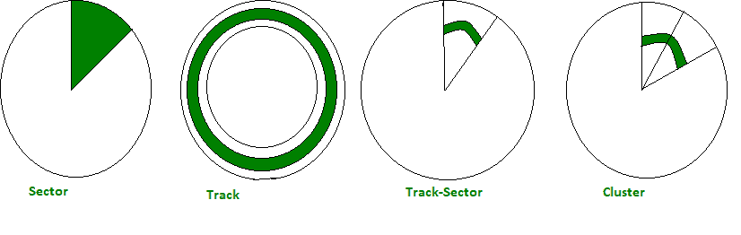
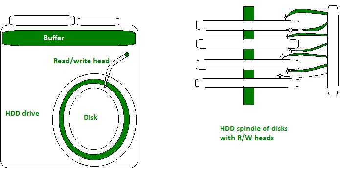

# 文件系统中的各种术语

> 原文:[https://www.geeksforgeeks.org/various-terms-in-file-system/](https://www.geeksforgeeks.org/various-terms-in-file-system/)

先决条件–[操作系统中的文件系统](https://www.geeksforgeeks.org/file-systems-in-operating-system/)

首先了解存储设备硬盘的结构:

**术语:**

```
(i). Sector
(ii). Track
(iii). Track-Sector
(iv). Cluster or Block 
```



<center>**Figure –** Terminology in disk</center>

下面简单解释一下。

*   **(一)。扇区:**
    这是一个从磁盘中心到圆周的饼状结构，读/写头从磁盘中心移动到圆周所需的时间称为延迟时间。
*   **(二)。轨迹:**
    是 r/w 头覆盖跟踪的环形路径。它的宽度取决于 r/w 磁头的磁头尺寸。
*   **(三)。**
    轨道-扇形:这是扇形和轨道的交点，可以参考图片更好的理解。
*   **(四)。集群:**
    两个或多个轨道扇区称为集群。它是操作系统用来存储数据的最小单位。每个群集的大小因其在磁盘中的位置而异。不是所有的簇都用来存储文件。

**建筑概念和可视化:**

1.  **Tommy and Jonny:**
    Let’s assume we want a book called Data Structure and Algorithm from college library. Now you go to library computer (let’s name it Tommy) and find if this book really present in library or not. If this is in library than tell me the shelf-number where to find the book. And suppose you are with your friend (let’s name him Jonny) and if book exist you pass the shelf-number to your friend and ask him to bring the book for you.

    同样，HDD 也有 Tommy，称为 BUFFER，它存储不同文件和文件夹的所有地址和其他属性。缓冲区可以帮助你在硬盘上找到任何东西，在 Jonny 的帮助下，这是读/写头。
    这证明了我们不能直接和磁盘交互，而是使用缓冲区间接交互。

    

    <center>**Figure –** HDD Structure</center>

2.  **Project Colleague:**
    Suppose you and your colleague are working on a project, you have a windows laptop and your colleague has mac book. He copied some project files in a pen drive and shared to you. But problem is that you are unable to see data on the pen drive.
    *   怎么可能？
    *   有什么可能是错的？
    *   是病毒吗？
    *   笔驱动器损坏？

    不，您的笔式硬盘没有任何问题，或者没有病毒影响文件。它是文件系统。Mac OS 使用 HFS 文件系统，Windows 使用 [NTFS](https://www.geeksforgeeks.org/difference-fat32-exfat-ntfs-file-system/) 。所以，你们两个都必须来到一个两者都支持的文件系统，也就是 FAT 系统。

    **缓冲区如何存储数据或地址？**

    <center>

    | 文件标识 | 文件名 | ifolder | 父母 | 地址 | 属性 |
    | --- | --- | --- | --- | --- | --- |
    | one | 用户 | one | Zero | Zero | ….. |
    | Two | 文档 | one | Two | Zero | …. |
    | three | 画 | one | Two | Zero | …. |
    | four | Resume.docx | Zero | three | 0x1000 | …. |
    | five | Me.jpg | Zero | four | 0x1500 | …. |

    </center>

    这种存储文件的格式称为 FAT(文件分配表)文件系统。这进一步改进为 FAT12、FAT16、FAT32。如果你剪切并粘贴文件到其他文件夹，那么唯一改变的属性是父文件夹，这非常快。但是如果你复制粘贴它需要时间，因为它存储在一个新的地址。