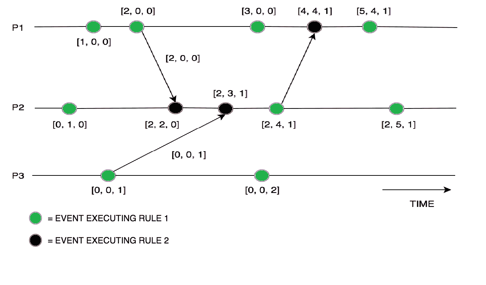

# 分布式系统中的矢量时钟

> 原文:[https://www . geesforgeks . org/vector-clocks-in-distributed-system/](https://www.geeksforgeeks.org/vector-clocks-in-distributed-systems/)

**矢量时钟**是一种在分布式系统中生成事件的部分排序并检测因果违规的算法。这些时钟在标量时间上扩展，以促进分布式系统的因果一致视图，它们检测一个贡献的事件是否导致了分布式系统中的另一个事件。它本质上抓住了所有的因果关系。这个算法帮助我们用一个向量(一个整数列表)来标记每个进程，这个向量代表系统中每个进程的每个本地时钟。所以对于 N 个给定的进程，会有大小为 N 的向量/数组。

**矢量时钟算法如何工作:**

*   最初，所有的时钟都设置为零。
*   每当进程中发生内部事件时，向量中进程逻辑时钟的值就会增加 1
*   此外，每次进程发送消息时，向量中进程逻辑时钟的值都会增加 1。

每当一个进程接收到一条消息时，该进程的逻辑时钟在向量中的值就增加 1，此外，每个元素通过取其自己的向量时钟中的值和接收到的消息中的向量中的值(对于每个元素)的最大值来更新。

**示例:**
考虑一个进程(P)，每个进程的向量大小为 N:上面提到的一组规则将由向量时钟执行:

上面的例子描述了向量时钟机制，其中向量时钟在内部事件执行后更新，箭头指示向量值如何在进程之间发送(P1、P2、P3)。

总而言之，矢量时钟算法在分布式系统中用于提供事件的**因果一致的**顺序，但是对于发送的每个消息，整个矢量被发送到每个进程，以便保持矢量时钟同步。