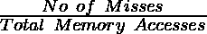
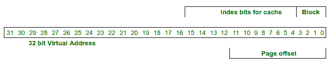

# 虚拟索引物理标记(VIPT)缓存

> 原文:[https://www . geesforgeks . org/virtual-indexed-physical-tagged-vipt-cache/](https://www.geeksforgeeks.org/virtually-indexed-physically-tagged-vipt-cache/)

**先决条件:**

1.  [缓存](https://www.geeksforgeeks.org/cache-memory-in-computer-organization/)
2.  [内存访问](https://www.geeksforgeeks.org/gate-gate-cs-2014-set-3-question-43/)
3.  [寻呼](https://www.geeksforgeeks.org/paging-in-operating-system/)
4.  [过渡后备缓冲器](https://www.geeksforgeeks.org/translation-lookaside-buffer-tlb-in-paging/)

**重访高速缓存访问**
当中央处理器产生物理地址时，对主存储器的访问先于对高速缓存的访问。使用标签和索引/设置位在缓存中检查数据，如这里的所示。从物理地址生成标记和索引位的这种高速缓存被称为物理索引和物理标记(PIPT)高速缓存。当缓存命中时，内存访问时间会显著减少。


缓存命中

```
Average Memory Access Time =
Hit Time + Miss Rate* Miss Penalty
```

这里，命中时间=高速缓存命中时间=访问高速缓存中的存储位置所花费的时间
未命中惩罚=将高速缓存行从主存储器加载到高速缓存中所花费的时间
未命中率= 

在今天的系统中，中央处理器为一个进程生成一个逻辑地址(也称为虚拟地址)。使用 PIPT 缓存时，需要先将逻辑地址转换为相应的物理地址，然后才能在 PIPT 缓存中搜索数据。从逻辑地址到物理地址的转换包括以下步骤:

1.  检查[转换后备缓冲器(TLB)](https://www.geeksforgeeks.org/translation-lookaside-buffer-tlb-in-paging/) 中的逻辑地址，如果它存在于 TLB，从 TLB 获得页面的物理地址。
2.  如果不存在，从物理内存访问页表，然后使用页表获取物理地址。

所有这些时间都增加了命中时间。因此，命中时间= **TLB 延迟+缓存延迟**


TLB 和 PIPT 缓存:命中和未命中

**PIPT 缓存的限制**

1.  这个过程是连续的，因此命中率很高。
2.  不适合内部缓存。
3.  任何系统都频繁访问数据缓存，每次对数据的 TLB 访问都会显著降低系统速度。

**虚拟索引虚拟标记缓存**
一个直接的解决方案似乎是**虚拟索引虚拟标记(VIVT)** 缓存。VIVT 缓存直接检查缓存中的数据并获取它，而不将其转换为物理地址，从而显著减少了命中时间。
在这样的缓存中，标签和索引将是 CPU 生成的逻辑/虚拟地址的一部分。现在，由中央处理器直接生成的地址可以用来提取数据，大大减少了命中时间。
只有当数据不在缓存中时，才会检查 TLB，最后转换为物理地址后，数据才会被带入 VIVT 缓存。因此，VIVT 的命中时间= **缓存命中时间。**


VIVT 缓存命中和未命中

**VIVT 缓存的限制:**

1.  TLB 包含重要标志，如脏位和无效位，因此即使有 VIVT 缓存， **TLB 也需要检查。**
2.  **上下文切换时出现大量缓存未命中:**由于缓存特定于逻辑地址，并且每个进程都有自己的逻辑地址空间，因此两个进程可以使用相同的地址，但引用不同的数据。
    请记住，这也是每个进程都有一个页表的原因。这意味着，对于每个上下文切换，都需要刷新缓存，并且每个上下文切换之后都会出现大量缓存未命中，这两种情况都很耗时，并且会增加命中时间。

这些问题的解决方案是**虚拟索引物理标记缓存** (VIPT 缓存)。本文的下一部分将介绍 VIPT 缓存、VIPT 缓存中的挑战以及一些解决方案

**虚拟索引物理标记缓存(VIPT)**
VIPT 缓存使用物理地址的标记位和逻辑/虚拟地址的索引作为索引。使用虚拟地址搜索高速缓存，并获得物理地址的标签部分。用虚拟地址搜索 TLB，获得物理地址。最后，将从 VIPT 高速缓存获得的物理地址的标签部分与从 TLB 获得的物理地址的标签进行比较。如果两者相同，则是缓存命中或缓存未命中。


VIPT 缓存命中和未命中

由于 TLB 的大小小于缓存，因此 TLB 的访问时间将小于缓存的访问时间。因此，命中时间= **缓存命中时间。**
VIPT 缓存在命中时占用的时间与 VIVT 缓存相同，解决了 VIVT 缓存的问题:

1.  由于 TLB 也是并行访问的，因此可以同时检查标志。
2.  VIPT 高速缓存使用部分物理地址作为索引，并且由于系统中的每次存储器访问将对应于唯一的物理地址，所以多个进程的数据可以存在于高速缓存中，因此不需要为每个上下文切换刷新数据。

可以想到的一个问题是存在高速缓存命中但 TLB 未命中的情况，这将需要对物理存储器中的页表进行存储器访问。这种情况很少发生，因为在高速缓存的情况下，TLB 只存储位(地址和标志)作为其条目，与整个内存块(几个字节)相比，这需要非常少的空间。因此，TLB 的条目数量远远多于高速缓存中的高速缓存块，即高速缓存的标签目录中 TLB 的条目条目。

**虚拟索引物理标记缓存的优势**

1.  避免顺序访问，减少命中时间
2.  在频繁访问缓存的数据缓存中非常有用
3.  避免上下文切换时缓存未命中
4.  TLB 标志可以与缓存访问并行访问

**虚拟索引物理标记缓存中的挑战**
VIPT 缓存中的虚拟索引会引起挑战。一个进程可以将两个虚拟地址映射到同一个物理位置。这可以在 linux 中使用 mmap 来完成:

mmap(virtual_addr_A，4096，file_descriptor，偏移量)
mmap(virtual_addr_B，4096，file_descriptor，偏移量)

上面两行将 file_descriptor 指向的文件映射到两个不同的虚拟地址，但物理地址相同。由于这两个虚拟地址是不同的，并且高速缓存是虚拟索引的，所以这两个位置可能被索引到高速缓存中的不同位置。这将导致数据块有两个副本，当这些位置被更新时，数据将是不一致的。这个问题叫做混叠。两个进程共享的块也会发生混叠。

以下是解决问题的四种方法:

1.  第一种解决方案要求**在更新内存位置时，使缓存**中的任何其他数据副本无效。
2.  第二种解决方案是**在更新内存位置
    时更新缓存**中的每隔一个数据副本。请注意，第一种和第二种解决方案需要检查是否有任何其他位置映射到相同的物理内存位置。这需要将虚拟地址转换为物理地址；但是 VIPT 的目的是避免翻译，因为翻译会增加点击延迟。
3.  第三种解决方案涉及**减小缓存大小**。请记住，在将虚拟地址转换为物理地址的过程中，虚拟地址的页面偏移量与物理地址的页面偏移量相同。这意味着两个虚拟地址也将具有相同的页面偏移量。为了确保两个虚拟地址映射到缓存中的同一索引，索引字段必须完全位于页面偏移量部分。

**演示混叠的示例:**

```
Consider a system with:
32 bit virtual address,
block size 16 Bytes and page size 4 KB
(i) Direct Mapped Cache: 64 KB
(ii) Direct Mapped Cache: 4 KB
(iii) Direct Mapped Cache: 2 KB
```

(I)在 32 位虚拟地址中，对于 64KB 直接映射高速缓存，
位 15 至 4 用于索引，
位 11 至 0 用于页面偏移(这意味着对于指向同一 PA 的任意两个 VA，12 个 LSB 位将是相同的)。



6 KB 直接映射缓存

两个虚拟地址可以是映射到同一个物理地址的 0x0045626E 和 FF21926E。第一个地址将被索引到(626) <sub>H</sub> 高速缓存行，第二个地址将被索引到(926) <sub>H</sub> 。这表明系统的 64KB 直接映射缓存会出现混叠。还要注意，最后 12 位在两个寻址中是相同的，因为它们已经映射到相同的物理寻址，并且最后 12 位形成对于两个虚拟地址都相同的页面偏移。

(ii)在 32 位虚拟地址中，对于 4KB 直接映射高速缓存，位 11 至 4 用于索引，位 11 至 0 用于页面偏移(这意味着对于指向同一 PA 的任意两个 VA，12 个 LSB 位将是相同的)。


4 KB 直接映射缓存

两个地址可以是 0x12345678 和 0xFEDCB678。注意，12 个 LSB 位是相同的，即(678) <sub>H</sub> 。因为对于 2KB 直接映射高速缓存，索引位完全是同一页偏移的一部分，所以两个虚拟地址将映射的高速缓存的索引将是相同的。因此，一次只保留一个副本，不会出现混叠。

(iii)以下是系统的 2KB 直接映射缓存的表示，未显示混叠。因此，任何大小小于或等于 4KB 的直接映射缓存都不会造成混叠。


2 KB 直接映射缓存

4.别名的第三种解决方案要求缓存更小，越小的缓存会导致更多的缓存未命中。解决方案 1、
2 和 3 是基于硬件的。另一个被称为**页面颜色/缓存着色**的解决方案是由操作系统实现的软件解决方案
，用于在不限制缓存大小的情况下解决混叠问题。在 64KB 高速缓存的情况下，需要 16 种
颜色来确保不会发生混叠。此外，请阅读:ARMv6 上的页面着色