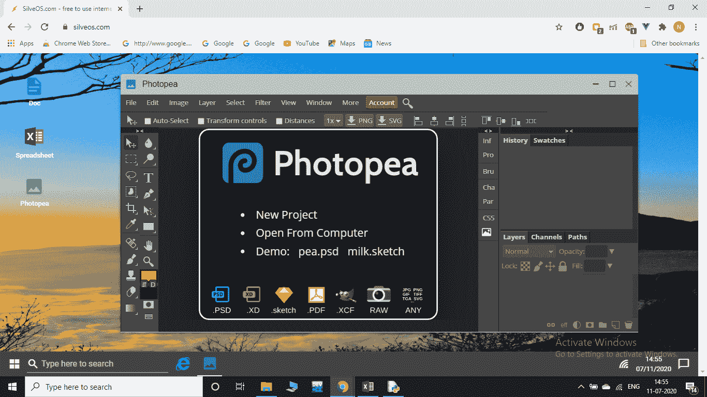

# 网络操作系统

> 原文:[https://www.geeksforgeeks.org/web-operating-system/](https://www.geeksforgeeks.org/web-operating-system/)

操作系统是一种系统软件，它充当计算机硬件和请求输入/输出的程序之间的接口。它管理计算机硬件、软件资源并允许其他程序运行。

网络操作系统是一个基于互联网的用户界面，它允许人们访问不存储在他们的计算机上而是完全或部分存储在互联网上的应用程序。它是一个虚拟操作系统，不直接与计算机硬件交互，依靠传统操作系统工作。换句话说，它是云等分布式计算系统的接口。

*   用于使网络操作系统工作的方法

*   网络操作系统主要是使用 AJAX 和 Flash 创建的。

Flash 使用户能够创建交互式网页。这是一个矢量动画软件，最初设计用于使用矢量图形在网页上创建动画。随着时间的推移，它通过编程变得越来越可控。随着闪存文件在互联网上流动，在访问部分文件之前将整个文件下载到计算机的麻烦就减少了。

[AJAX(异步 Javascript 和 XML)](https://www.geeksforgeeks.org/ajax-introduction/) 是一组用于创建异步 web 应用程序的技术。这些网络应用程序可以在后台从服务器发送和检索数据，而不会干扰任何其他网页，以小信息的形式。

**流程:**
网络操作系统按照指定的程序工作。

用户发出运行特定程序的请求，连同指定的数据
该请求然后被传递到最近的教育引擎， 它可能驻留在网络上的任何地方
引擎随后在其资源中执行搜索，以检查它是否请求了程序
然后检查本地系统是否能够满足服务质量参数
引擎可能拒绝请求或将其传递给其他教育引擎，直到其中一个最终接受请求
除此之外，任何网络操作系统用户都应该能够与其他用户共享他的本地资源。 因此，需要有效的搜索和交流策略。

主要使用以下两种搜索策略

**广播策略:**
通过请求机器将请求传递给列表中的每台机器。然后，这些机器中的每一台都会发回消息。如果列表包含 n 台机器，将生成 2n 条消息，n 条来自请求机器，其他 n 条来自列表上的机器，为正或负。因此，在这种策略中，网络负载很高。
串行请求策略——在该策略中，请求机器只向列表中的一台机器发送包含列表中其余机器的请求，因此网络负载相对较小。如果请求服务的程序在这台机器上可用，它会发回一个肯定的消息，否则它会将请求传递给任何一台机器，并列出所有剩余的机器，以此类推。

**示例–**
互联网上有很多 WebOS。在这个例子中，我们使用的是 SilveOs。

网站–[https://www.silveos.com/](https://www.silveos.com/)

你所需要做的就是登录网站，它就在那里，在你的浏览器上是一个虚拟的操作系统。

示例