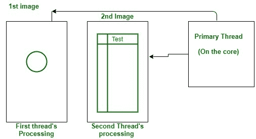

# 什么是计算机处理器或 CPU 中的线程？

> 原文:[https://www . geesforgeks . org/什么是计算机处理器或 cpu 中的线程/](https://www.geeksforgeeks.org/what-are-threads-in-computer-processor-or-cpu/)

[线程](https://www.geeksforgeeks.org/thread-in-operating-system/)是将一个 CPU 的物理核划分为多个虚拟核的虚拟组件或代码。单个中央处理器内核每个内核最多可以有 2 个线程。

例如，如果一个中央处理器是双核(即 2 个内核)，它将有 4 个线程。如果一个中央处理器是八核(即 8 核)，它将有 16 个线程，反之亦然。

**工作:**
线程是由进程创建的。每次打开一个应用程序时，它都会自己创建一个线程来处理该特定应用程序的所有任务。类似地，打开的应用程序越多，创建的线程就越多。

线程总是由操作系统创建，用于执行特定应用程序的任务。
内核上有一个线程(执行计算的内核代码，也称为主线程)，当从用户那里获得信息时，它会创建另一个线程并将任务分配给它。同样，如果它得到另一条指令，它会形成第二个线程，并将任务分配给它。一共做了两根线。

**示例:**
智能手机应用就是一个例子，当你打开一个 app，它会显示一个不断旋转的圆圈，这个过程是由一个专门为此目的创建的线程来完成的，第二个线程会加载信息并在图形用户界面中呈现出来。

唯一会限制线程创建的事实是物理中央处理器提供的线程数量，并且它因中央处理器而异。第一个图像是第一个线程加载的微调器，第二个图像是第二个线程加载的图形用户界面。

**现在，线程有什么用？**
线程已经成为计算中至关重要的一部分，因为它们允许处理器同时执行多个任务，从而使任务更快。还能让电脑多任务处理。由于只有线程，你可以同时浏览网页和听音乐。