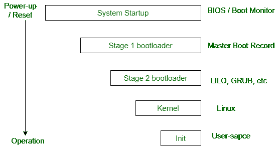
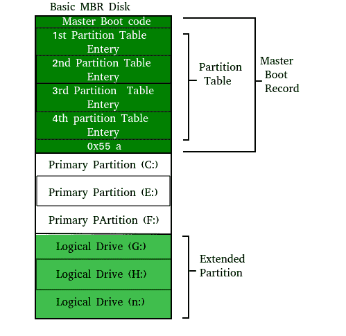

# 打开电脑会发生什么？

> 原文:[https://www . geesforgeks . org/当我们打开电脑时会发生什么/](https://www.geeksforgeeks.org/what-happens-when-we-turn-on-computer/)

一台没有运行程序的计算机只是一个电子插件。电脑开机后要做的第一件事就是启动一个叫做操作系统的特殊程序。操作系统的工作是通过处理控制计算机硬件的混乱细节来帮助其他计算机程序工作。

**引导过程概述**

启动过程是每次打开电脑时都会发生的事情。你不会真正看到它，因为它发生得太快了。你按下电源按钮几分钟后回来，Windows XP，或 Windows Vista，或你使用的任何操作系统都已加载。

基本输入输出系统芯片告诉它在一个固定的地方，通常是在编号最低的硬盘(引导盘)上寻找一个被称为引导加载程序的特殊程序(在 Linux 下，引导加载程序被称为 Grub 或 LILO)。引导加载程序被拉入内存并启动。引导加载程序的工作是启动真正的操作系统。

**BIOS 功能**

**开机自检**(开机自检)开机自检在每次打开电脑时进行。听起来很复杂，那是因为有点复杂。你的电脑开着的时候会做很多事情，这只是其中的一部分。

它初始化各种硬件设备。这是一个重要的过程，以确保所有设备顺利运行，没有任何冲突。ACPI 之后的 BIOSes 创建描述计算机中设备的表格。

开机自检首先检查 bios，然后测试互补金属氧化物半导体随机存取存储器。如果没有问题，开机自检将继续检查中央处理器、硬件设备(如显卡)、辅助存储设备(如硬盘、软盘驱动器、压缩驱动器或光盘驱动器)。如果发现一些错误，屏幕上会显示一条错误信息或听到一些蜂鸣声。这些蜂鸣音称为开机自检蜂鸣音。

**主开机记录**

主引导记录(MBR)是一个小程序，在计算机引导时启动，以便找到操作系统(例如，视窗操作系统)。这个复杂的过程(称为引导过程)从开机自检(开机自检)开始，到 Bios 在硬盘上搜索 MBR 时结束，MBR 通常位于第一个扇区、第一个磁头、第一个柱面(柱面 0、磁头 0、扇区 1)。

典型的结构如下所示:

引导加载程序存储在计算机的可编程只读存储器、只读存储器或其他非易失性存储器中。当计算机开机或重启时，它首先执行开机自检，也称为开机自检。如果开机自检成功且未发现问题，引导加载程序会将计算机的操作系统加载到内存中。然后，计算机将能够快速访问、加载和运行操作系统。

**初始化**

init 是内核启动序列的最后一步。它查找文件 */etc/inittab* ，查看是否有 *initdefault* 的条目。它用于确定系统的初始运行级别。运行级用于决定操作系统的初始状态。
一些运行级别是:

**等级**T2】

*   0–>系统暂停

*   1–>单用户模式

*   3–>网络全多用户模式

*   5–>带网络和 X 显示管理器的全多用户模式

*   6 –>重新启动

init 的上述设计称为 SysV-发音为[系统五](https://en.wikipedia.org/wiki/UNIX_System_V)。现在已经编写了 init 的其他几个实现。一些流行的工具是系统的和新贵的。Upstart 从 2006 年开始被 ubuntu 使用。暴发户的更多细节可以在[这里](https://help.ubuntu.com/community/UbuntuBootupHowto)找到。

init 的下一步是启动支持网络和其他服务的各种守护进程。x 服务器守护进程是最重要的守护进程之一。它管理显示器、键盘和鼠标。当 X 服务器守护程序启动时，您会看到一个图形界面，并显示一个登录屏幕。

参考文献:
[http://www . tldp . org/how to/Unix-and-Internet-foundations-how to/bootup . html](http://www.tldp.org/HOWTO/Unix-and-Internet-Fundamentals-HOWTO/bootup.html)
[【https://www.computerhope.com/jargon/b/bootload.htm】](https://www.computerhope.com/jargon/b/bootload.htm)
[http://www . dewassoc . com/kbase/hard _ drives/master _ boot _ record . htm](http://www.dewassoc.com/kbase/hard_drives/master_boot_record.htm)

本文由 [**Saket Kumar**](https://www.facebook.com/saketkumar95) 供稿。如果你喜欢 GeeksforGeeks 并想投稿，你也可以使用[contribute.geeksforgeeks.org](http://www.contribute.geeksforgeeks.org)写一篇文章或者把你的文章邮寄到 contribute@geeksforgeeks.org。看到你的文章出现在极客博客主页上，帮助其他极客。

如果你发现任何不正确的地方，或者你想分享更多关于上面讨论的话题的信息，请写评论。