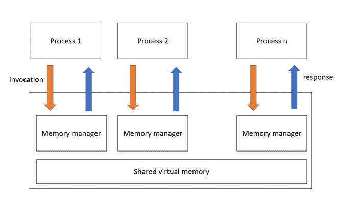

# 什么是分布式共享内存及其优势

> 原文:[https://www . geesforgeks . org/什么是分布式共享内存及其优势/](https://www.geeksforgeeks.org/what-is-distributed-shared-memory-and-its-advantages/)

需求侧管理是一种跨多个节点管理内存并使进程间通信对最终用户透明的机制。应用程序会认为它们运行在共享内存上。需求侧管理是一种允许用户进程在不使用进程间通信的情况下访问共享数据的机制。在需求侧管理中，每个节点都有自己的内存，提供内存读写服务，并提供一致性协议。分布式共享内存(DSM)实现了分布式系统中的共享内存模型，但它没有物理共享内存。所有节点共享共享内存模型提供的虚拟地址空间。数据在不同节点的主存储器之间移动。

## 分布式共享内存的类型

**片内存储器:**

*   数据存在于芯片的中央处理器部分。
*   存储器直接连接到地址线。
*   片上存储器需求侧管理既昂贵又复杂。

**基于总线的多处理器:**

*   一组称为总线的并行线充当中央处理器和内存之间的连接。
*   通过使用一些算法来防止多个 CPU 同时访问同一存储器
*   缓存用于减少网络流量。

**基于环的多处理器:**

*   基于环的需求侧管理中不存在全局集中内存。
*   所有节点都通过令牌传递环连接。
*   在基于环的需求侧管理中，单个地址线被划分为共享区域。

## **分布式共享内存的优势**

*   **更简单的抽象:**程序员不需要关心数据移动，因为地址空间是一样的，所以比 RPC 更容易实现。
*   **更容易移植:**需求侧管理中使用的访问协议允许从顺序系统到分布式系统的自然过渡。需求侧管理程序是可移植的，因为它们使用公共编程接口。
*   **数据的位置:**以大块移动的数据，即靠近正在提取的当前存储位置的数据，可能在将来需要，因此也将被提取。
*   **按需数据移动:**由 DSM 提供，将消除数据交换阶段。
*   **更大的内存空间:**它提供了大的虚拟内存空间，总内存大小是所有节点的内存大小之和，分页活动减少。
*   **更好的性能:** DSM 通过加快数据访问速度来提高性能和效率。
*   **灵活的通信环境:**他们可以加入和离开需求侧管理系统而不影响其他系统，因为发送者和接收者不需要存在，
*   **进程迁移简化:**它们都共享地址空间，因此一个进程可以轻松地移动到不同的机器上。

除了上述优点之外，需求侧管理还具有以下优点:

*   与使用多处理器系统相比，成本更低。
*   数据访问没有瓶颈。
*   可扩展性，即具有大量节点的规模相当不错。