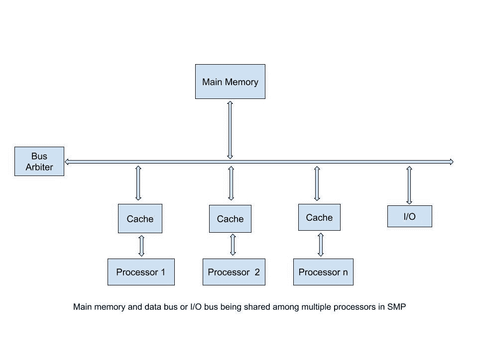

# 什么是 SMP(对称多处理)？

> 原文:[https://www . geesforgeks . org/what-is-SMP-对称-多处理/](https://www.geeksforgeeks.org/what-is-smp-symmetric-multi-processing/)

**多处理(MP)，**涉及计算机硬件和软件架构，其中有多个(两个或更多)处理单元为单个操作(计算机)系统执行程序。

**SMP 即对称多处理，**是指多个相同的处理器互连到单个共享主存储器的计算机体系结构，所有 I/O 设备都可以完全访问，这与非对称 MP 不同。换句话说，如图所示，所有处理器都有公共的共享内存和相同的数据路径或输入/输出总线。

#### SMP 的特点

*   **相同**:所有的处理器都是平等的，也就是说都是相同的。
*   **通信**:共享内存是处理器之间的通信方式。
*   **复杂性**:设计复杂，因为所有单元共享相同的内存和数据总线。
*   **贵**:它们本质上更贵。
*   与任务仅由主处理器完成的不对称不同，这里操作系统的任务由处理器单独处理。

#### 应用程序

这个概念在**并行处理**中找到了应用，其中分时系统(TSS)将任务分配给彼此并行运行的不同处理器，也在使用**多线程**的 TSS 中找到了应用，即多个线程同时运行。

#### 优势

*   **吞吐量:**由于任务可以由所有处理器运行，不像在非对称情况下，因此提高了吞吐量(单位时间内执行的进程)。
*   **可靠性:**处理器出现故障并不会导致整个系统出现故障，因为所有处理器的能力都是一样的，尽管吞吐量确实会出现一点故障。

#### 不足之处

*   **复杂设计:**由于操作系统对所有处理器一视同仁，因此这类操作系统的设计和管理变得困难。
*   **成本更高:**由于所有处理器共享同一个主内存，因此需要的内存大小越大意味着越贵。