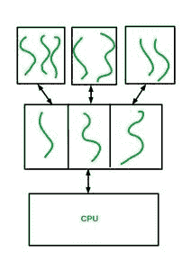

# 为什么用户线程必须映射到内核线程

> 原文:[https://www . geesforgeks . org/为什么必须将用户线程映射到内核线程/](https://www.geeksforgeeks.org/why-must-user-threads-be-mapped-to-a-kernel-thread/)

**先决条件:**操作系统中的[线程](https://www.geeksforgeeks.org/thread-in-operating-system/)、[用户级线程与内核级线程的关系](https://www.geeksforgeeks.org/relationship-between-user-level-thread-and-kernel-level-thread/)

**简介:**

*   线程是计算机系统中 CPU 利用率的基本原子单位。
*   大多数情况下，我们认为一个进程是 CPU 利用率的基本单位，但是一个进程可以进一步划分为多个执行线程。一个进程可以被分成不同的任务或者可以独立执行的单元，这些单元被称为线程(更不用说一个进程作为一个整体本身就是一个线程)。
*   多线程，即由单个进程创建多个线程很重要，因为有时单个线程可能会有短而长的输入/输出突发，在该突发被处理之前，与该进程相关联的独立于输入/输出突发的其他任务必须暂停，或者有时可能需要并行执行 2 个或更多任务，并且只有一个执行线程无法实现并行。
*   例如，文字处理器程序等待用户输入，但在等待输入或接受输入时，它会执行一些其他任务，如拼写检查、将输出打印到屏幕上等。

**线程类型:**
在计算机系统中创建的线程可以是以下两种类型之一

1.  用户线程
2.  内核线程

线程可以在进程本身的地址空间中创建，即在没有内核干预或有内核干预的情况下在进程内部创建。

**1。用户线程–**
用户线程是用户在用户库的帮助下创建的线程，只对创建过程及其运行时环境可见(内核不知道这些线程的创建)。用户线程只是停留在创建进程的地址空间中，并由创建进程运行和管理，无需内核干预，即这些线程执行中的任何问题都不是内核头疼的问题。

**2。内核线程–**
另一方面，内核线程是由内核创建的，并且对其可见。一个用户进程在一个提供的库的帮助下，要求内核为该进程创建一个可执行线程，然后内核代表该进程创建该线程，并将其放在可用的可执行线程列表中。这里，线程的创建、执行和管理由内核负责。

现在从线程的定义开始，是时候回答这个问题了，为什么我们需要将这些用户线程映射到内核线程，而它们之间唯一不同的是谁控制这些线程的执行，内核还是创建过程？为了理解这一点，我们需要看一下下面给出的图表。

首先，为了避免这种情况，图表的最顶层显示了 3 个框，代表内存中的 3 个不同进程，第一个进程的地址空间中有 3 个用户线程，第二个进程有 2 个，以此类推。图的第二层显示了内核，每个用户级进程映射到内核空间中的一个内核线程(为什么？我们会找到它的！！)这是用箭头指定的，在底层我们有 CPU。

**注意–**
我在这里使用多对一模型来解释映射过程，但是还有其他模型可用于映射。有关线程映射模型的更多信息，请参考[这篇](https://www.geeksforgeeks.org/multi-threading-models-in-process-management/)文章。

**CPU 调度器对线程的调度:**

*   现在考虑一下内部系统结构，类似于上图所示。现在发生的是内核中的 CPU 调度器将线程调度到 CPU 上执行。
*   但是这里的问题是，作为内核一部分的调度器只知道内核级线程，因为如前所述，内核不知道用户线程的存在，因为它们是在创建过程的地址空间中创建的，因此内核无法控制它们。
*   内核中的 CPU 调度程序只需查看它拥有的线程“列表”中可供执行的线程列表，并开始调度它们。

**用户线程映射:**

*   但是用户线程会发生什么呢？再次如前所述，内存中的每个进程本身就是一个“内核线程”，这意味着该进程也在内核的线程列表中。这意味着内核将用户进程映射到一个内核线程来执行它。
*   一个进程创建的所有用户线程都在指定给整个进程的同一个内核级线程上执行。每当轮到指定的进程在中央处理器上执行时，它的内核线程就会被调度到中央处理器上，从而执行该进程。
*   用户线程，因为它们都是由创建过程本身控制的，所以它们将被一个接一个地映射到指定的内核线程上，并因此被执行。
*   我们可以把这整个过程想象成创造一个伟大的新产品，也许是一个电子小工具什么的。如果要销售该产品，必须以品牌名称销售，该品牌或公司需要向政府注册，此外，该公司必须遵守政府规定的规则和条例，通过市场上的商店销售所需产品。这里我指的是用户线程是产品，内核是政府，进程是公司，商店是内核线程。

**总结:**
所以简单来说用户线程需要映射到内核线程，因为是内核调度线程在 CPU 上执行，因此它必须知道自己正在调度的线程。对于一个简单的进程，内核只知道进程的存在，而不知道在进程内部创建的用户线程，所以内核将只调度进程的线程(它是一个内核线程)到中央处理器上，进程内部的所有其他用户线程必须一个接一个地映射到指定给创建进程的内核线程上，如果它们必须被执行的话。