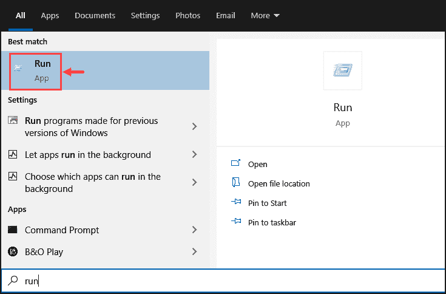
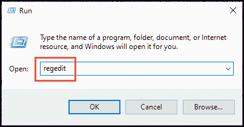
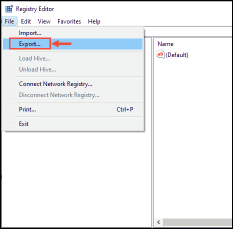
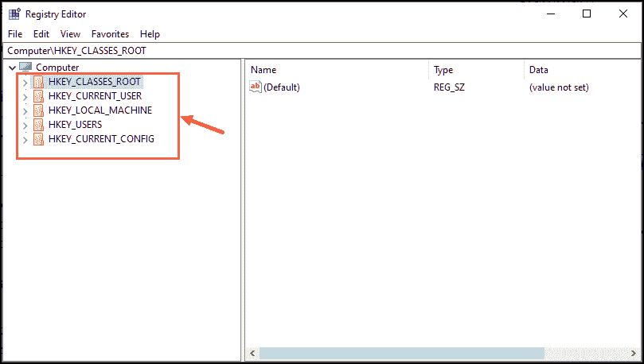

# 窗口注册表

> 原文:[https://www.geeksforgeeks.org/windows-registry/](https://www.geeksforgeeks.org/windows-registry/)

在本文中，我们将讨论 Windows 注册表的概述，并了解如何访问注册表、如何进行注册表备份、注册表根项以及窗口注册表的实际存储位置。我们一个一个来讨论。

**概述:**

*   如果你是一个狂热的视窗操作系统用户，你可能知道注册表这个术语。注册表或 Windows 注册表是存储操作系统及其支持注册表的应用程序的低级设置的数据库。
*   它包含系统上安装的软件和硬件的所有信息。用户可以通过启动 Windows 操作系统的注册表编辑器工具来访问和配置注册表的设置。
*   注册表可以被认为是视窗设备的基因。
*   它包含已安装应用程序的命令。每当您在系统上安装受注册表支持的 Windows 应用程序时，它都会自动添加一个新的注册表项，并在其中存储运行新应用程序所需的所有基本信息。例如，文件的位置，哪些其他应用程序可以使用新程序，等等。
*   注册表可在 Windows 10/8/7 上编辑，最多可在使用 Windows 95 操作系统的设备上编辑。

**访问 Windows 10 中的注册表:**

*   Windows 操作系统上的注册表被广泛用于在操作系统的应用程序中进行更改，这是您无法直接执行的。这是一种在操作系统中执行非官方黑客攻击的快速方法，如禁用窗口启动延迟、禁用窗口操作栏、关闭锁定屏幕。
*   为了访问设备上安装的不同程序的注册表，Windows 提供了一个名为注册表编辑器的图形界面。注册表编辑器不是您需要安装的应用程序。它是一个内置的窗口工具，可以通过运行命令窗口轻松访问。

**实施步骤:**
以下步骤同。

**第一步:**
在你的 Windows 操作系统上，输入**运行**并点击其图标启动。

**步骤 2 :**
运行命令盒将被启动。在提供的空白处键入**注册表编辑**命令，然后按回车键启动注册表编辑器。

**步骤 3 :**
查找要更改的应用程序的注册表。

**注–**

*   如果您是新手用户，建议在注册表中没有专家帮助的情况下不要执行任何更改。这可能会使应用程序无响应，或者最糟糕的是，导致系统故障。
*   即使您知道如何使用注册表，也建议您进行备份，为最坏的情况做好准备。

**注册表备份:**
要备份注册表，请按照以下步骤操作。

1.  打开注册表编辑器窗口
2.  单击文件菜单并选择导出。
3.  在硬盘或外置硬盘上选择一个安全的位置，并将注册表保存在那里。

**注册表根键:**
当您第一次启动注册表编辑器时，您会注意到根键，包含所有不同的注册表值。

**注册表根键表:**
让我们知道这些根键包含什么。

<figure class="table">

| **注册表根键** | **描述** |
| --- | --- |
| **HKEY _ CLASES _ ROOT(HKCR)** | 它描述了文件类型、文件扩展名以及对象链接和嵌入(OLE)信息。 |
| **HKEY _ 当前 _ 用户(HKCU)** | 包含当前登录用户的信息和设置。 |
| **HKEY_LOCAL_MACHINE (HKLM)** | 这是大多数注册表存在和正在编辑的地方。它包含特定于设备的信息。每个可以登录电脑的用户都可以访问 HKLM。 |
| **HKEY _ 用户(HKU)** | 它包含系统中所有用户帐户的数据。 |
| **HKEY _ 电流 _ 配置(HKCC)** | 该根密钥包含当前连接到设备的硬件配置的详细信息。 |

**注册表在 Windows 设备中的位置:**
在最新的 Windows 操作系统如 Windows 10、8 直至 XP 上，注册表存储在安装 Windows 的驱动器上。确切位置是%SystemRoot%\System32\Config\文件夹。在旧版本的 Windows 操作系统上，注册表作为 DAT 文件存储在%WINDIR%文件夹中。

</figure>